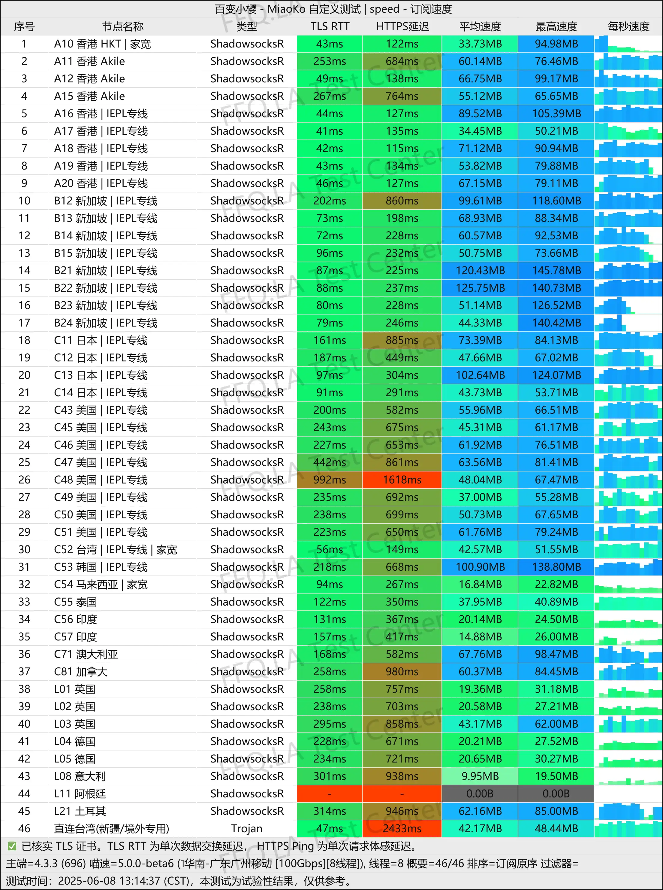
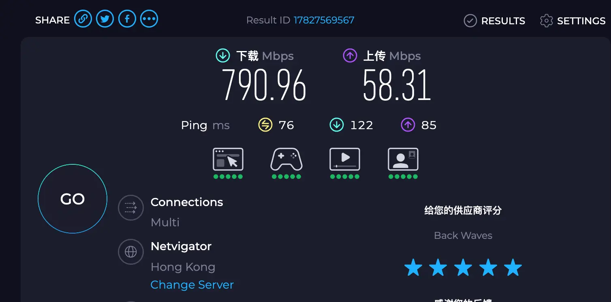
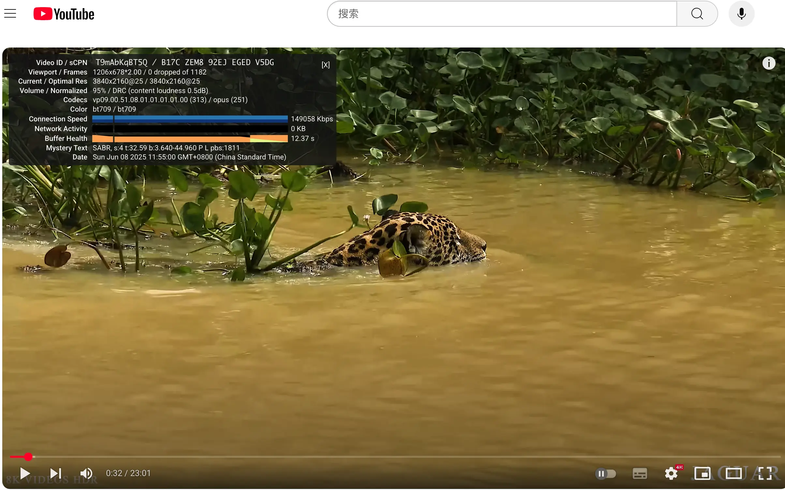
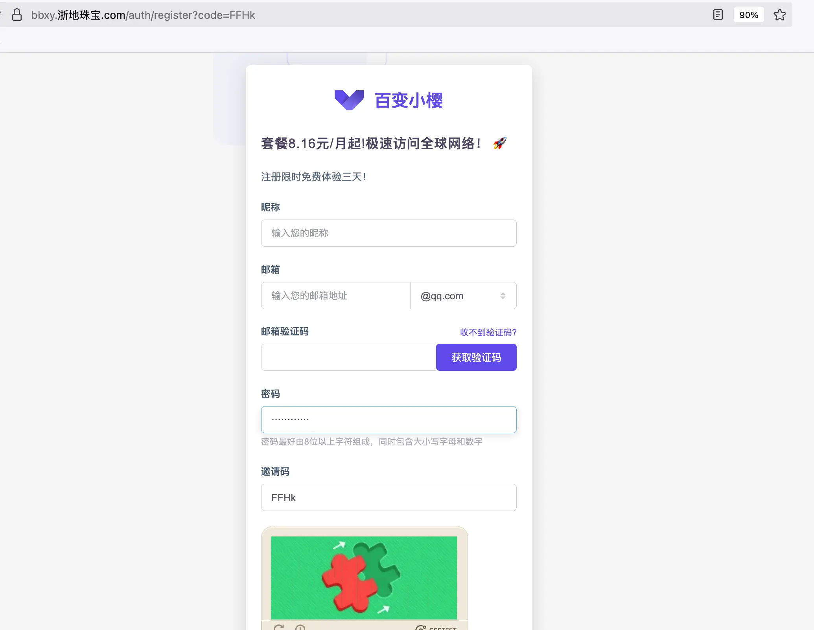
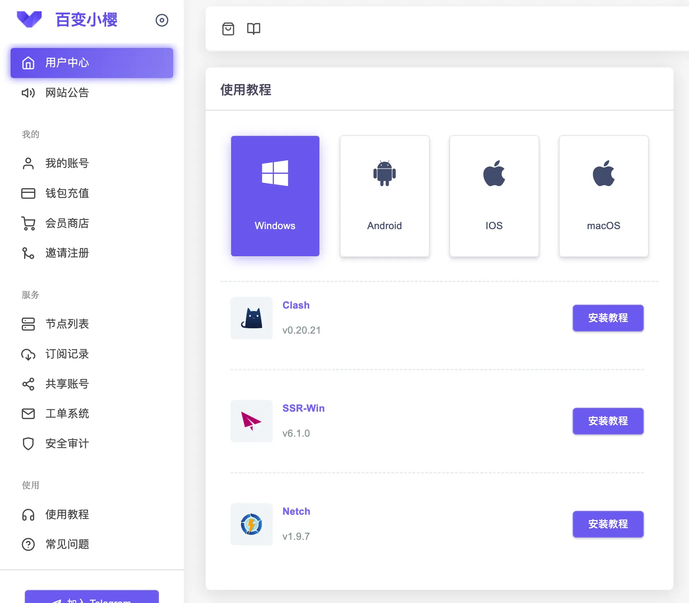
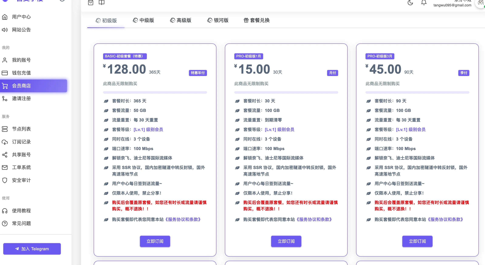
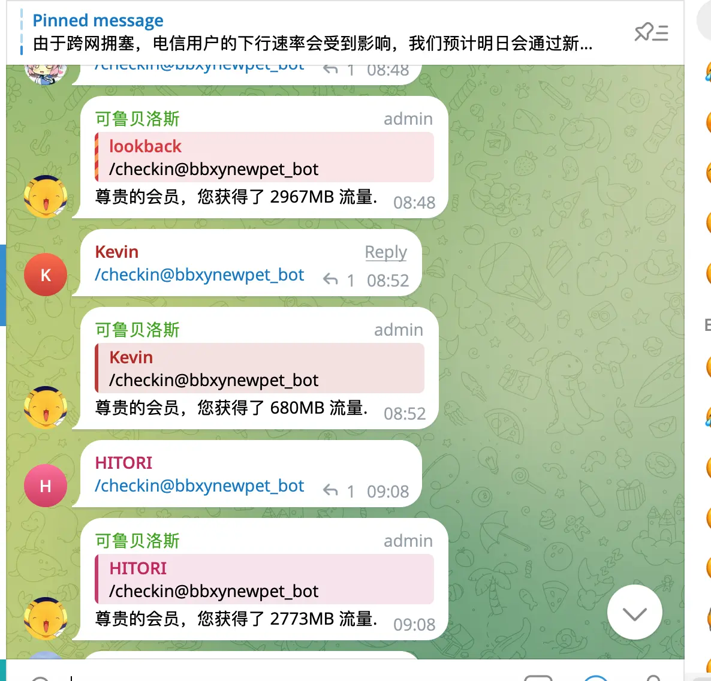
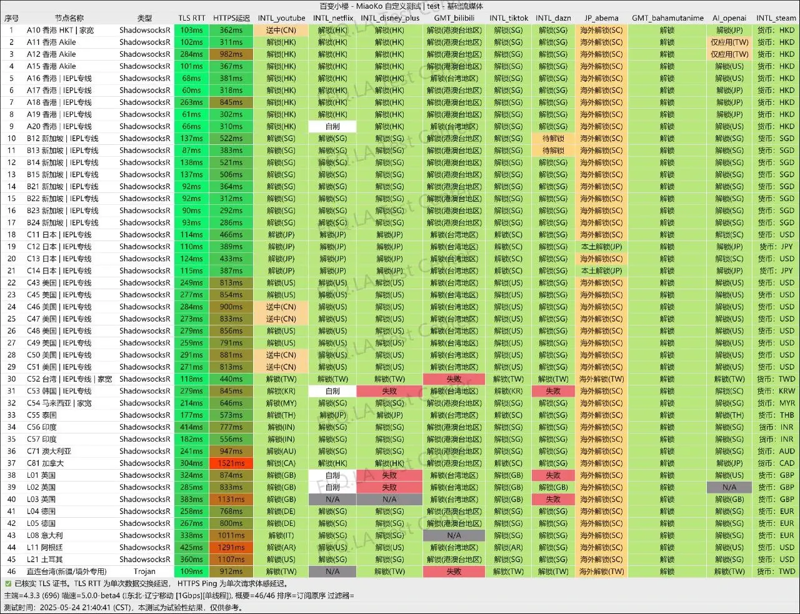

## 引言

IEPL 专线机场，支持移动、电信、联通三网高速回程，小众稳定运营近5年。团队肉身海外，运营风格低调,客服响应快,TG群活跃，节点配置扎实，速度优秀，延迟低，稳定性强，晚高峰表现依旧流畅。

支持 ShadowsocksR 协议，兼容主流客户端。流媒体解锁全面，ChatGPT / Netflix / TikTok / Disney+ 均支持多地区访问。还赠送 Disney+/Netflix 等共享账号，提供Emby服务器,海量高清视频免费观看,非常适合影视爱好者。

该机场我观察超过三年了，稳定性在同类中名列前茅，适合长期主力使用。

三网通吃，IEPL 稳定专线，对不同运营商网络都非常友好，跨网访问无压力。

---

## 🧭 基本信息一览（百变小樱机场）

| 属性    | 内容                                                                |
|-------|-------------------------------------------------------------------|
| 官网    | [百变小樱](https://bbxy.xn--cesw6hd3s99f.com/auth/register?code=FFHk) |
| 开业时间  | 2021年                                                             |
| 协议支持  | ShadowsocksR                                                      |
| 客户端支持 | Clash, Shadowrocket, Surge 等主流工具                                  |
| 解锁能力  | 支持解锁 ChatGPT / Netflix / Disney+ / TikTok / YouTube 等             |
| 节点数   | 香港、新加坡、日本、美国等共40+条线路                                              |
| 专线类型  | 公网隧道 IEPL 专线，支持UDP，适合游戏/低延迟需求                                     |
| 流量机制  | 月流量计费，签到送流量，高级套餐送流媒体账号                                            |
| 支付方式  | 支持支付宝、微信、USDT                                                     |
| 设备连接数 | 3 ~ 15 台（按套餐）                                                     |
| 审计规则  | 禁止 BT / SMTP / IMAP 等，屏蔽 22、80、443 等端口,屏蔽轮子媒体                     |

---

> 📅 最后测试时间：2025-06-08

> 🛠️ 工具环境：1G 宽带 + MiaoKo测速脚本

> 📦 测试方式：延迟 + 解锁 + 下载速度 + 稳定性 + 节点分布  + SpeedTest + Youtube 等综合测试

> 📍 所测机场：百变小樱

## 🎬 解锁测试截图

> 以下为百变小樱节点解锁能力实测截图：

✅ 全节点支持访问 ChatGPT / Google / YouTube  
✅ 多节点支持 Netflix 港区 / 美区 / 新加坡区  
✅ 支持 TikTok / Abema / Bili 港澳台区  
✅ Steam 可切换多区

---

## 🚀 速度测试截图

- 峰值速度达 140MB/s+，平均带宽 50~90MB/s
- 延迟最低 40ms（IEPL）
- 香港、新加坡节点速度表现优秀，晚高峰依然流畅

## SpeedTest 香港节点测试结果

## Youtube 测试结果

---

## 🔧 如何使用？

### 1. 注册账号

前往官网注册 → [点击直达注册页](https://bbxy.xn--cesw6hd3s99f.com/auth/register?code=FFHk)

### 2.安装使用教程

登录进入用户中心 → 下拉找到使用教程,找到适合你平台的客户端->点击安装教程

### 3. 试用到期或者想购买付费套餐

进入会员商店,按自己的需求购买套餐

---

## 💰 付费套餐选择和差异对比

### 🟢 初级版（适合轻度使用者，日常办公/聊天/轻度视频）

| 套餐名称 | 价格 | 月流量 | 设备数 | 带宽 | 会员等级 | 支付周期 |
|----------|------|--------|--------|------|-----------|----------|
| BASIC 初级年付 | ¥128 | 50GB | 3台 | 100Mbps | LV1 | 年付 |
| PRO-30天 | ¥15 | 100GB | 3台 | 100Mbps | LV1 | 月付 |
| PRO-90天 | ¥45 | 100GB | 3台 | 100Mbps | LV1 | 季付 |
| PRO-180天 | ¥90 | 100GB | 3台 | 100Mbps | LV1 | 半年付 |
| PRO-365天 | ¥180 | 100GB | 3台 | 100Mbps | LV1 | 年付 |
| PRO-1095天 | ¥540 | 100GB | 3台 | 100Mbps | LV1 | 三年付 |

---

### 🟡 中级版（适合多终端+中等强度使用，如刷视频+AI+多客户端）

| 套餐名称 | 价格 | 月流量 | 设备数 | 带宽 | 会员等级 | 支付周期 |
|----------|------|--------|--------|------|-----------|----------|
| BASIC 中级年付 | ¥298 | 200GB | 5台 | 300Mbps | LV2 | 年付 |
| PRO-30天 | ¥28 | 200GB | 5台 | 300Mbps | LV2 | 月付 |
| PRO-90天 | ¥84 | 200GB | 5台 | 300Mbps | LV2 | 季付 |
| PRO-180天 | ¥168 | 200GB | 5台 | 300Mbps | LV2 | 半年付 |
| PRO-365天 | ¥336 | 200GB | 5台 | 300Mbps | LV2 | 年付 |
| PRO-1095天 | ¥998 | 200GB | 5台 | 300Mbps | LV2 | 三年付 |

---

### 🔵 高级版（适合 4K 流媒体、AI工作、团队共享，推荐主力使用）

| 套餐名称 | 价格 | 月流量 | 设备数 | 带宽 | 会员等级 | 支付周期 |
|----------|------|--------|--------|------|-----------|----------|
| BASIC 高级年付 | ¥498 | 400GB | 8台 | 500Mbps | LV3 | 年付 |
| PRO-30天 | ¥48 | 400GB | 8台 | 500Mbps | LV3 | 月付 |
| PRO-90天 | ¥144 | 400GB | 8台 | 500Mbps | LV3 | 季付 |
| PRO-180天 | ¥288 | 400GB | 8台 | 500Mbps | LV3 | 半年付 |
| PRO-365天 | ¥576 | 400GB | 8台 | 500Mbps | LV3 | 年付 |
| PRO-1095天 | ¥1728 | 400GB | 8台 | 500Mbps | LV3 | 三年付 |

---

### 🔴 银河版（极致高配，适合极重度流媒体/AI/多用户共享/IDC项目）

| 套餐名称 | 价格 | 月流量 | 设备数 | 带宽 | 会员等级 | 支付周期 |
|----------|------|--------|--------|------|-----------|----------|
| PRO-30天 | ¥88 | 1000GB | 15台 | 800Mbps | LV3 | 月付 |
| PRO-90天 | ¥264 | 1000GB | 15台 | 800Mbps | LV3 | 季付 |
| PRO-180天 | ¥528 | 1000GB | 15台 | 800Mbps | LV3 | 半年付 |
| PRO-365天 | ¥1056 | 1000GB | 15台 | 800Mbps | LV3 | 年付 |
| PRO-1095天 | ¥3168 | 1000GB | 15台 | 800Mbps | LV3 | 三年付 |

---

## ✅ 套餐选择建议总结

| 用户类型 | 推荐套餐 | 原因 |
|----------|-----------|------|
| 🐣 **翻墙新手 / 轻度用户** | 初级版 PRO-30天 / BASIC | 成本低，方便试水，适合仅访问 ChatGPT、Google 等 |
| 📱 **手机+电脑轻度办公族** | 初级版 PRO-90天 / 180天 | 配额适中，适合常规网页浏览、社交媒体和轻度视频 |
| 📺 **视频党 / AI工具频繁用户** | 中级版 PRO 系列 | 200GB/月足够支撑 AI+流媒体组合场景，支持多设备 |
| 👨‍👩‍👧‍👦 **家庭/多人共享** | 高级版 BASIC / PRO 年付 | 可接8台设备，带宽更高，适合家人同时使用或共享订阅 |
| 🎬 **重度 Netflix / Disney+ / TikTok 用户** | 高级版 PRO 365天 | 解锁服务丰富，搭配赠送的会员账号使用性价比更高 |
| 🧠 **AI开发者 / 远程办公 / 多设备同步党** | 银可版 PRO 系列 | 超大流量 & 带宽，15台设备并发，适合科研或团队用 |
| 📦 **站群 / 项目远程部署** | 银可版 PRO 三年 | 高配持久型，适合对长期稳定翻墙服务有强依赖者 |

---

📌 **温馨提示：**

- 高等级套餐（LV3）会附赠 Netflix、Disney+、Prime Video 等共享账号，非常适合观影重度用户。
- 所有套餐均支持 IEPL 专线，三网通用，抗封锁能力强，晚高峰不卡顿。
- 免费体验1天也可用于测试节点质量，建议先试用再入手。

---

## ✅ 总结：这类机场适合谁？

| 人群 | 推荐理由 |
|------|----------|
| 翻墙新手 | 免费体验+稳定速度，适合试用 |
| AI 使用者 | OpenAI/ChatGPT可直接访问 |
| 游戏玩家 | 支持 UDP，适合打美服、日服游戏 |
| 海外观影党 | Netflix、Disney+ 解锁无压力 |
| 科研开发 | GitHub/GitLab 下载稳定，低延迟 |

---

## 📌 限时福利：1天免费体验

👉 点击直达注册页：**[立即注册百变小樱机场](https://bbxy.xn--cesw6hd3s99f.com/auth/register?code=FFHk)**

> 📢 注册即送专线体验，无需付费。  

> 🎁 LV3用户还送 Netflix/Disney+/Prime 视频账号, 喜欢海外原创剧集的追剧党有福了！

> 🎁 若想购买付费套餐或者试用到期,购买套餐时可使用我们申请到的 **专属95折优惠码: bbxy-5th**

---

## 💡Tips 记得每日TG群签到免费领流量薅羊毛

---

## 更多阅读

> [👉机场推荐榜单  2025科学上网指南](https://gptvpnhelper.com/airport-access/)

--- 

## 历史测速结果

### 2025-05-26

