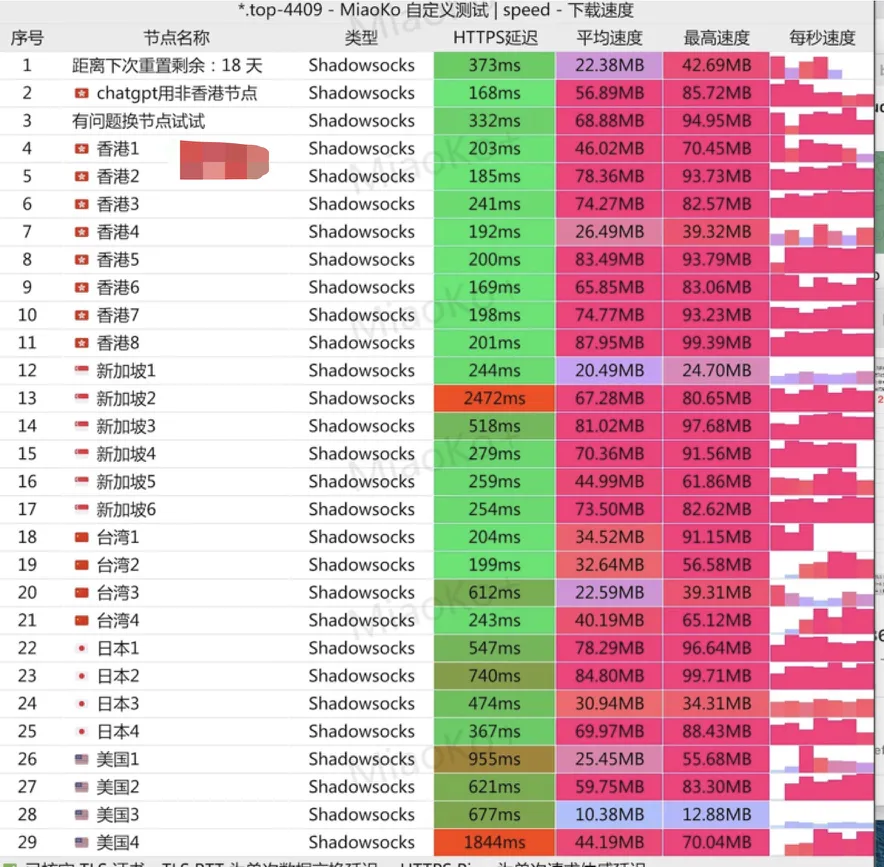

## 🌟 贝贝云机场测评：轻量级用户的优选方案

**贝贝云 Beibei.Cloud** 成立于 2022 年，是一款主打“入门友好+价格亲民”的中转型 Shadowsocks 协议机场。其特色在于江苏地区的隧道入口，配合稳定中转节点、分布在全球 30+ 地区的落地服务器，整体速度表现优秀，晚高峰也保持稳定连接体验。

> 📌 新手友好、价格透明、节点干净，适合轻度科学上网、ChatGPT 与流媒体用户日常使用。

<a href="https://beibeilink.top/register?code=Oa86Fbs3" target="_blank" style="color:#1a73e8;font-weight:bold;text-decoration:underline;">💡 立即注册贝贝云，填写专属优惠码享 95 折：beibei.cloud</a>

---

## 🔧 基础信息一览

| 评测维度       | 详情说明                                                                 |
|----------------|--------------------------------------------------------------------------|
| 开业时间       | 2022 年                                                                  |
| 协议支持       | Shadowsocks 协议                                                         |
| 节点数量       | 全球 30+ 节点：香港、新加坡、日本、美国、英国、台湾、马来西亚、阿根廷等     |
| 入口方式       | 江苏隧道 + 多地备用入口，中转模式稳定不易被墙                              |
| 流媒体支持     | ✅ Netflix 港/美/日区，✅ Disney+ US 4K，全平台 YouTube 流畅播放             |
| ChatGPT 解锁   | ✅ 全节点支持，推荐优先使用日本/新加坡线路，HK 节点偶有速率限制                |
| 设备限制       | 默认支持 5 台设备同时在线，无强制限制                                      |
| 支付方式       | 支持支付宝、微信、USDT（1U 手续费另计）                                   |
| 限制说明       | 屏蔽 SMTP 协议（邮件客户端），屏蔽 22 端口，屏蔽部分政治敏感网站              |
| 落地资源       | Hytron、Akari、PoloCloud、Eons、香港 HGC 等                               |
| 客服与社群     | 提供 TG 官方频道，客服在线响应较快，无公开群组                             |

---

## 💰 套餐与流量价格表

| 套餐名称   | 每月流量 | 月付价格 | 季付价格 | 每次重置价格 |
|------------|----------|----------|-----------|---------------|
| 基础套餐   | 100 GB   | ¥14.9    | -         | ¥15           |
| 标准套餐   | 200 GB   | ¥22.9    | ¥62.9     | ¥23           |
| 高配套餐   | 300 GB   | ¥32.9    | -         | ¥33           |
| 扩容套餐   | 500 GB   | ¥49.9    | -         | ¥50           |
| 大水管套餐 | 1000 GB  | ¥79.9    | -         | ¥80           |

> 📌 套餐不含手续费，支持一键重置当月流量，不增加时长。节点数和速度在各档套餐中保持一致。

---

## 📊 实测速度与解锁表现（2025年6月12日）

### ⚡ 节点测速：平均速度稳定，部分节点超 90MB/s

通过 MiaoKo 自定义测速脚本，对 29 个节点进行测试，表现如下：

- 香港节点：平均速度 60~90MB/s，稳定性较高
- 新加坡/日本：整体延迟低于 300ms，适合访问 ChatGPT / Claude / Gemini
- 美国节点：部分存在延迟偏高，但流媒体可播放 1080p
- 支持流媒体解锁：Netflix 港/美/日、Disney+ US、YouTube、TikTok 港区投稿等

---

## ✅ 推荐人群

- 🎯 新手用户 / 科学上网入门者
- 💰 预算有限但需要稳定连通 ChatGPT / YouTube 的用户
- 📺 日常 Netflix / Disney+ / TikTok 等流媒体使用者
- 📦 不需要太多技术设置，希望“开箱即用”的轻度用户

---

## 📦 注册与优惠码

  <a href="https://beibeilink.top/register?code=Oa86Fbs3" target="_blank" style="
    display:inline-block;
    background:linear-gradient(90deg,#00b09b,#96c93d);
    color:#fff;
    font-weight:600;
    font-size:16px;
    padding:12px 24px;
    border-radius:8px;
    text-decoration:none;
    box-shadow:0 4px 14px rgba(0,0,0,0.25);
    transition:all 0.3s ease;
  " onmouseover="this.style.transform='scale(1.05)'" onmouseout="this.style.transform='scale(1)'">
    <strong>💸 点击前往 贝贝云官网，注册享 95 折优惠</strong>
  </a>

🎁 支付时输入专属优惠码：`beibei.cloud`，可享 95 折一次性优惠。

---

## 🔚 总结：小而美的入门级机场，适合当主力备用都不亏

贝贝云凭借较低门槛的价格、稳定可用的中转节点、基础但实用的功能，成为当前性价比最高的 Shadowsocks 协议机场之一。适合初学者作为主力起步选项，也可作为高端机场用户的备用线路。

> ✅ 稳定、干净、节点不挤 —— 这就是贝贝云的真实标签。

## 📚 延伸阅读推荐

- [🌐 科学上网机场推荐榜单（实时更新）](https://gptvpnhelper.com/airport-access/)

