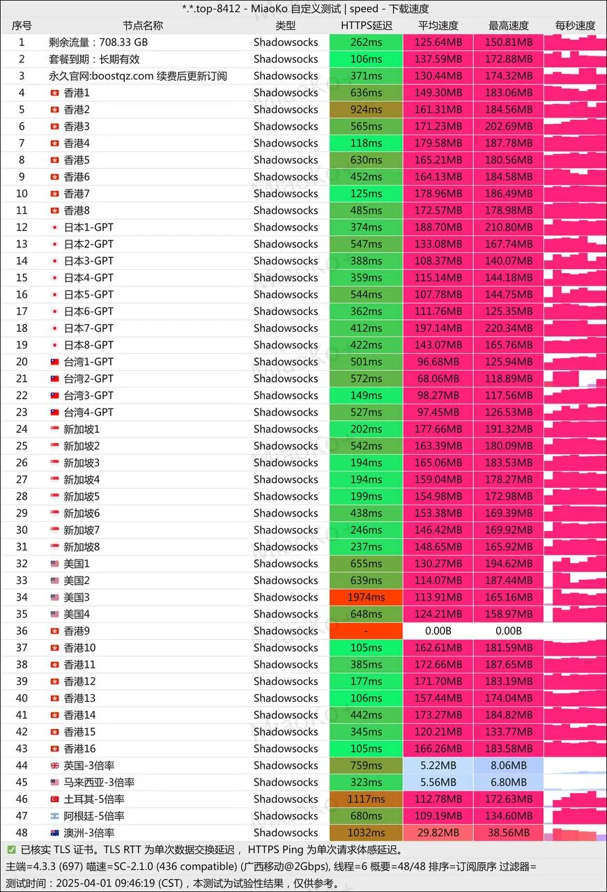

## ⚡ BoostNet 测评：小众精品，三网IEPL高速稳定直连

**BoostNet** 成立于 2020 年，是一家低调但稳定的专线机场，主打中国电信、联通、移动三网直连的 IEPL 专线通道，落地节点以香港 HGC 为核心，延迟低、速度快、覆盖广。支持 Shadowsocks 协议，全节点支持 UDP 及原生 IPv6，适合日常使用、备用及流媒体大带宽场景。

> 📌 三网直连、移动友好，体验流畅，是值得信赖的稳定型节点提供商。

---

## 📌 基础信息速览

| 项目           | 详情说明                                                                 |
|----------------|--------------------------------------------------------------------------|
| 开业时间       | 2020 年                                                                  |
| 接入方式       | 广东电信/联通/移动三网直连 → IEPL 专线出口落地香港 HGC                   |
| 节点地区       | 30+，含港/台/日/新/美/英/马/土/阿等地                                      |
| 协议支持       | Shadowsocks（不支持 SSR 软件）                                             |
| UDP 支持       | ✅ 支持全节点                                                              |
| IPv6 支持      | ✅ 香港/日本/美国节点原生 IPv6                                               |
| 流媒体解锁     | ✅ Netflix 港区、Disney+ US、Prime Video US 解锁，4K播放不卡顿              |
| ChatGPT 解锁   | ✅ 全节点支持，电信/移动访问延迟约 200-260ms                                |
| 登录设备限制   | 默认软限 5 台设备，后台可自助踢出                                          |
| 屏蔽与限制     | 禁 SMTP、22端口，屏蔽轮媒/rfa/pincong，1万以上端口封禁                     |
| 支付方式       | 支持支付宝 / 微信，无手续费                                                |
| 可用区域       | 仅限中国大陆使用，境外不可使用                                              |
| 管理系统       | v2board 面板，支持一键订阅 / 客户端配置                                     |
| 客服支持       | ✅ 提供客服，响应较快                                                       |

---

## 💰 套餐价格一览

| 套餐流量    | 月付    | 季付    | 半年付  | 年付     | 说明                     |
|-------------|---------|---------|---------|----------|--------------------------|
| 20G/年      | -       | -       | -       | ¥118     | 年度备用热门爆款         |
| 200G/月     | ¥39     | ¥100    | ¥220    | ¥350     | ⭐ 主力套餐               |
| 400G/月     | ¥58     | ¥150    | ¥310    | ¥500     |                          |
| 1000G/月    | ¥108    | ¥280    | ¥600    | ¥1000    |                          |
| 3000G/月    | ¥500    | ¥1500   | ¥2888   | ¥5688    | 团体用户/高带宽业务适用 |

🎁 **专属优惠码**：`boost`（新用户可享 8 折一次性优惠）

---

## 📊 实测数据展示（2025年4月）

使用 MiaoKo 脚本对 48 个 BoostNet 节点进行测速，表现如下：

- ✅ 延迟优秀：平均延迟低于 200ms，部分港区节点仅 100ms 内
- ✅ 峰值速率高：下载峰值超过 180MB/s，适合 4K / 多线程下载
- ✅ 节点丰富：HK/JP/SG/US 各地节点速度稳定，解锁能力强
- ✅ 流媒体全绿：Netflix / Disney+ / Prime Video 美区无压力播放

---

## 🧩 推荐人群

- 🎬 视频观看为主，追求 Netflix / Disney+ 稳定 4K 解锁者
- 🧑‍💻 远程办公 / AI 工具（如 ChatGPT / Claude）日常使用者
- 🔁 需要备用通道、高容错率的中高强度用户

---

## 💡 注册优惠入口

  <a href="https://boostnet1.com/register?code=kKMFirlm" target="_blank" style="
    display:inline-block;
    background:linear-gradient(90deg,#1a73e8,#4285f4);
    color:#fff;
    font-weight:600;
    font-size:16px;
    padding:12px 24px;
    border-radius:8px;
    text-decoration:none;
    box-shadow:0 4px 14px rgba(0,0,0,0.25);
    transition:all 0.3s ease;
  " onmouseover="this.style.transform='scale(1.05)'" onmouseout="this.style.transform='scale(1)'">
    <strong>⚡ 点击前往 BoostNet 官网注册，立享 8 折优惠</strong>
  </a>

🎁 支付时填写优惠码：`boost`

---

## ✅ 总结：低调稳定三网专线机场，长期使用不失联

BoostNet 作为一家三网直连 IEPL 高速机场，专注节点稳定与带宽表现，后台功能完善、流媒体全绿解锁。价格合理，配置灵活，是日常主力 / 备用通道的强力候选之一。

> 📝 **一句话评价**：三网加持、解锁全绿、低调稳定，是值得长期信赖的主力机场。

## 📚 延伸阅读推荐

- [🌐 科学上网机场推荐榜单（实时更新）](https://gptvpnhelper.com/airport-access/)
