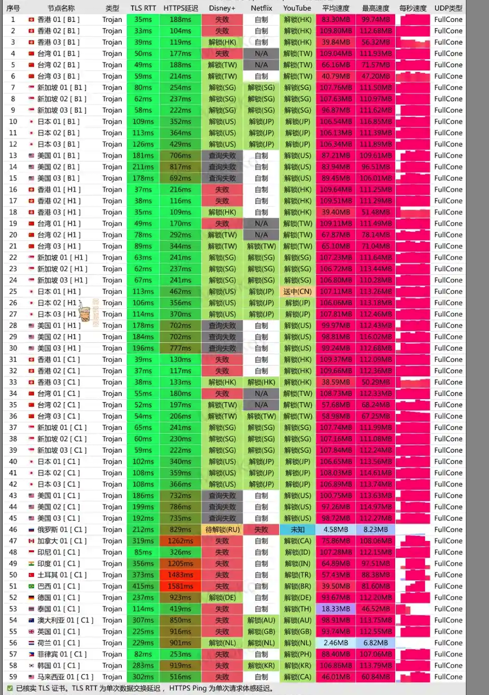
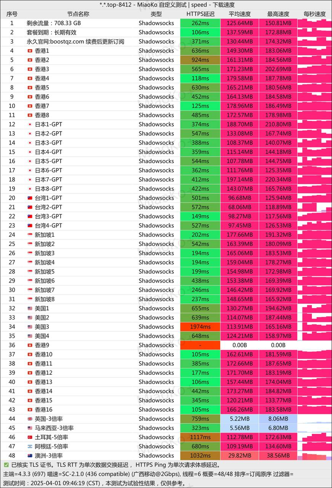
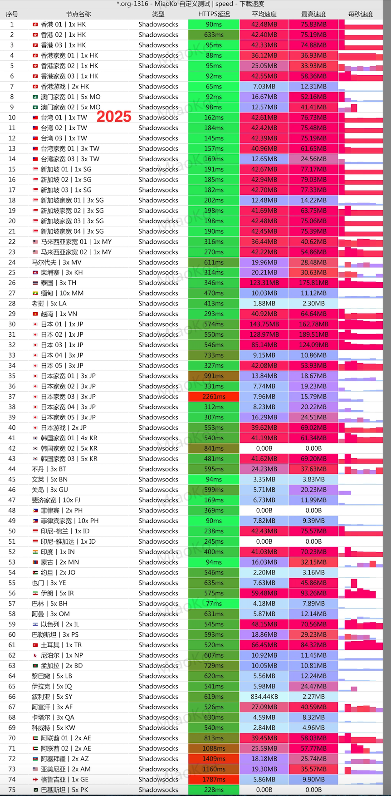
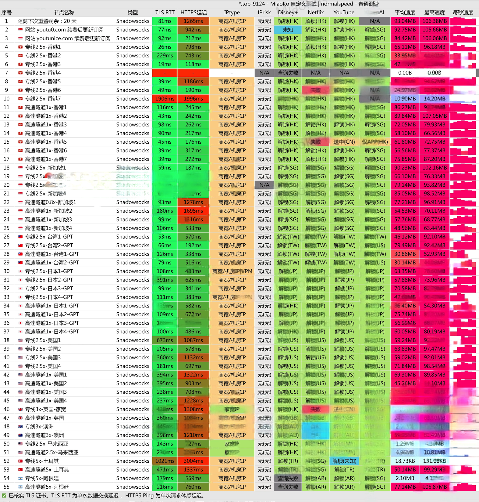
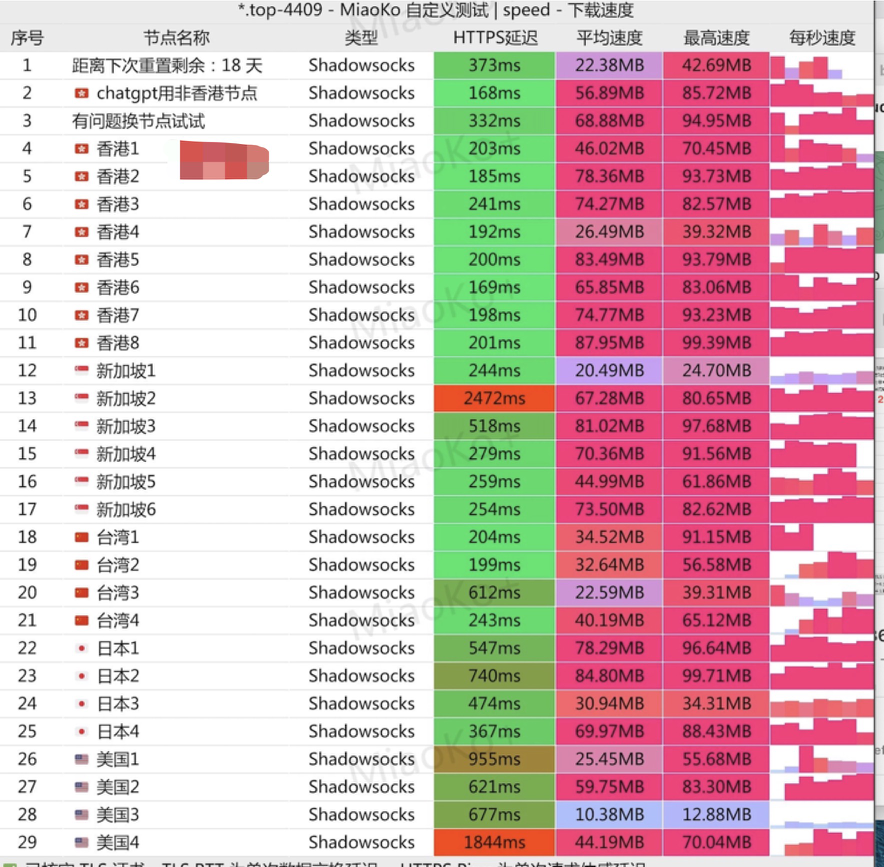
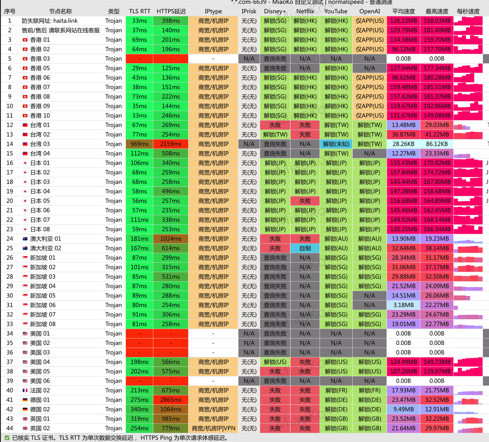

在全球互联网内容日益丰富的今天，科学上网已成为中文用户获取知识、拓展视野、连接世界的重要工具。  
然而，市场上的机场服务质量参差不齐，选错不仅影响体验，还可能带来安全隐患。

为了帮助大家少走弯路，本项目由 **ChatGPT 中文助手导航站** 精心策划出品，  
专为需要稳定高速科学上网的中文用户，推荐经过实测筛选的优质机场服务商。

我们从**速度、稳定性、节点覆盖、价格、安全性、隐私保护、用户体验**等多个关键维度，  
进行长期真实测评与对比分析，只推荐值得信赖、适合不同需求人群的优秀服务。

希望通过本榜单，帮助你轻松找到适合自己的科学上网解决方案，  
无论是访问 YouTube、ChatGPT、Netflix、Google，还是进行跨境工作与留学科研，都能顺畅无忧！

---

## 目录
1. [什么是机场](#什么是机场)  
2. [机场和VPN对比](#机场和VPN对比)  
3. [如何挑选靠谱机场](#如何挑选靠谱机场)  
4. [七大精选机场深度评测](#七大精选机场深度评测)  
5. [关键参数横向对比表](#关键参数横向对比表)  
6. [风险提示与购买建议](#风险提示与购买建议)  
7. [一分钟上手教程](#一分钟上手教程)  
8. [免责声明与结语](#免责声明与结语)  

---

## 什么是机场？
在中文互联网语境中，“**机场**”泛指以 **Shadowsocks / V2Ray / Trojan** 等加密协议为核心、采用 *订阅链接* 向用户批量分发节点的 **代理服务**。与传统 VPN 的“一条线路走天下”不同，机场背后往往是一整套负载均衡系统：包含多条大陆入口线路（直连/专线/隧道）、多组过境方案（IEPL 内网专线、BGP 高防、隧道中转）以及遍布全球的落地服务器（家宽 IP、商宽 IP、云服务商 IP）。

拥有机场意味着什么？

| 场景 | 机场能做的事 |
| :-- | :-- |
| **内容娱乐** | 解锁 Netflix 地区番剧、Disney+ 独家资源、YouTube 4K HDR、Spotify 全球曲库、NBA League Pass、Prime Video 限定剧集 |
| **工作学习** | 无障碍访问 ChatGPT、Claude、Gemini、Hugging Face；远程登录 GitHub、Docker Hub 拉取镜像；提交 App Store/Play Console 应用；跨区做市场调研 |
| **跨境电商** | 运营 Amazon 海外站、eBay Listing、Shopify 店铺；同步 ERP；查看各国 SERP；跑 Google Ads / FB Ads 广告投放 |
| **游戏加速** | 切换 Steam 土区 / 阿根廷区；低延迟连接 PSN / Switch 服；游玩 MMO 日服韩服美服 |
| **数字生活** | 注册外区 Apple ID / Google Play 账号；购买外区 Gift Card；订阅 iCloud+ 或 YouTube Premium 低价区 |

> **一句话**：机场 = 多节点、可定制、富可玩性的“全球网络加速包”。

---

## [🆓 免费机场推荐：V2Free](https://w1.v2free.cc/auth/register?code=i0A3)

如果你当前完全无法访问外网（比如连 ChatGPT 和 VPN 官网都打不开），可以先注册一个免费机场作为临时通道：

👉 [点击注册 V2Free（每日领取免费流量）](https://w1.v2free.cc/auth/register?code=i0A3)
- 此机场作者已使用了2年,可免费可购买套餐,便宜稳定
- 支持 Clash、V2rayN 导入
- 每日免费流量
- 可用于访问 ChatGPT、YouTube、GitHub、VPN 官网等

---

## 机场和VPN对比

| 维度 | VPN | 机场 |
| :-- | :-- | :-- |
| **连接方式** | 官方客户端一键全局 | 订阅导入→策略组→分流 |
| **节点数量** | 3‑10 条主流出口 | 30‑200+ 全球线路 |
| **灵活度** | 全局 / 分应用（少数支持） | 域名 / 端口 / IP 分流、规则自定义、链式代理 |
| **速度上限** | 受单机带宽、用户量限制 | 取决于机场总带宽投入与线路等级 |
| **价格区间** | 2‑12 USD/月 | 5‑120 CNY/月（高中低档全覆盖） |
| **协议可选** | OpenVPN / WireGuard 等 | SS / Vmess / Trojan 并存，可混用 |
| **解锁能力** | Netflix 仅部分；ChatGPT 看官方策略 | 机场通常针对流媒体 + AI 服务优化，解锁率高 |

**核心结论**
- **VPN**：极简易用，适合“连上就走”的零基础用户。
- **机场**：DIY 空间大，速度、价格、可玩性三维度均可按需选择。对“翻墙”质量有强需求的开发者、跨境卖家、内容创作者，机场更香。

---

## 如何挑选靠谱机场？
1. **线路架构**：优先 IEPL 专线 > 隧道中转 > 直连公网。专线延迟低、抖动小；中转更考验运营商的带宽采购能力；直连最便宜，但易被限速。
2. **带宽与并发**：看老板是否公开总带宽、是否分时段测速、是否针对晚高峰扩容。1000 Mbps 专线 x 多条 > 单条 GIA 直连。
3. **落地 IP 与解锁**：原生 / 家宽 IP 对 Netflix 等流媒体尤为关键。ChatGPT 需“非中国”地区且未被滥用封号的 ASN。
4. **口碑与运营年限**：开业越久、测速记录越多、Telegram 社群越活跃的机场，跑路概率越低。
5. **套餐灵活度**：最好支持月付 / 季付 / 流量包，支持支付宝或 USDT；设备数量与重置流量机制要透明。

> **Tips**：口号再响、价格再低，没有“带宽投入 + 技术运维”统统是空谈。选择时请秉持“先月付试水，再长期续费”的原则。

---

## ✨ 如果你不想看完整评测，直接根据我的个人推荐选择：
根据长期实际体验和稳定性测试，以下是我为不同需求用户精选的快速推荐：
---
🥇 高端机场推荐：[WgetCloud](https://invite.wgetcloud.ltd/auth/register?code=xEgJKS)
- 推荐理由： WgetCloud 是业界少有的顶级机场，节点遍布全球，速度极快且稳定性极高。专线带宽，无惧晚高峰，流媒体（Netflix、YouTube 4K、Disney+ 等）全解锁。适合高强度科学上网、远程办公、游戏加速、高清视频流用户。对速度和体验要求极高的重度用户首选。
- 👉 [点击前往 WgetCloud 官网,新用户享85折优惠](https://invite.wgetcloud.ltd/auth/register?code=xEgJKS)

---
🥈 中端机场推荐：[BoostNet](https://boostnet1.com/register?code=kKMFirlm)、[悠兔机场](https://youtu1.xyz/register?aff=erkQTmbM)
- BoostNet 推荐理由： BoostNet 线路优化优秀，拥有优质节点，速度快、延迟低，流媒体解锁能力强大，适合追求稳定和体验同时又希望控制预算的用户。性价比非常高，日常使用体验媲美高端机场。
- 👉 [点击前往 BoostNet 官网,享8折优惠](https://boostnet1.com/register?code=kKMFirlm)
- 新人8折优惠券：boost

---

- 悠兔机场 推荐理由： 悠兔机场价格实惠，线路稳定，适合日常使用，包括访问谷歌、ChatGPT、海外流媒体。对于预算有限又希望获得流畅体验的用户，悠兔是非常值得选择的中端梯队代表。
- 👉 [点击前往 悠兔官网享8折优惠](https://youtu1.xyz/register?aff=erkQTmbM)
- 新人 8 折优惠码：888

---
🥉 低端机场推荐：[贝贝云](https://beibeilink.top/register?code=Oa86Fbs3)
- 推荐理由： 贝贝云属于入门级机场，价格非常亲民，适合轻度科学上网使用，如日常网页浏览、访问海外资料、简单使用 ChatGPT 等,对流媒体晚高峰要求不高。对于不需要高强度大流量应用的用户来说，是最具性价比的起步选择。
- 👉 [点击前往 贝贝云 官网](https://beibeilink.top/register?code=Oa86Fbs3)

✅ 小提醒：上面是快速推荐，适合不同预算和使用需求直接参考。
如果你希望深入了解各大机场的详细测速、节点分布、流媒体解锁能力等信息，请继续阅读下面的「七大精选机场深度评测」。

---

## 七大精选机场深度评测

> 以下七家从 40+ 热门机场中精挑细选，覆盖高端旗舰、平价主力、入门备胎三大梯度，确保不同预算、不同场景都能找到契合方案。

### 1 . [WgetCloud — 高端旗舰，企业级稳定](https://invite.wgetcloud.ltd/auth/register?code=xEgJKS)
**综合评分：9.6 / 10**  
**关键词**：广州 IEPL｜自研面板｜多线路分组｜邮件通知

| 指标 | 数据 |
| :-- | :-- |
| 开业时间 | 2021 |
| 入口 / 过境 | 广州 BGP 接入 → IEPL 专线出海 |
| 节点国家 | 18 国 59 落地 IP（香港、日本、新加坡、美国、英国、德国…） |
| 协议 | Trojan（主力）+ Shadowsocks（兼容路由器） |
| UDP 支持 | 全节点 Full‑Cone |
| 流媒体 | Netflix 美/日 4K 全绿，Disney+ HK/US 全绿 |
| ChatGPT | 台湾动态 IP 解锁，晚高峰 180‑220 ms |
| 客户端限制 | 3 设备，同时在线软限，超额会被推迟握手 |
| 官网支付 | 先充值 → 套餐，支付宝手续费 6‑9% |
| 售后 | 工单 + 邮件，平均响应 1‑3 h |

**套餐速览**
- **基础组 B**：按月 140 GB/月 → ¥59；按季 200 GB/月 → ¥177；按年 240 GB/月 → ¥588
- **优质组 C**：按月 160 GB/月 → ¥69；按季 220 GB/月 → ¥195；按年 280 GB/月 → ¥708
- **精品组 H**：1按月 180 GB/月 → ¥79；按季 240 GB/月 → ¥228；按年 320 GB/月 → ¥828

**推荐受众**  
运营团队 / 视频剪辑工作室 / 重度 AI 调用者，需要“全年无故障、高速低抖动”体验的人；适合预算充足的用户,贵是真贵,好是真好,各项指标拉满

👉 [点击前往 WgetCloud 官网,新用户享85折优惠](https://invite.wgetcloud.ltd/auth/register?code=xEgJKS)

**实测体验**

---

### 2 . [BoostNet — 三网 IEPL，带宽拉满](https://boostnet1.com/register?code=kKMFirlm)
**综合评分：9.2 / 10**  
**关键词**：深港专线｜移动友好｜新人 8 折｜一年 118 备用流量包

| 指标 | 数据                                            |
| :-- |:----------------------------------------------|
| 开业时间 | 2020                                          |
| 入口 / 过境 | 广东三网 IEPL → 香港 HGC 落地                         |
| 节点 | 30+ （HK/JP/SG/US/UK/MY/TR/AR…）                |
| 协议 | Shadowsocks（仅支持 SS 客户端）                       |
| UDP / IPv6 | UDP 全开，HK/JP/US 原生 IPv6                       |
| 流媒体 | Netflix 港区 4K，Disney+ 美区 4K，Prime Video US 可用 |
| ChatGPT | 全节点解锁，移动出口 200‑260 ms                         |
| 登录限制 | 5 IP 软限，可后台踢设备                                |
| 付款 | 支付宝/微信，直接套餐，无额外费率                             |

**套餐速览**
- **200 GB/月**：¥39；季度 ¥110 / 年 ¥350
- **400 GB/月**：¥58；季度 ¥150 / 年 ¥500
- **20 GB/月**：¥118/年，极佳备用包

**推荐受众**  
想要“大水管 + 月付可大可小”且重度流媒体的用户；

👉 [点击前往 BoostNet 官网,享8折优惠](https://boostnet1.com/register?code=kKMFirlm)
- 新人8折优惠券：boost

**实测体验**

---

### 3 . [TAG — 全球 90+ 国家宽原生 IP](https://honven.dedicated-afflink.com/#/auth/lN2XqdIt)
**综合评分：9.0 / 10**  
**关键词**：冷门地区｜家宽 IP｜影片解锁狂魔｜年付 154 超值

| 指标 | 数据                                             |
| :-- |:-----------------------------------------------|
| 开业时间 | 2018                                           |
| 入口 / 过境 | 深圳 → 深港 IEPL                                   |
| 节点 | 220+，覆盖 92 国，含 AT&T US 家宽、KDDI JP、CTM MO …     |
| 协议 | Shadowsocks                                    |
| UDP | 大部分节点 Full‑Cone                                |
| ChatGPT | 全解锁                                            |
| 流媒体 | 支持 Netflix 90+ 区，Disney+ / Hulu / HBO Max 全部畅通 |
| 登录限制 | 10 设备                                          |
| 付款 | 支付宝 + USDT                                     |

**套餐速览**
- **个人 Bronze**：250 GB/月 → ¥176/季
- **流量包**：200 GB/年 → ¥154（口碑爆款，作为备用性价比极高）
- **团队套餐**：3 TB/月 → ¥627/月

**推荐受众**  
流媒体爱好者 / 需要注册各国账号的数字玩家 / 需要冷门国家 IP 做 SEO、投放 A/B 测试的跨境从业者。

👉 [点击前往 TAG 官网注册](https://honven.dedicated-afflink.com/#/auth/lN2XqdIt)

**实测体验**

---

---

### 4 . [悠兔 — 电信入口，专线 + 隧道混合](https://youtu1.xyz/register?aff=erkQTmbM)
**综合评分：8.6 / 10**  
**关键词**：多入口负载均衡｜120 ¥/年 200 GB 流量包｜8 折代码“888”

| 项 | 值 |
| :-- | :-- |
| 开业 | 2022 |
| 入口/过境 | 广东电信 → IEPL 专线 + 隧道中转 |
| 协议 | Shadowsocks |
| 节点 | 35+，负载均衡后端，多商家落地 |
| UDP | 支持 |
| 流媒体 | Netflix JP/US/HK，Disney+ US 4K，无降码率 |
| ChatGPT | 全解锁，回程 190‑230 ms |
| 登录 | 5 IP 软限 |
| 支付 | 支付宝 / 微信 |

**套餐建议**
- **150 GB/月**：¥29；季度 ¥85
- **流量包 200 GB/年**：¥120（小白买来当“保险箱”）

**体验要点**
- 动态倍率：默认 1x 隧道；高需求可切 2x IEPL 专线。
- 入口多且分区独立，单一入口被阻断时其余正常。
- 后台支持“付费流量重置”无需重新购买套餐。

👉 [点击前往 悠兔官网享8折优惠](https://youtu1.xyz/register?aff=erkQTmbM)
- 新人 8 折优惠码：888

**实测体验**

---

### 5 . [贝贝云 — 95 折高性价比，江苏隧道入口](https://beibeilink.top/register?code=Oa86Fbs3)
**综合评分：8.4 / 10**  
**关键词**：14.9 /月 100 GB｜95 折码“beibei.cloud”｜TG 社群活跃

| 项 | 值 |
| :-- | :-- |
| 开业 | 2022 |
| 入口 | 江苏隧道 + 备用中转 |
| 节点 | 30+（HK/JP/SG/US/UK/MY/TR/AR…） |
| 协议 | Shadowsocks |
| 流媒体 | Netflix 港/美/日，Disney+ US 4K |
| ChatGPT | 全解锁，HK 节点易被限流，建议 JP/SG |
| 登录 | 5 设备 |
| 支付 | 支付宝 / 微信 |

**套餐**
- 100 GB ¥14.9/月（主推）
- 200 GB ¥22.9/月；季付 ¥62.9
- 1000 GB ¥79.9/月

👉 [点击前往 贝贝云 官网](https://beibeilink.top/register?code=Oa86Fbs3)

**实测体验**

---

### 6 . [海獭 — Trojan 入门价，季度 ¥25 = 50 GB/月](https://aff.joinhaita.com/register?aff=Jqfg23Tx)
**综合评分：8.0 / 10**  
**关键词**：中部入口｜不限设备｜Trojan 全节点

| 指标 | 数据                            |
| :-- |:------------------------------|
| 上线 | 2020 Q4                        |
| 协议 | Trojan                        |
| 入口 / 过境 | 中部地区 → 公网中转                   |
| 节点 | 23+（HK/JP/SG/US/CA/TW/KR）     |
| 流媒体 | Netflix JP/HK 解锁；Disney+ 部分节点 |
| ChatGPT | 约 20 % 节点可用，入口经常更新            |
| 登录 | 不限设备                          |
| 支付 | 支付宝                           |

**套餐**
- **季度 50 GB/月**：¥25
- **月付 100 GB**：¥15.99
- **月付 700 GB**：¥54.99

**体验**
- Trojan 协议天然抗审计，配合自签 TLS 证书，HTTP3 握手更稳。
- 未限制路由器使用，适合家里多台设备共同走流量。

👉 [点击前往 海獭 官网](https://aff.joinhaita.com/register?aff=Jqfg23Tx)

**实测体验**

---

### 7 . [龙猫云 — Hytron 入口，无限设备](https://inv03.lmaff01.cc/register?aff=Y6CVzzEF)
**综合评分：7.9 / 10**  
**关键词**：67 节点｜Hytron 香港｜全节点 ChatGPT

| 项 | 值 |
| :-- | :-- |
| 开业 | 2022 |
| 协议 | Trojan |
| 入口 / 过境 | Hytron 香港直连 + 隧道中转 |
| 节点 | 67（HK/JP/SG/MY/US/TW/TR/AR…） |
| 登录 | 不限设备 |
| 流媒体 | Netflix JP/US/HK/SG 全解锁，YouTube 4K ≥ 30 Mbps |
| ChatGPT | 全节点解锁，延迟 190‑240 ms |
| 支付 | 支付宝 / 微信 |

**套餐**
- 100 GB ¥15/月
- 400 GB ¥60/月
- 1000 GB ¥120/月

**特色**
- 官方明确支持境外登陆；适合作为“海内外双居”用户的移动热点方案。
- 定期更新落地列表，方便做 IP 库白名单。

👉 [点击前往 龙猫云 官网](https://inv03.lmaff01.cc/register?aff=Y6CVzzEF)

**实测体验**

---

## 关键参数横向对比表

| 机场 | 定位 | 协议 | 参考月付 | 月流量 | 入口 / 过境 | 流媒体 | ChatGPT | 登录数 |
| :-- | :-- | :-- | :--: | :--: | :-- | :-- | :-- | :--: |
| WgetCloud | 高端旗舰 | Trojan/SS | ¥59 | 140 GB | 广州 → IEPL | 4K 全绿 | 台湾 IP | 3 |
| BoostNet | 高速主力 | SS | ¥39 | 200 GB | 深港 IEPL | 4K 全绿 | 全解锁 | 5 |
| TAG | 多国家宽 | SS | ¥176/季 | 250 GB | 深港 IEPL | 92 国解锁 | 全解锁 | 10 |
| 悠兔 | 稳稳性价 | SS | ¥29 | 150 GB | 电信 IEPL+隧道 | JP/US/HK | 全解锁 | 5 |
| 贝贝云 | 低价主力 | SS | ¥14.9 | 100 GB | 江苏隧道 | 港/美 4K | 全解锁 | 5 |
| 海獭 | 入门 Trojan | Trojan | ¥15.99 | 100 GB | 中转公网 | 部分 | 部分 | ∞ |
| 龙猫云 | 无限设备 | Trojan | ¥15 | 100 GB | Hytron 直连+隧道 | 多区 4K | 全解锁 | ∞ |

---

## 风险提示与购买建议
1. **月付 / 季付优先**：机场行业缺乏监管，坚决不要一次性充年费给“小透明”。
2. **备份通道**：至少保留两家不同线路、不同协议的机场，出现地区性封锁可秒切换。
3. **紧盯公告**：Telegram / 邮件渠道发布的“入口变更”“节点迁移”需第一时间更新订阅，否则可能出现域名污染。
4. **合法合规**：严禁利用机场从事任何违法活动，否则账号冻结、追责风险自负。

---

## 一分钟上手教程
1. 注册 & 选套餐 → 获得专属订阅链接 `https://example.com/sub/xxxxxxxx`
2. 安装 **Clash Verge / Mihomo-Party / Shadowrocket / Clash Meta**（按系统选择）
3. 导入订阅 → 更新 → 选择延迟最低的节点 → 开启系统代理
4. 打开 `https://chat.openai.com` / `https://www.youtube.com` 测试；若加载正常即成功
5. 高阶设置：
   - 配置 **规则分流**（ChatGPT 走美区节点、视频走 HK 节点、其余直连）
   - 启用 **自动测速** 每 30 分钟切换最佳节点

---

## 免责声明与结语
本文所有数据基于公开测速、实际体验与用户反馈，仅作学习交流，不构成任何法律或投资建议。在任何情况下，作者不对因使用本仓库信息而导致的直接或间接损失承担责任。请各位务必遵守当地法律法规，合理合规使用科学上网服务。

> 科学上网，先科学，后上网；愿你我都能自由、安全、快速地拥抱世界知识。

---

## 📚 推荐配套教程

- [🔐 VPN 推荐榜单](https://gptvpnhelper.com/network-access/)
- [📝 ChatGPT 注册教程](https://gptvpnhelper.com/chatgpt-register-guide/)
- [💳 ChatGPT Plus 升级指南](https://gptvpnhelper.com/chatgpt-plus-guide/)
- [📘 ChatGPT 中文教程主站](https://gptvpnhelper.com)

---

📂 GitHub Pages 主站地址：[https://gptvpnhelper.com](https://gptvpnhelper.com)  
⭐ 如果你觉得本站有帮助，请点击 Star 或分享给有需要的朋友  
---
