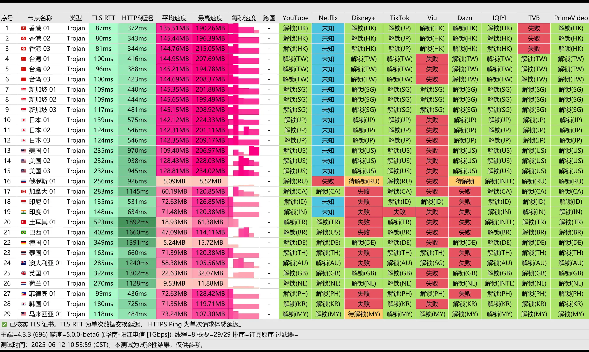
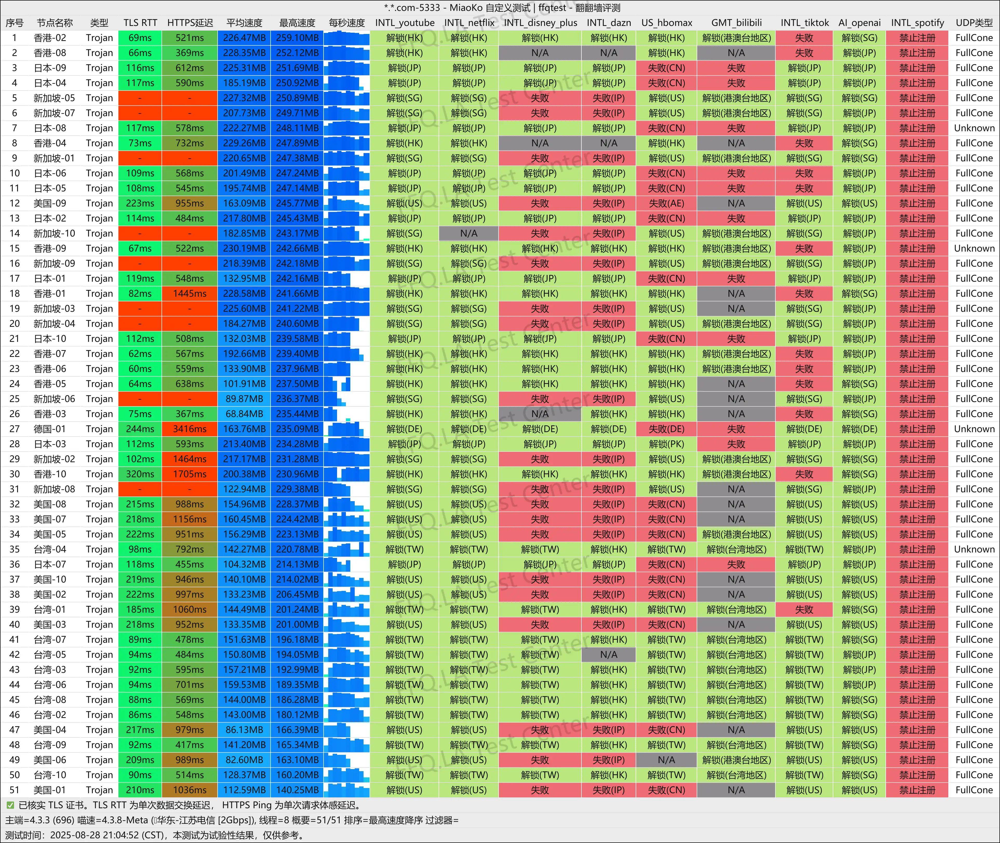
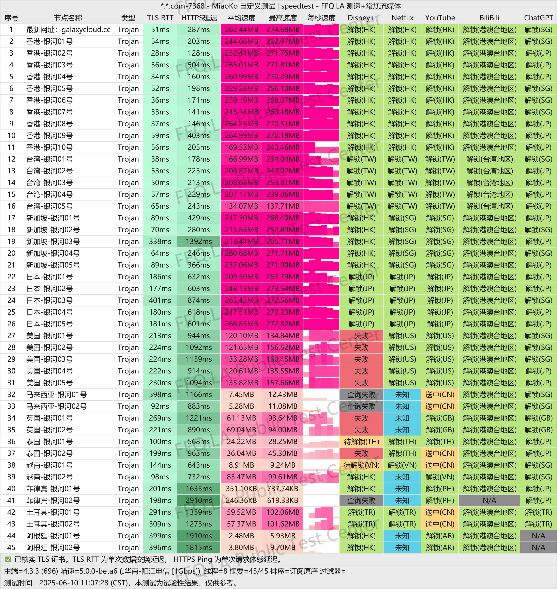
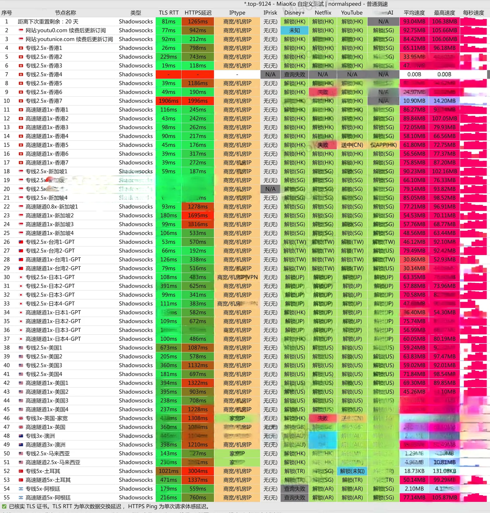
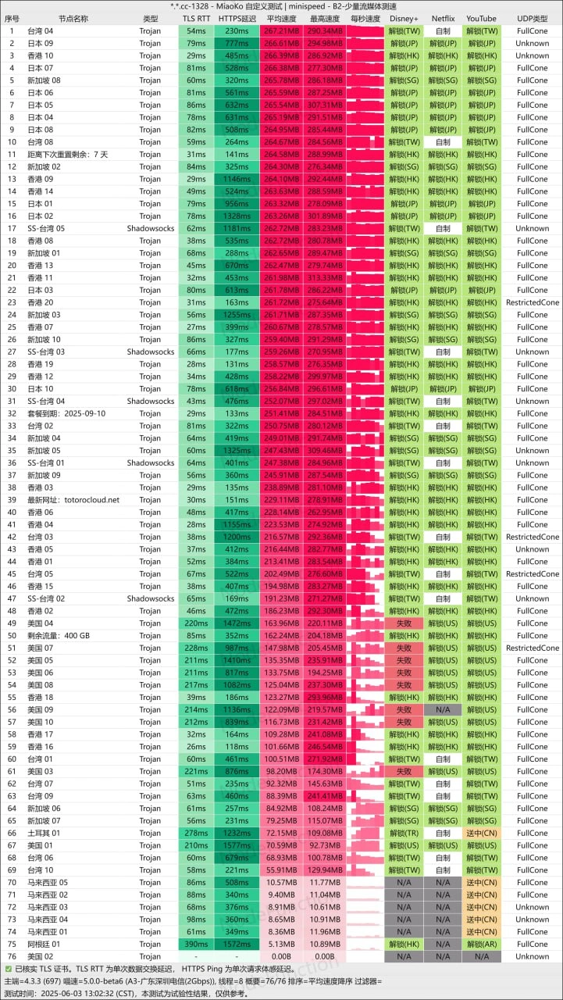

## 引言
🚀 本页面为 2025 年最新实测中文科学上网机场推荐榜单，由 **[ChatGPT 中文助手导航站](https://gptvpnhelper.com)** 出品，  
实测筛选支持 Clash、V2Ray、Trojan 协议的高质量机场服务，覆盖 Windows、Mac、iOS、Android 等主流平台。

我们通过真实测速，评估机场的**节点速度、稳定性、流媒体解锁能力、晚高峰表现与价格性价比**，  
帮助你快速选择适合访问 YouTube、Netflix、ChatGPT、Google 等服务的稳定科学上网方案。

内容包含机场推荐、流量套餐对比、科学上网教程、配置指南与节点导入方式，  
无论你是初次科学上网、跨境办公、海外留学还是流媒体重度用户，都能在此找到最合适的机场解决方案。

> 最近更新: 2025年9月29日

---

## 📚 目录

### 📖 基础知识
1. [什么是机场？科学上网的原理与作用](#ssssr)
2. [免费试用机场推荐](#free)

### 🎯 选购指南：如何挑选适合你的机场服务
3. [如何挑选靠谱机场？](#choose)
4. [快速选择适合自己的机场服务](#person)
5. [精选机场深度评测（2025 最新）](#top7)

### 🚀 使用教程：快速上手科学上网
6. [一分钟快速上手教程｜配置机场科学上网全流程](#study)

### ⚠️ 风险意识与责任说明
7. [购买建议与风险提醒（如何防跑路/规避封锁）](#risk)
8. [免责声明](#免责声明)

### 关于机场和VPN
9. [机场 vs VPN：哪个好用？适合谁？](#vs)

### 📖 更多阅读
10. [❓ 常见问题 FAQ（AEO优化）](#faq)
11. [🌐 常用网站推荐](#listweb)
12. [📎 更多配套教程阅读](#resources)

---

## ✈️ 什么是“机场”？科学上网的原理与作用（2025版）

在中文网络环境中，**“机场”**一词广泛用于指代一类基于 **Shadowsocks、V2Ray、Trojan** 等加密协议构建的科学上网工具。通过**订阅链接（Subscription URL）**，用户可一键获取多国节点，实现更为稳定、灵活地突破防火墙，畅享全球网络内容。

相比传统 VPN 单一路线的运行机制，机场服务主打**多节点、智能分流**，常见特性包括：

- ⛓️ 多种**入口链路**（如直连、CN2 专线、隧道中转）
- 🌉 多样的**过境技术**（IEPL 内网专线、BGP 高防网络、加密隧道等）
- 🌍 全球分布的**落地节点**（涵盖原生 IP、家庭宽带、云服务商 IP）

---

### 🎯 机场的使用场景：能做什么？

| ✅ 应用领域 | 🌐 解锁能力一览 |
|------------|------------------|
| **内容娱乐** | 支持访问 **Netflix、Disney+、YouTube 4K HDR、Spotify 全球曲库、Prime Video、NBA League Pass** 等受限平台 |
| **AI 工具与远程办公** | 畅用 **ChatGPT、Claude、Gemini、Hugging Face、Notion AI** 等工具，顺利登录 **GitHub、Docker Hub、OpenAI API** |
| **跨境电商运营** | 可高效管理 **Amazon、eBay、Shopify** 等店铺，投放 **Google/Facebook 广告**，同步 **ERP 系统**，实时查看目标国家 **SERP 页面** |
| **国际游戏加速** | 低延迟连接 **PSN、Switch、Steam** 全球服务器，自由切换至 **阿根廷、土耳其** 等低价区加速体验 |
| **数字生活拓展** | 注册美区 **Apple ID** 或 **Google Play** 账号，购买海外礼品卡，订阅低价地区 **iCloud+、YouTube Premium、Spotify Family Plan** 等服务 |

---

> 💡 **简而言之：**  
> “机场” 是一种融合**多节点调度、智能流量分流与全球加速**的科学上网解决方案，灵活性胜过 VPN，稳定性优于传统代理，堪称 2025 年访问 **ChatGPT、YouTube、Netflix** 等平台的优选工具。

---

## 🆓 限时免费高端机场推荐：<a href="https://bbxy.xn--cesw6hd3s99f.com/auth/register?code=FFHk" target="_blank" style="color:#1a73e8;text-decoration:underline;">百变小樱</a> —— 稳定实用科学上网方案

### 🚀 无法访问 ChatGPT、YouTube、GitHub？先用这个免费机场恢复联网！

如果你当前处于**完全无法翻墙**的状态 —— 无法打开 ChatGPT、YouTube、Google、GitHub 或 VPN 官网，那么这款 **限时免费高端IEPL专线机场「百变小樱」** 是你最佳的起点选择。

📌 **强烈建议立即注册，恢复基础联网能力，体验顶级加速 IEPL 专线！**

---

### ✨ 为什么推荐「百变小樱」机场？

**一句话价值主张：** 运营 **5+ 年** 的海外团队，IEPL 高速专线 + 全平台一键导入，支持 **3 天免费试用**，先体验后购买。

- ✅ **0 成本试用**：注册即享 **3 天免费体验**，先测速度与稳定性，再决定是否付费。
- ✅ **长期稳定**：海外团队持续运维 **5+ 年**，高峰期依然顺畅，故障响应及时。
- ✅ **IEPL 高速专线**：低延迟 / 大带宽 / 抖动小，适合游戏、远程办公、下载与超清观影。
- ✅ **灵活套餐**：从入门到高阶多档位选择，**可随时升级**，按需购买更省钱。
- ✅ **一键导入**：全面兼容 **Clash / Shadowrocket / SSR** 等主流客户端，订阅链接一键导入即用。
- ✅ **强力解锁**：**ChatGPT、YouTube、TikTok、Netflix、Disney+、HBO Max** 等平台稳定解锁，**4K 串流无压力**。
- ✅ **会员福利**：**LV3+** 用户可享 **Netflix / Disney+ / Prime Video** 等会员福利（以官方活动为准）。
- ✅ **影视党福音**：内置 **Emby 服务器**，精选高清片库，开箱即看更省心。
---

> 🧠 **作者实测使用超过3年，稳定性极高**。日常办公、AI 使用、高清观影、海外游戏、跨境电商访问，**全场景表现优秀，值得长期使用**！

**国庆活动！错过等一年！（9.27-10.10）**
- 活动1:
  **一年/三年套餐66折优惠码（不包含特惠套餐）：2025-10-1-12**
  注意：新套餐开通后会覆盖旧套餐，如欲升级年付以上套餐可发工单补差价升级！

- 活动2:
  **活动期间每日签到可获得5-10GB随机流量奖励！连续签到最高可获得150GB！**

- 活动3:
  **传家宝套餐限时返场（每日限量1个）**

- 活动4:
  **限时0.1倍率直连节点，无需购买套餐，免费使用，10月1日开启！**

📊 [👉 查看百变小樱机场详细测评：节点实测、配置教程、套餐介绍](https://gptvpnhelper.com/airport-access/bbxy/)

---

### 🔗 立即开启你的科学上网之路：

  <a href="https://bbxy.xn--cesw6hd3s99f.com/auth/register?code=FFHk" target="_blank" style="display: inline-block; padding: 12px 20px; background-color: #1E88E5; color: white; font-size: 16px; font-weight: bold; border-radius: 8px; text-decoration: none;">
    👉 免费注册百变小樱机场（限时开放中）
  </a>

🎁 试用期到期之后,若想购买付费套餐,购买套餐时可使用我们申请到的**专属95折优惠码: bbxy-5th**

---

> 💡 提示：科学上网的第一步是选择靠谱稳定的机场节点。**百变小樱作为新手推荐第一站，解决你“打不开 ChatGPT”的痛点**，是你通往自由互联网世界的起点。

---

## ❓如何挑选靠谱机场服务商？

### 🧱 网络架构优先级
**IEPL / IPLC 专线 > BGP 中转 > 普通中转 > 公网直连**
- 专线（IEPL/IPLC）：延迟低、丢包少、不易被墙，适合高频用户和游戏党
- 中转线路：体验较好但稳定性受节点调度影响
- 公网直连：最容易被限速或封锁，慎选

### 🚀 带宽与高峰体验
选择**公开带宽信息、支持高峰测速**的服务商：
- 多条千兆专线 > 单条 GIA / CN2
- 是否支持晚高峰时段测速是核心指标
- 高峰期无扩容能力，用户体验会严重下降

### 🌍 IP 落地与解锁能力
- 使用 Netflix、ChatGPT、TikTok 等服务，建议使用**原生 IP / 家宽 IP**
- 避免中国 ASN（如 4134/4837 等）落地，否则易封号、验证失败
- 优秀机场会标明各节点的地区、解锁能力及 IP 类型

### ⭐ 品牌口碑与运营资历
- 优先选择**稳定运营 1 年以上、社群活跃、有测速记录**的老牌机场
- 留意是否有官网测速页、Telegram 群组、自动工单系统等支持
- 谨防新站、无主匿名机场，跑路风险极高

### 💰 套餐灵活性与支付方式
- 支持**月付 / 流量包 / USDT / 支付宝**等多种方式，避免年付陷阱
- 留意是否限制设备连接数、流量是否周期重置、支持共享账号等细则
- 有些机场支持试用或限时退款，适合新手测试体验

---

### ⚠️ 风险提醒：远离免费与极低价机场

- ❌ 免费机场通常**存在以下风险**：
    - **严重限速、频繁掉线、带宽被滥用**
    - 被运营方**注入广告、追踪甚至监控**
    - **隐私安全无保障**，尤其不建议用于敏感操作（如科学上网登录金融账号）

- ❌ 超低价机场（如 9.9 元包年）存在：
    - **IP 长期污染无法访问外网**
    - 用户激增导致**服务崩溃、流量争抢**
    - 临时网站、一键搭建平台，一旦跑路毫无维权保障

> ✅ **建议策略**：使用稳定的主力机场搭配一个备用机场（可选择包流量的中转/专线套餐），确保关键时刻不断网。

---

## ✨ 如果你不想看完整评测，直接根据我的个人推荐选择：

根据长期实际体验和稳定性测试，以下是我为不同需求用户精选的快速推荐：

---

### 🚀 高端旗舰机场推荐（顶级速度 / 稳定解锁 / 高质量用户体验）

#### 1. [**WgetCloud 机场**｜顶级机场 · 自建面板 · 新用户85折](https://invite.wgetcloud.ltd/auth/register?code=xEgJKS)

- ✅ **自建面板 + 顶级带宽**，晚高峰照样稳如老狗，几乎从不掉速或卡顿
- ✅ **全平台流媒体解锁**：Netflix / Hulu / HBO / TVB / Happyon / AbemaTV
- ✅ **音乐平台支持**：Spotify、Pandora 无障碍访问
- ✅ **AI工具全面兼容**：ChatGPT、Claude、Midjourney 等完美支持
- ✅ 用户口碑极佳，是重度使用者首选

🎁 国庆活动2025年09月28日 - 2025年10月09日
👉 活动详情：在活动期间，您可以访问【活动商店】选购**限量优惠流量包**。具体活动产品内容请参考活动日的产品页面。

📊 [👉 查看 WgetCloud 机场详细测评：测速、解锁能力、套餐分析](https://gptvpnhelper.com/airport-access/wgetcloud/)

---

### 💎 中端主力机场推荐（主流流媒体 + AI工具 + 高性价比）

#### 1. [**小蜜蜂机场**｜IEPL专线 · 全场85折](https://tangwu095.xmfvipaff01.cc/register?aff=oClLBb5A)

- ✅ **IEPL 全专线节点**，无倍率限制，带宽直达
- ✅ **原生IP**，支持 Netflix / Disney+ / HBO / TikTok 等流媒体 & AI工具
- ✅ **不限客户端、不限设备连接数**
- ✅ 提供美区 ID，**一键下载小火箭 Shadowrocket**（iOS用户刚需）
- ✅ 小包年付低至 8 元/月，稳定是最大特色

🎁 专属优惠码：`xmfwww85`（全场 85 折）

📊 [👉 查看小蜜蜂机场详细测评：节点实测、配置教程、套餐介绍](https://gptvpnhelper.com/airport-access/xmf/)

---

#### 2. [**TNTCloud 机场**｜IPLC专线 · 海外团队 · 全套餐8折](https://tanu095.tntvipaff.cc/#/register?code=7MPbfr89)

- ✅ 原生 IP + 高速 IPLC 专线，适合开发者 / AI用户 / 流媒体重度用户
- ✅ 解锁 ChatGPT、TikTok、Netflix、Copilot 等工具毫无压力
- ✅ 支持多设备 / 不限速 / 稳定持久运行
- ✅ 海外团队运营，响应快，适合长期使用

🎁 专属优惠码：`2510815`（全场 8 折） 活动即日起至2025年10月31号23时59分

📊 [👉 查看 TNTCloud 机场详细测评：测速、解锁、使用指南](https://gptvpnhelper.com/airport-access/tntcloud/)

---

#### 3. [**银河云 Galaxy机场**｜全场 8 折. Trojan 协议 · 专线大带宽 · 稳定不掉线](https://inv03.galaxyaff.cc/register?aff=tcOd0ob7)

- ✅ Trojan 协议 + IEPL 专线，支持 Netflix / ChatGPT / 油管 4K 全部解锁
- ✅ 海外新加坡团队大机房，线路极稳，**1h 内问题必修复**
- ✅ 流量包灵活，提供不限时流量套餐（限流量）
- ✅ 年付爆款套餐仅 98 元 / 年，性价比极高（该套餐不支持优惠码）

🎁 专属优惠码：`10180`（全场 8 折） 即日起 ～ 2025年11月1日 23:59

📊 [👉 查看银河云 Galaxy机场详细测评：套餐解析 / 协议介绍 / 使用教程](https://gptvpnhelper.com/airport-access/yinheyun/)

---

### 🎯 入门级机场推荐（低门槛 / 轻度用户优选）

#### 1. [**贝贝云机场**｜新手首选 · 价格亲民 · 95折优惠](https://beibeilink.top/register?code=Oa86Fbs3)

- ✅ 轻度科学上网用户的入门之选，**网页浏览 / AI工具使用无压力**
- ✅ 不适合流媒体高需求用户，但性价比极高
- ✅ 支持访问 ChatGPT、Google、Twitter 等海外服务
- ✅ 极简配置，适合无经验用户快速上手

🎁 优惠码：`beibei.cloud`（享受 95 折）

📊 [👉 查看贝贝云机场详细测评：套餐配置 / 新手指南 / 使用限制](https://gptvpnhelper.com/airport-access/bby/)

---

### 💡 使用建议

- 高强度使用、需要解锁 Netflix / TikTok / AI工具 → 推荐 **WgetCloud、小蜜蜂、TNTCloud、银河云**
- 普通网页访问 / ChatGPT / 科学上网入门 → 推荐 **贝贝云**
- 所有机场均支持 Clash / V2Ray / Trojan 等主流协议，请根据自身设备平台选择

---

✅ **小提醒**  
以上推荐适合不同预算和使用需求的用户参考。如果你想深入了解各大机场的测速表现、节点分布、流媒体解锁等细节，请阅读下面的「精选机场深度评测」。

---

## 🏆 精选机场深度评测（2025 最新）

> 本次评测从超过 **40+ 热门机场服务商**中精挑细选，最终筛选出八款兼具稳定性、速度与性价比的优质机场。覆盖了从高端旗舰、平价主力到新手入门的**三大梯度**，无论你是重度使用者还是轻量需求者，都能找到适合自己的科学-上网解决方案。

这些机场均通过实测验证，全面支持 ChatGPT、YouTube、Netflix 等主流平台访问，并具备良好的连接稳定性和流媒体解锁能力。

🧭 无论你的需求是“零故障生产环境”、还是“流媒体刷剧党”，或是“低价备用应急”，这份清单都为你准备好了对应的优选方案。

### 1. <a href="https://invite.wgetcloud.ltd/auth/register?code=xEgJKS" target="_blank" style="color:#1a73e8;text-decoration:underline;">WgetCloud — 高端旗舰，企业级稳定首选</a>

**综合评分：10 / 10**  
**标签关键词**：广州 IEPL 专线｜自研控制面板｜多线路动态分组｜邮件流量提醒

WgetCloud（原名 GaCloud）是一家成立于 2021 年的高端全球加速服务提供商，主要面向需要稳定、高速网络连接的用户。
其服务采用多线 BGP 中转和双程 CN2 优质线路，并在香港设有自建机房，确保在高峰期也能提供稳定的网络体验。

> 一线口碑机场代表，聚焦“稳定、速度、安全”三位一体的高端体验。采用企业级 IEPL 专线出海，保障节点高可用与低延迟，适合追求极致品质的用户。

| 指标         | 数据说明                                        |
|--------------|---------------------------------------------|
| **成立时间** | 2021 年                                      |
| **接入线路** | 广州 BGP 接入 → IEPL 专线传输                       |
| **节点覆盖** | 覆盖全球 18 个国家，29 条落地 IP（含香港、日本、新加坡、美国、英国、德国等） |
| **协议支持** | Trojan（主协议）+ Shadowsocks（兼容路由器使用）           |
| **UDP 支持** | 全节点开启 Full-Cone UDP，适配游戏/实时通话               |
| **流媒体解锁**| Netflix（美/日区）4K 全绿，Disney+ HK/US 全绿         |
| **ChatGPT**  | 台湾动态 IP 全解锁，晚高峰平均延迟 30‑50ms                 |
| **客户端限制**| 默认 3 台设备同时在线，超过限制将自动延迟握手处理                  |
| **售后服务** | 支持工单系统和邮件响应，平均回复时间 1-3 小时                   |

---

**📦 套餐价格速览**

| 套餐名称   | 月付套餐        | 季付套餐         | 年付套餐         |
|------------|-------------|--------------|--------------|
| 基础组 B   | ¥69 / 140GB | ¥196 / 200GB | ¥662 / 240GB |
| 优质组 C   | ¥79 / 160GB | ¥225 / 220GB | ¥758 / 280GB |
| 精品组 H   | ¥89 / 180GB | ¥253 / 240GB | ¥853 / 320GB |
---

**🎯 推荐人群**

适合以下高强度用户群体：
- 视频剪辑/后期制作工作室
- 团队远程协作/运营办公
- 重度 AI 模型调用者（如 GPT、Midjourney 用户）
- 对全年 24x7 无故障运行有严苛要求的用户
- 晚高峰4K高清流媒体用户（如 Netflix、Disney+）

WgetCloud机场作为一家高端全球加速服务提供商，以其稳定的网络连接、高速的传输性能和完善的客户服务，赢得了用户的认可。
尽管价格相对较高，但对于追求高质量网络体验的用户而言，WgetCloud 是一个值得考虑的选择。

📌 **一句话总结**：贵是真贵，但性能和体验真的顶。属于“买了不后悔”类型。

<!-- 优化样式的官网跳转按钮 -->

  <a href="https://invite.wgetcloud.ltd/auth/register?code=xEgJKS" target="_blank" style="
    display:inline-block;
    background:linear-gradient(90deg,#ff416c,#ff4b2b);
    color:#fff;
    font-weight:600;
    font-size:16px;
    padding:12px 24px;
    border-radius:8px;
    text-decoration:none;
    box-shadow:0 4px 14px rgba(0,0,0,0.25);
    transition:all 0.3s ease;
  " onmouseover="this.style.transform='scale(1.05)'" onmouseout="this.style.transform='scale(1)'">
    <strong>🚀 点击进入 WgetCloud 官网，立享 85 折限时优惠</strong>
  </a>

---

>  👉 [WgetCloud 机场详细测评,如需了解更多测速、解锁、套餐信息、使用教程请前往](https://gptvpnhelper.com/airport-access/wgetcloud/)

---

---

### 2. <a href="https://tangwu095.xmfvipaff01.cc/register?aff=oClLBb5A" target="_blank" style="color:#1a73e8;text-decoration:underline;">🐝小蜜蜂机场- 深港IEPL专线 — 85折优惠</a>

**综合评分：9.6 / 10**  
**关键词标签**：全IEPL专线 | 不限速 | 特色年付小包低至8元每月 | 稳定性好

> IEPL全专线节点，所有套餐不限速无倍率，所有套餐只有流量区别，
原生IP解锁流媒体，包括Netflix、Disney+、HBO、HUGO等等，
解锁Tiktok，解锁ChatGPT、Copilot、Gemini等工具，
晚高峰不限速、不限制客户端，提供美区id下载小火箭Shadowrocket
---

| **评测指标**     | **详情**                                                 |
|------------------|--------------------------------------------------------|
| **开业时间**     | 2022 年                                                 |
| **入口 / 出海**  | 深圳 → 深港 IEPL 专线                                        |
| **节点覆盖**     | 香港x10、台湾x5、日本x5、新加坡x5、美国x5、马来西亚x2、英国x2、阿根廷x2、泰国x2、巴西x2 |
| **协议支持**     | Trojan                                                 |
| **UDP 支持**     | 全节点开启 Full‑Cone UDP                                    |
| **ChatGPT 支持** | 全节点解锁，响应稳定                                             |
| **流媒体解锁**   | 支持 Netflix 全球 90+ 区、Disney+、Hulu、HBO Max 等主流平台         |
| **设备限制**     | 不限设备数                                                  |
| **支付方式**     | 支持支付宝 + 微信 + USDT                                      |

---

**📦 小蜜蜂机场套餐价格速览（2025最新版**

| 套餐名称           | 流量            | 价格         | 计费方式 | 特点简述                                               |
|------------------|----------------|--------------|---------|------------------------------------------------------|
| 🐝 **大黄蜂特惠年度版** | 60GB/月 × 12     | ¥96         | 年付     | 每月轻度使用，年费低至 8 元/月，解锁 ChatGPT、Tiktok，稳定不掉线 |
| 🐝 **小蜜蜂畅游版**     | 120GB / 月       | ¥20 / 月     | 月付     | 适合日常通用场景，支持 AI 工具与多流媒体平台，高性价比         |
| 🛠 **工蜂极速版**      | 240GB / 月       | ¥40 / 月     | 月付     | 对速度和稳定性要求较高用户，IEPL 全专线，高峰不卡顿             |
| 👑 **蜂王尊享版**      | 500GB / 月       | ¥75 / 月     | 月付     | 中重度用户推荐，解锁所有平台，流畅看 4K 视频                   |
| 🌀 **蜂群无限版**      | 1000GB / 月      | ¥140 / 月    | 月付     | 超重度使用者首选，流量大户/办公族/AI重度工具用户推荐           |
| 📦 **备用流量包**      | 200GB（一次性）  | ¥125         | 一次性   | 不限时间使用，适合临时补充流量，应急使用场景                   |

> ✅ 所有套餐均为 **全IEPL专线**，不限速、不限设备数，支持 Netflix、Disney+、HBO、Tiktok、ChatGPT、Copilot、Midjourney 等  
> ✅ 提供美区 ID 下载小火箭，iOS 用户福音  
> 🎁 专属优惠码：`xmfwww85`，全场 85 折优惠
---

**🎯 推荐人群**

- 各平台流媒体内容的狂热用户
- 注册各国账号 / 浏览冷门站点的数字玩家
- 做 SEO、广告投放 A/B 测试的跨境电商或技术团队

📌 **一句话总结**：全节点 IEPL 专线机场，性价比高，解锁能力极强,流媒体、AI、Tiktok全解锁

  <a href="https://tangwu095.xmfvipaff01.cc/register?aff=oClLBb5A" target="_blank" style="
    display:inline-block;
    background:linear-gradient(90deg,#00c9ff,#92fe9d);
    color:#000;
    font-weight:600;
    font-size:16px;
    padding:12px 24px;
    border-radius:8px;
    text-decoration:none;
    box-shadow:0 4px 14px rgba(0,0,0,0.2);
    transition:all 0.3s ease;
  " onmouseover="this.style.transform='scale(1.05)'" onmouseout="this.style.transform='scale(1)'">
    <strong>🐝 点击前往 小蜜蜂 官网注册</strong>
  </a>

🎁 **支付时填写85折专属优惠码：xmfwww85**,⚠️⚠️⚠️大黄蜂特惠年付版价为:8元/月,不享受优惠码
- **特别提示**：年付以上商店里显示的已经是折扣后的价格了，配合优惠码购买3年付即可享受42折优惠

--- 

>  👉 [小蜜蜂机场详细测评,如需了解更多测速、解锁、套餐信息、使用教程请前往](https://gptvpnhelper.com/airport-access/xmf/)

---

---

### 3.<a href="https://tanu095.tntvipaff.cc/#/register?code=7MPbfr89" target="_blank" style="color:#1a73e8;text-decoration:underline;">TNTCloud — 专线级 Trojan 协议机场，高速稳定， 国庆全场8折</a>

**综合评分：9.3 / 10**  
**关键词标签**：Trojan 全节点｜IPLC 内网专线｜原生 IP｜不限速｜不限设备｜全流媒体解锁｜AI 工具支持

> **TNTCloud** 是一家成立于 2024 年的专线级机场服务商，采用 Trojan 协议和全线 IPLC 专线通道，节点速度极快、晚高峰稳定性极高，尤其适合高频使用者和 AI 工具/流媒体需求用户。

---

#### ✅ 核心信息一览

| **评测维度**     | **详情说明**                                                                 |
  |------------------|------------------------------------------------------------------------------|
| **上线时间**     | 2024 年                                                                       |
| **协议支持**     | Trojan（支持 Clash、Clash Meta、Singbox、Shadowrocket 等客户端）            |
| **接入方式**     | IPLC 全专线传输，不限速、不限倍率                                             |
| **节点数量**     | 香港×10、台湾×10、新加坡×10、日本×10、美国×10、德国×1                      |
| **流媒体解锁**   | 支持 Netflix、Disney+、HBO、HUGO 等主流流媒体平台                             |
| **ChatGPT 支持** | 全节点均支持 ChatGPT、Gemini、Copilot、Claude 等 AI 工具                     |
| **设备限制**     | 不限设备数量，支持多端同时在线和路由器部署                                   |
| **支付方式**     | 支持支付宝、微信、U 转账                                                     |

---

#### 💰 套餐价格一览

| 套餐名称       | 流量 / 月     | 价格        | 说明                     |
|----------------|----------------|-------------|--------------------------|
| 季付限量包     | 60GB × 3 月    | ¥30 / 季     | 超低月均价，轻量用户首选 |
| VIP1（轻量）    | 110GB          | ¥20 / 月     | 日常上网 + 流媒体         |
| VIP2（中量）    | 220GB          | ¥40 / 月     | 主力推荐，性价比高         |
| VIP3（高量）    | 440GB          | ¥80 / 月     | 多设备 + 高画质视频适配     |
| VIP4（巨量）    | 1100GB         | ¥160 / 月    | 重度使用者或多人共享       |
| 定制套餐       | 独享 / 定制    | ¥680 / 月    | 专线独享，支持定向功能     |

---
#### ⭐️ 使用亮点
- 多节点 TLS RTT < 50ms，适合游戏、AI 工具调用
- 支持全球六大地区，晚高峰不降速
- 解锁能力强，TikTok / Netflix / ChatGPT 全部直连成功

---

#### 🎯 推荐人群

- 🤖 AI 工具深度用户（如 ChatGPT / Copilot / Claude 等）
- 🎥 视频平台和流媒体高频访问者
- 📱 TikTok 本地号运营、自媒体出海创作者
- 👨‍💻 稳定高速连接需求的外贸 / 技术开发 / 远程办公人群

  <a href="https://tanu095.tntvipaff.cc/#/register?code=7MPbfr89" target="_blank" style="
    display:inline-block;
    background:linear-gradient(90deg,#ff6a00,#ee0979);
    color:#fff;
    font-weight:600;
    font-size:16px;
    padding:12px 24px;
    border-radius:8px;
    text-decoration:none;
    box-shadow:0 4px 14px rgba(0,0,0,0.25);
    transition:all 0.3s ease;
  " onmouseover="this.style.transform='scale(1.05)'" onmouseout="this.style.transform='scale(1)'">
    <strong>🦦 立即访问TNT Cloud官网,享限时 8 折优惠</strong>
  </a>

> 🎁 专属优惠码：`2510815`（全场 8 折） 活动即日起至2025年10月31号23时59分

--- 

>  👉 [TNTCloud 机场详细测评,如需了解更多测速、解锁、套餐信息、使用教程请前往](https://gptvpnhelper.com/airport-access/tntcloud/)

---

---

### 4.<a href="https://inv03.galaxyaff.cc/register?aff=tcOd0ob7" target="_blank" style="color:#1a73e8;text-decoration:underline;">银河云 Galaxy — 高性价比 Trojan 专线机场，节点丰富， 国庆全场8折</a>

**综合评分：9 / 10**  
**关键词标签**：Trojan 协议｜IEPL 内网专线｜多地区节点｜不限速｜支持退款｜YouTube 4K｜全天候稳定

> **银河云 Galaxy** 由新加坡团队运营，采用 Trojan 协议 + IEPL 专线传输，拥有超强稳定性和全球节点覆盖，支持全平台客户端。无论你是 AI 深度用户、流媒体重度观看者，还是跨境远程办公，都能找到合适的套餐，性价比在专线机场中极具竞争力。

---

#### ✅ 核心信息一览

| **评测维度**     | **详情说明**                                                           |
|------------------|--------------------------------------------------------------------|
| **上线时间**     | 2023 年 6 月                                                         |
| **协议支持**     | Trojan（兼容 Clash / Meta / Singbox / Shadowrocket）                   |
| **接入方式**     | 全线路 IEPL 专线，低延迟高稳定                                                 |
| **节点分布**     | 香港×10、台湾×5、新加坡×5、日本×5、美国×5、马来西亚×2、越南×2、菲律宾×2、泰国×2、英国×2、阿根廷×2、土耳其×2 |
| **流媒体解锁**   | 支持 Netflix、Disney+、YouTube 4K、TikTok 等全平台                          |
| **ChatGPT 支持** | 所有节点均可直连使用 ChatGPT / Copilot / Gemini / Claude                     |
| **设备限制**     | 不限设备数量，支持路由器配置及家庭共享                                                |
| **支付方式**     | 支持支付宝、微信、USDT（USDT / VX 请联系官网客服）                                   |

---

#### 💰 套餐价格一览

| 套餐名称       | 流量 / 月    | 月付    | 季付    | 半年付  | 年付    | 两年付  | 三年付  |
|----------------|--------------|---------|---------|---------|---------|---------|---------|
| 年付轻量包     | 50GB         | -       | -       | -       | ¥98     | -       | -       |
| 星尘套餐       | 100GB        | ¥18     | ¥49     | ¥92     | ¥173    | ¥302    | ¥389    |
| 行星套餐       | 200GB        | ¥35     | ¥95     | ¥179    | ¥336    | ¥588    | ¥756    |
| 恒星套餐       | 400GB        | ¥70     | ¥189    | ¥357    | ¥672    | ¥1176   | ¥1512   |
| 星系套餐       | 800GB        | ¥140    | ¥378    | ¥714    | ¥1344   | ¥2352   | ¥3024   |
| 永久不限时套餐 | 1000GB       | -       | -       | -       | -       | -       | ¥680（一次性） |

---

#### ⭐️ 使用亮点

- 所有节点皆采用 Trojan 专线，晚高峰也能流畅观看 YouTube 4K
- 超快带宽，多端同时在线依然稳定
- 流媒体 / AI 工具 / TikTok 解锁率极高
- 支持退款，客服响应迅速（1 小时内修复节点问题）
- 年付套餐极致性价比，适合长期主力使用

---

#### 🎯 推荐人群

- 🤖 ChatGPT、Claude、Gemini 等 AI 工具深度用户
- 🎥 油管 4K、Netflix、Disney+ 等流媒体重度观众
- 🌎 TikTok 本地号运营、自媒体视频创作者
- 🧳 跨境电商、远程办公、技术开发、科学-上网刚需人群

  <a href="https://inv03.galaxyaff.cc/register?aff=tcOd0ob7" target="_blank" style="
    display:inline-block;
    background:linear-gradient(90deg,#0f2027,#2c5364);
    color:#fff;
    font-weight:600;
    font-size:16px;
    padding:12px 24px;
    border-radius:8px;
    text-decoration:none;
    box-shadow:0 4px 14px rgba(0,0,0,0.25);
    transition:all 0.3s ease;
  " onmouseover="this.style.transform='scale(1.05)'" onmouseout="this.style.transform='scale(1)'">
    <strong>🚀 立即前往银河云官网，享专属8折优惠</strong>
  </a>

> 🎁 ⚠️⚠️付款时记得填专属优惠码：**
🎁 专属优惠码：`10180`（全场 8 折） 即日起 ～ 2025年11月1日 23:59

---

>  👉 [Galaxy 银河云 机场详细测评,如需了解更多测速、解锁、套餐信息、使用教程请前往](https://gptvpnhelper.com/airport-access/yinheyun/)

---

---

### 5. <a href="https://boostnet1.com/register?code=kKMFirlm" target="_blank" style="color:#1a73e8;text-decoration:underline;">BoostNet — 三网 IEPL 稳定直连，带宽表现优异</a>

**综合评分：9.2 / 10**  
**标签关键词**：深港直连专线｜移动端友好｜新人专享 8 折｜年度备用流量包爆款

> BoostNet 主打“高速大带宽 + 易用性”，采用广东电信/联通/移动三网 IEPL 出口，稳定落地香港 HGC，移动用户体验尤佳。适合对速度有较高要求的日常刷剧、办公及备用场景。

| 指标项目         | 数据说明                                                              |
|------------------|-----------------------------------------------------------------------|
| **开业时间**     | 2020 年                                                               |
| **接入路线**     | 广东三网 IEPL 专线接入 → 香港 HGC 落地                                |
| **节点覆盖**     | 覆盖全球 30+ 地区（HK/JP/SG/US/UK/MY/TR/AR…）                          |
| **协议支持**     | Shadowsocks（仅支持 SS 客户端）                                        |
| **UDP & IPv6**   | 全节点支持 UDP，全覆盖原生 IPv6（HK/JP/US）                            |
| **流媒体解锁**   | Netflix 港区 4K、Disney+ 美区 4K、Prime Video US 全绿                 |
| **ChatGPT 支持** | 全节点解锁，移动网络出口延迟约 200‑260ms                              |
| **设备限制**     | 软限 5 个 IP，可后台手动踢设备                                          |
| **支付方式**     | 支持支付宝 / 微信，直接购买套餐，无需手续费                            |

---

**📦 套餐速览**

| 套餐规格       | 月付        | 季付         | 年付         |
|----------------|-------------|--------------|--------------|
| 200 GB/月     | ¥39         | ¥110         | ¥350         |
| 400 GB/月     | ¥58         | ¥150         | ¥500         |
| 20 GB/年      | —           | —            | ¥118（极佳备用） |

---

**🎯 推荐人群**

适合以下场景用户：
- 想要“大水管 + 灵活套餐”组合
- 重度流媒体观影者（Netflix / Disney+）
- 需要稳定备用通道的轻量用户

📌 **一句话总结**：BoostNet 性能扎实，价格灵活，是“看重性价比 + 容错性强”的优秀选择。

  <a href="https://boostnet1.com/register?code=kKMFirlm" target="_blank" style="
    display:inline-block;
    background:linear-gradient(90deg,#1a73e8,#4285f4);
    color:#fff;
    font-weight:600;
    font-size:16px;
    padding:12px 24px;
    border-radius:8px;
    text-decoration:none;
    box-shadow:0 4px 14px rgba(0,0,0,0.25);
    transition:all 0.3s ease;
  " onmouseover="this.style.transform='scale(1.05)'" onmouseout="this.style.transform='scale(1)'">
    <strong>⚡ 点击前往 BoostNet 官网注册，立享 8 折优惠</strong>
  </a>

🎁 **支付时填写新人优惠码**：`boost`

>  👉 [BoostNet 机场详细测评,如需了解更多测速、解锁、套餐信息、使用教程请前往](https://gptvpnhelper.com/airport-access/boostnet/)

---

---

### 6. <a href="https://youtu7.shop/register?code=erkQTmbM" target="_blank" style="color:#1a73e8;text-decoration:underline;">悠兔 — 电信接入，IEPL + 隧道双通道智能分流</a>

**综合评分：9 / 10**  
**关键词标签**：多入口负载均衡｜灵活流量调度｜年付低门槛｜中端首选机场

> 悠兔是一款集灵活性、稳定性于一体的平价型机场，主打“隧道与专线混合接入”。多入口配置支持分区独立运行，动态倍率机制满足从日常到高强度场景的切换。小白易上手，老用户有深度配置空间。

---

| **评测维度**     | **详情说明**                                                            |
|------------------|-------------------------------------------------------------------------|
| **开业时间**     | 2022 年                                                                 |
| **接入方式**     | 广东电信入口 → 隧道中转 + IEPL 专线备选                                  |
| **节点覆盖**     | 35+，采用多商家后端架构，具备一定容灾能力                                |
| **协议支持**     | Shadowsocks                                                              |
| **UDP 支持**     | 全节点开启 UDP                                                          |
| **流媒体解锁**   | Netflix（JP/US/HK）与 Disney+ US 全绿，4K 无降码率                        |
| **ChatGPT 支持** | 全节点解锁，晚高峰平均延迟 190‑230ms                                     |
| **设备限制**     | 默认软限 5 个 IP                                                         |
| **支付方式**     | 支持支付宝 / 微信                                                        |

---

**🐰 悠兔机场 · 预付流量套餐价格表（2025年最新版）**

| 套餐名称                         | 流量         | 价格         | 计费方式   | 适用人群 & 特点                                 |
|----------------------------------|--------------|--------------|------------|------------------------------------------------|
| 每月150G 标准包                  | 150GB / 月   | ¥29 / 月     | 月付       | 入门级套餐，适合网页浏览、邮件、轻度工具使用      |
| 每月300G 增强包                  | 300GB / 月   | ¥39 / 月     | 月付       | 视频、社交、AI工具日常使用，性价比高              |
| 每月500G 高级包                  | 500GB / 月   | ¥59 / 月     | 月付       | 中度流媒体 + AI工具解锁，稳定可用                  |
| 每月1000G 超大包                 | 1000GB / 月  | ¥100 / 月    | 月付       | 重度用户首选，支持多设备、大带宽使用               |
| 每季50G 轻量版（共150G）         | 50GB / 月    | ¥55 / 季     | 季付       | 三个月周期，轻量备用，价格实惠                    |
| 年付200G 轻量包（一次性）        | 共200GB      | ¥120 / 年    | 年付一次性 | 不支持叠加/不可用券，适合备用或轻度偶尔使用         |

📌 **流量倍率说明**：
- 默认使用 1x 隧道线路（流量更省）
- 需要更高速度时，可切换为 2x IEPL 专线节点

---

**🔧 功能亮点**

- 多入口负载均衡，入口分区独立，抗封锁能力强
- 后台支持“付费重置流量”，无需重新购买套餐
- 性价比极高，适合轻中度用户与应急备用

---

**🎯 推荐人群**

- 新手用户首次使用机场服务
- 想要稳定备用通道的轻量用户
- 追求入口冗余和自由切换的中级玩家

  <a href="https://youtu7.shop/register?code=erkQTmbM" target="_blank" style="
    display:inline-block;
    background:linear-gradient(90deg,#8e2de2,#4a00e0);
    color:#fff;
    font-weight:600;
    font-size:16px;
    padding:12px 24px;
    border-radius:8px;
    text-decoration:none;
    box-shadow:0 4px 14px rgba(0,0,0,0.25);
    transition:all 0.3s ease;
  " onmouseover="this.style.transform='scale(1.05)'" onmouseout="this.style.transform='scale(1)'">
    <strong>🐰 立即访问悠兔官网，新用户享 8 折优惠</strong>
  </a>

🎁 **支付时填写专属优惠码**：`888`

---

>  👉 [悠兔 机场详细测评,如需了解更多测速、解锁、套餐信息、使用教程请前往](https://gptvpnhelper.com/airport-access/youtu/)
---

---

### 7. <a href="https://inv03.lmaff01.cc/register?aff=Y6CVzzEF" target="_blank" style="color:#1a73e8;text-decoration:underline;">龙猫云 — Hytron 接入，无限设备，移动热点优选,最低可享受48折优惠</a>

**综合评分：8.5 / 10**  
**关键词标签**：Hytron 香港接入｜无限设备｜IP 白名单可控｜全节点解锁 ChatGPT

> 龙猫云主打“设备无限制 + Hytron 稳定接入”，适合海内外双居或多设备共用网络的用户。节点数量丰富，流媒体解锁全面，适合作为中轻度需求用户的主力或备用方案。

---

| **评测维度**     | **详情说明**                                                            |
|------------------|-------------------------------------------------------------------------|
| **开业时间**     | 2022 年                                                                 |
| **协议支持**     | Trojan 协议                                                             |
| **接入方式**     | Hytron 香港直连接入 + 隧道中转                                           |
| **节点覆盖**     | 67+ 节点（含 HK/JP/SG/MY/US/TW/TR/AR 等）                              |
| **流媒体解锁**   | Netflix JP/US/HK/SG 全区支持，YouTube 4K ≥ 30 Mbps                      |
| **ChatGPT 支持** | 所有节点支持 ChatGPT，平均延迟 190‑240ms                               |
| **设备限制**     | 无限设备数，适合多人同时在线使用                                         |
| **支付方式**     | 支持支付宝 / 微信                                                        |

---

**📦 套餐价格速览**

| 套餐方案     | 内容说明           | 价格       |
|--------------|--------------------|------------|
| 基础套餐     | 100 GB / 月        | ¥15 / 月   |
| 标准套餐     | 400 GB / 月        | ¥60 / 月   |
| 高流量套餐   | 1000 GB / 月       | ¥120 / 月  |

---

**🌐 使用亮点**

- 官方支持海外 IP 登陆，适合跨国移动办公 / 双地生活用户
- 定期更新落地列表，方便添加 IP 白名单或做地址控制
- 节点分布广泛，适合中等需求日常使用

---

**🎯 推荐人群**

- 设备多、出差频繁或双地长期切换用户
- 移动热点用户 / 跨平台 ChatGPT 使用者
- 需要性价比流媒体通道与轻量工作访问的用户

  <a href="https://inv03.lmaff01.cc/register?aff=Y6CVzzEF" target="_blank" style="
    display:inline-block;
    background:linear-gradient(90deg,#36d1dc,#5b86e5);
    color:#fff;
    font-weight:600;
    font-size:16px;
    padding:12px 24px;
    border-radius:8px;
    text-decoration:none;
    box-shadow:0 4px 14px rgba(0,0,0,0.25);
    transition:all 0.3s ease;
  " onmouseover="this.style.transform='scale(1.05)'" onmouseout="this.style.transform='scale(1)'">
    <strong>🐱‍🏍 点击前往 龙猫云官网注册使用,最低可享受48折优惠</strong>
  </a>

- **🎁支付时填写专属优惠码**：月付/季度/半年：享受85折优惠，优惠码：kaixue85
- **🎁支付时填写专属优惠码**：年付/2年/3年：享受8折优惠，优惠码：kaixue80
- **特别提示**：年付以上商店里显示的已经是8折价格了，配合优惠码购买3年付即可享受48折优惠，非常划算哦
- **活动周期**：即日起至2025年9月15号23时59分

---

>  👉 [龙猫云 机场详细测评,如需了解更多测速、解锁、套餐信息、使用教程请前往](https://gptvpnhelper.com/airport-access/longmaoyun/)
---

--

### 8. <a href="https://beibeilink.top/register?code=Oa86Fbs3" target="_blank" style="color:#1a73e8;text-decoration:underline;">贝贝云 — 高性价比之选，江苏入口+活跃社群</a>

**综合评分：8.4 / 10**  
**关键词标签**：月付低至 ¥14.9｜江苏隧道接入｜Telegram 社群活跃｜95 折优惠码

> 贝贝云是一款入门友好的高性价比机场，主打“低门槛 + 可用性稳定”，适合轻度使用者和日常访问 ChatGPT、YouTube、Netflix 等常规场景。官方 TG 群活跃，响应及时，适合新手入坑。

---

| **评测维度**     | **详情说明**                                                            |
|------------------|-------------------------------------------------------------------------|
| **开业时间**     | 2022 年                                                                 |
| **入口方式**     | 江苏隧道接入 + 中转备用                                                  |
| **节点数量**     | 30+（香港、日本、新加坡、美国、英国、马来西亚、土耳其、阿根廷等）         |
| **协议支持**     | Shadowsocks                                                              |
| **流媒体解锁**   | Netflix 港/美/日区，Disney+ US 4K 全绿                                   |
| **ChatGPT 支持** | 全解锁，建议优先使用 JP / SG 节点，HK 节点偶有限流                         |
| **设备限制**     | 默认 5 台设备同时在线                                                    |
| **支付方式**     | 支持支付宝 / 微信                                                        |

---

**📦 套餐价格一览**

| 套餐方案       | 内容说明                 | 价格         |
|----------------|--------------------------|--------------|
| 基础套餐       | 100 GB / 月              | ¥14.9 / 月（主打） |
| 标准套餐       | 200 GB / 月              | ¥22.9 / 月；季付 ¥62.9 |
| 大水管套餐     | 1000 GB / 月             | ¥79.9 / 月    |

---

**🎯 推荐人群**

- 预算有限但需要稳定访问外网的用户
- 科学-上网新手 & 小白友好入门方案
- 日常 ChatGPT / Netflix / 邮箱收发等轻度应用者

  <a href="https://beibeilink.top/register?code=Oa86Fbs3" target="_blank" style="
    display:inline-block;
    background:linear-gradient(90deg,#00b09b,#96c93d);
    color:#fff;
    font-weight:600;
    font-size:16px;
    padding:12px 24px;
    border-radius:8px;
    text-decoration:none;
    box-shadow:0 4px 14px rgba(0,0,0,0.25);
    transition:all 0.3s ease;
  " onmouseover="this.style.transform='scale(1.05)'" onmouseout="this.style.transform='scale(1)'">
    <strong>💸 点击前往 贝贝云官网，注册享 95 折优惠</strong>
  </a>

🎁 **支付时填写专属优惠码**：beibei.cloud

--- 

>  👉 [贝贝云 机场详细测评,如需了解更多测速、解锁、套餐信息、使用教程请前往](https://gptvpnhelper.com/airport-access/bby/)
---

---

## 📊 八大机场对比表格

| 机场名称      | 协议          | 接入方式              | 节点覆盖        | UDP 支持 | 流媒体/AI 解锁     | 设备限制     | 起始价格 | 推荐人群             |
|---------------|---------------|------------------------|------------------|-----------|---------------------|--------------|----------|----------------------|
| WgetCloud     | Trojan / SS   | 广州 BGP + IEPL        | 59 条 / 18 国    | ✅        | 全解锁              | 默认 3 台     | ¥59 起   | 高端用户             |
| 小蜜蜂         | Trojan        | 深港全 IEPL 专线       | 10+ 国家         | ✅        | 全解锁              | 不限          | ¥20 起   | 流媒体 & 多平台       |
| TNTCloud      | Trojan        | IPLC 全专线            | 60+ 节点         | ✅        | 全解锁              | 不限          | ¥20 起   | AI / 流媒体          |
| 银河云         | Trojan        | IEPL 专线              | 12+ 国家         | ✅        | 全解锁              | 不限          | ¥18 起   | 主力长期使用         |
| BoostNet      | Shadowsocks   | 广东三网 IEPL + HGC    | 30+ 地区         | ✅        | 港美全绿            | 软限 5 IP     | ¥39 起   | 备用 / 流媒体        |
| 悠兔           | Shadowsocks   | 隧道中转 + IEPL 备选   | 35+ 节点         | ✅        | JP/US/HK 全绿       | 软限 5 IP     | ¥29 起   | 新手 & 轻中度用户     |
| 龙猫云         | Trojan        | Hytron + 隧道中转      | 67+ 节点         | ✅        | 全解锁              | 不限          | ¥15 起   | 多设备 / 移动热点用户 |
| 贝贝云         | Shadowsocks   | 江苏隧道 + 公网中转     | 30+ 节点         | ✅        | 港/美/日/Disney+   | 默认 5 台     | ¥14.9 起 | 新手 & 轻度用户       |

---

## 🚀 一分钟超简单上手教程｜快速科学上网指南

### 1️⃣ 选择并注册一个机场
根据你的需求在上面选一个机场 → 注册账号 → 选购套餐 → 获取专属订阅链接（格式如下）：  
`https://example.com/sub/xxxxxxxx`

---

### 2️⃣ 下载并安装适合你设备的客户端,看自己的操作系统和芯片型号选择合适的版本。

| 平台              | 软件名称         | 下载地址                                                                 |
|-----------------|------------------|--------------------------------------------------------------------------|
| **Windows**     | Clash Verge      | [GitHub 下载](https://github.com/zzzgydi/clash-verge/releases)          |
|                 | Mihomo-Party     | [GitHub 下载](https://github.com/mihomo-party-org/mihomo-party/releases)       |
| **macOS**       | Clash Verge      | [GitHub 下载](https://github.com/zzzgydi/clash-verge/releases)          |
|                 | ClashX Meta      | [GitHub 下载](https://github.com/MetaCubeX/ClashX.Meta/releases)        |
| **Android**     | Clash Meta       | [GitHub 下载](https://github.com/MetaCubeX/ClashMetaForAndroid/releases)|
| **iOS**(需要外区账号) | Shadowrocket     | [App Store（付费）](https://apps.apple.com/app/shadowrocket/id932747118)|
|                 | Stash            | [App Store（付费）](https://apps.apple.com/app/stash-rule-based-proxy/id1596063349)|

---

### 3️⃣ 导入订阅链接 & 开启代理
- 打开客户端
- 导入你的订阅链接
- 更新节点列表
- 选择延迟最低的节点
- 启用系统代理

---

### 4️⃣ 测试是否连接成功
访问以下任意网站：

- [https://chat.openai.com](https://chat.openai.com) – ChatGPT
- [https://www.youtube.com](https://www.youtube.com) – YouTube 视频

若可正常访问，即为连接成功 ✅

---

### 5️⃣ 高阶设置（可选）
- 设置 **规则分流**：例如 ChatGPT 用美区节点，YouTube 用香港节点，国内网站直连
- 启用 **自动测速**：每 30 分钟自动切换到当前延迟最低的节点，提升体验

---

## 购买建议与风险提醒（如何防跑路/规避封锁）
1. **月付 / 季付优先**：机场行业缺乏监管，坚决不要一次性充年费给“小透明”。
2. **备份通道**：至少保留两家不同线路、不同协议的机场，出现地区性封锁可秒切换。
3. **紧盯公告**：Telegram / 邮件渠道发布的“入口变更”“节点迁移”需第一时间更新订阅，否则可能出现域名污染。
4. **合法合规**：严禁利用机场从事任何违法活动，否则账号冻结、追责风险自负。

---

## 免责声明
本文所有数据基于公开测速、实际体验与用户反馈，仅作学习交流，不构成任何法律或投资建议。在任何情况下，作者不对因使用本仓库信息而导致的直接或间接损失承担责任。请各位务必遵守当地法律法规，合理合规使用科学上网服务。

> 科学上网，先科学，后上网；愿你我都能自由、安全、快速地拥抱世界知识。

---

## 机场 vs VPN：哪个好用？适合谁？

| 维度 | VPN | 机场 |
| :-- | :-- | :-- |
| **连接方式** | 官方客户端一键全局(但是国内封锁严重)       | 订阅导入→策略组→分流 |
| **节点数量** | 3‑10 条主流出口 | 30‑200+ 全球线路 |
| **灵活度** | 全局 / 分应用（少数支持） | 域名 / 端口 / IP 分流、规则自定义、链式代理 |
| **速度上限** | 受单机带宽、用户量限制 | 取决于机场总带宽投入与线路等级 |
| **价格区间** | 2‑12 USD/月 | 5‑120 CNY/月（高中低档全覆盖） |
| **协议可选** | OpenVPN / WireGuard 等 | SS / Vmess / Trojan 并存，可混用 |
| **解锁能力** | Netflix 仅部分；ChatGPT 看官方策略 | 机场通常针对流媒体 + AI 服务优化，解锁率高 |

**🔍 核心结论对比**

- **VPN**： 因为国内网络封锁严重,使用起来稍微麻烦一点,网速通常很快,但是科学上网要对信息各种加密解密,所以延迟比较高,短期价格也比较贵,长期价格还是比较便宜,国外大厂无跑路风险,安全性更有保障
- **机场**：自由度高，用户可根据自身需求在速度、价格、节点数量等方面灵活选择。机场专线延迟很低,对于有高质量网络需求的技术开发者、游戏玩家、跨境电商卖家、内容创作者、流媒体重度用户来说，**机场往往是更优选**。

📌 **延伸推荐**  
如需了解更多国际大厂 VPN 的实测体验、详细评测与使用教程（均为大陆可用）：

  <a href="https://gptvpnhelper.com/network-access/" target="_blank" style="
    display:inline-block;
    background:linear-gradient(90deg,#4facfe,#00f2fe);
    color:#fff;
    font-weight:600;
    font-size:16px;
    padding:12px 24px;
    border-radius:8px;
    text-decoration:none;
    box-shadow:0 4px 14px rgba(0,0,0,0.2);
    transition:all 0.3s ease;
  " onmouseover="this.style.transform='scale(1.05)'" onmouseout="this.style.transform='scale(1)'">
    <strong>👉 点击查看 2025 高质量 VPN 推荐与使用指南</strong>
  </a>

---

## 🌐 常用网站推荐

一旦成功科学上网，你就能畅游全球网络。下面是一些值得访问的热门网站，涵盖搜索、学习、娱乐、工具、社交，以及仅限成年人的平台。

### 🔍 搜索与问答资源
- [Google](https://www.google.com) – 世界上功能最强的搜索引擎，科学上网后首选工具
- [DuckDuckGo](https://duckduckgo.com) – 注重隐私、不追踪你的搜索历史
- [Quora](https://www.quora.com) – 海外知识问答社区，获取真实见解
- [Reddit](https://www.reddit.com) – 国际综合论坛，内容覆盖新闻、科技、VPN测评等

### 🎓 在线学习平台与学术资源
- [YouTube](https://www.youtube.com) – 学习视频宝藏，推荐频道如 CrashCourse、CS50、Khan Academy
- [Coursera](https://www.coursera.org)、[edX](https://www.edx.org) – 免费学习名校课程
- [Google Scholar](https://scholar.google.com) – 查找学术论文的好帮手

### 📺 流媒体平台精选
- [Netflix](https://www.netflix.com) – 海量影视资源，美区账号可解锁更多内容
- [Hulu](https://www.hulu.com) – 精选美剧、综艺和纪录片
- [BBC iPlayer](https://www.bbc.co.uk/iplayer) – 英国广播公司平台，需英区 IP 才可观看
- [Twitch](https://www.twitch.tv) – 游戏直播和互动社区平台

### 💼 开发与实用工具平台
- [ChatGPT (OpenAI)](https://chat.openai.com) – AI 助手，提升工作与学习效率
- [GitHub](https://github.com) – 最大的开源项目平台
- [Figma](https://www.figma.com) – 在线 UI/UX 协作设计工具
- [Canva](https://www.canva.com) – 易上手的图形设计平台
- [Speedtest](https://www.speedtest.net) – 测试当前网络速度的实用工具

### 🔞 成人内容平台（仅限18岁及以上用户）
> 本栏目内容仅面向**年满18岁**的用户,请确保符合当地法律。

- [Pornhub](https://www.pornhub.com) – 全球访问量最高的成人视频网站
- [OnlyFans](https://onlyfans.com) – 内容创作者订阅平台，海外 IP 可完整访问
- [xHamster](https://xhamster.com)、[XNXX](https://www.xnxx.com) – 其他主流成人网站

### 📱 国际社交与短视频平台
- [TikTok](https://www.tiktok.com) – 国际版抖音，推荐使用日本或新加坡节点
- [Instagram](https://www.instagram.com) – 全球图片与短视频分享社区
- [X (Twitter)](https://twitter.com) – 全球最大实时信息平台，关注最新动态
- [Facebook](https://www.facebook.com) – 老牌社交网站，在东南亚等地区依然活跃
- [Threads](https://www.threads.net) – Meta 推出的新社交平台

---

## 📚 推荐配套教程

- [🔐 VPN 推荐榜单 实测可用](https://gptvpnhelper.com/network-access/)
- [📝 ChatGPT 注册教程](https://gptvpnhelper.com/chatgpt-register-guide/)
- [💳 ChatGPT Plus 升级指南](https://gptvpnhelper.com/chatgpt-plus-guide/)
- [📘 ChatGPT 中文教程主站](https://gptvpnhelper.com)
- [📘 ChatGPT最佳实践以及使用技巧](https://gptvpnhelper.com/guide/)
- [如何选择 Clash 机场 ➜](https://github.com/OpenNetCN/freego/blob/main/choose.md)
---

📂 GitHub Pages 主站地址：[https://gptvpnhelper.com](https://gptvpnhelper.com)  
📂 GitHub 仓库 地址：[https://github.com/chatgpt-helper-tech/airport-access](https://github.com/chatgpt-helper-tech/airport-access)  
⭐ 如果你觉得本站有帮助，请点击 Star 或分享给有需要的朋友
---
