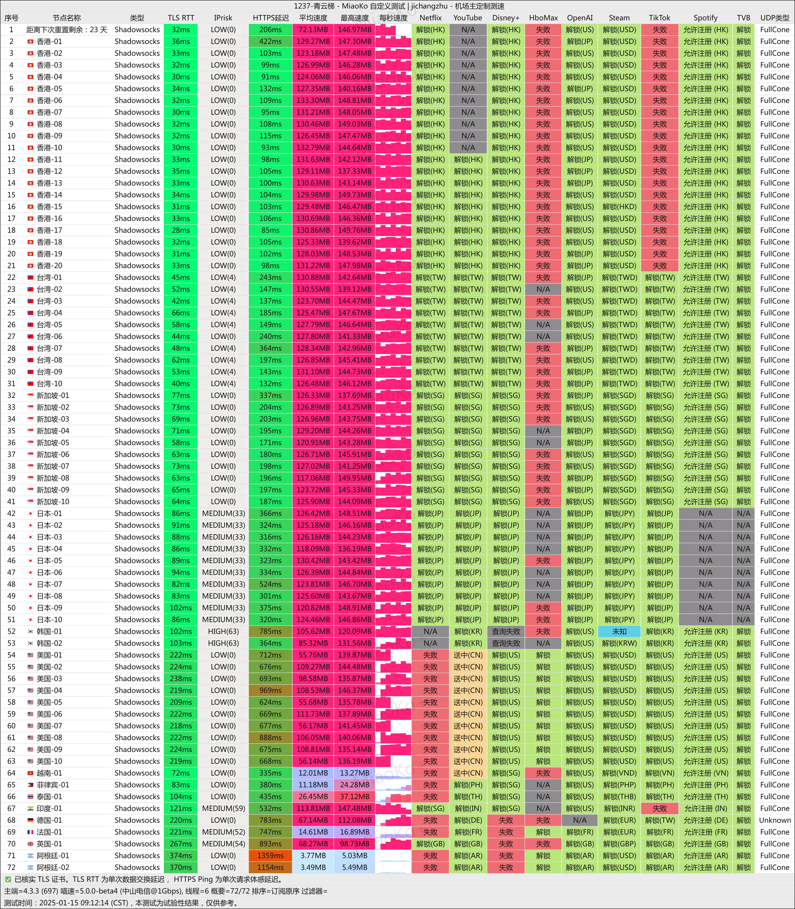

<div style="background:linear-gradient(135deg,rgba(26,115,232,0.08),rgba(26,115,232,0.18));border:1px solid rgba(26,115,232,0.25);border-left-width:6px;border-radius:12px;padding:18px 22px;margin:20px 0;">
  <p style="margin:0 0 8px 0;font-weight:600;">📅 <strong>内容最后更新：</strong>2025年11月2日</p>
  <p style="margin:0 0 8px 0;font-weight:600;">🆕 <strong>最近更新：</strong></p>
  <ul style="margin:0 0 0 18px;color:#1a3b5d;line-height:1.6;font-size:15px;">
    <li>新增银河云双11限时 8 折码 <code style="background:#fff;padding:2px 6px;border-radius:4px;">1180</code>（至 2025-11-30）</li>
  </ul>
</div>

<div style="overflow-x:auto;margin:20px 0;border:1px solid #e0e7ff;border-radius:12px;box-shadow:0 12px 32px rgba(26,115,232,0.08);">
  <table style="width:100%;border-collapse:collapse;font-size:15px;">
    <thead style="background:#f0f4ff;color:#1a3b5d;">
      <tr>
        <th style="padding:12px 16px;text-align:left;">机场</th>
        <th style="padding:12px 16px;text-align:left;">优惠力度</th>
        <th style="padding:12px 16px;text-align:left;">截止日期</th>
        <th style="padding:12px 16px;text-align:left;">优惠码</th>
        <th style="padding:12px 16px;text-align:left;">快捷跳转</th>
      </tr>
    </thead>
    <tbody>
      <tr>
        <td style="padding:12px 16px;font-weight:600;">百变小樱</td>
        <td style="padding:12px 16px;">3 天免费 + 95 折</td>
        <td style="padding:12px 16px;">长期</td>
        <td style="padding:12px 16px;"><code>bbxy-5th</code></td>
        <td style="padding:12px 16px;"><a href="https://bbxy.xn--cesw6hd3s99f.com/auth/register?code=FFHk" target="_blank" style="color:#1a73e8;font-weight:600;">立即注册</a></td>
      </tr>
      <tr style="background:#fafbff;">
        <td style="padding:12px 16px;font-weight:600;">小蜜蜂机场</td>
        <td style="padding:12px 16px;">双11 8 折（活动年付小包除外</td>
        <td style="padding:12px 16px;">2025-11-30 </td>
        <td style="padding:12px 16px;"><code>11118</code></td>
        <td style="padding:12px 16px;"><a href="https://tangwu095.xmfvipaff01.cc/register?aff=oClLBb5A" target="_blank" style="color:#1a73e8;font-weight:600;">立即注册</a></td>
      </tr>
      <tr>
        <td style="padding:12px 16px;font-weight:600;">青云梯</td>
        <td style="padding:12px 16px;">双11 8 折（年付小包除外）</td>
        <td style="padding:12px 16px;">2025-11-11</td>
        <td style="padding:12px 16px;"><code>10180</code></td>
        <td style="padding:12px 16px;"><a href="https://realvtest.qytvipaff.cc/register?aff=zcIlh0VY" target="_blank" style="color:#1a73e8;font-weight:600;">立即注册</a></td>
      </tr>
      <tr style="background:#fafbff;">
        <td style="padding:12px 16px;font-weight:600;">TNTCloud</td>
        <td style="padding:12px 16px;">双11 8 折 (季付小包除外)</td>
        <td style="padding:12px 16px;">2025-11-30 </td>
        <td style="padding:12px 16px;"><code>Crazy1111</code></td>
        <td style="padding:12px 16px;"><a href="https://tanu095.tntvipaff.cc/#/register?code=7MPbfr89" target="_blank" style="color:#1a73e8;font-weight:600;">立即注册</a></td>
      </tr>
      <tr>
        <td style="padding:12px 16px;font-weight:600;">银河云</td>
        <td style="padding:12px 16px;">双11 8 折（年付小包除外）</td>
        <td style="padding:12px 16px;">2025-11-30</td>
        <td style="padding:12px 16px;"><code>1180</code></td>
        <td style="padding:12px 16px;"><a href="https://inv03.galaxyaff.cc/register?aff=tcOd0ob7" target="_blank" style="color:#1a73e8;font-weight:600;">立即注册</a></td>
      </tr>
    </tbody>
  </table>
  <p style="margin:8px 16px 16px 16px;font-size:13px;color:#5f6f8c;">* 以官方公告为准，如活动调整请以官网提示为准。</p>
</div>

<div style="background:#f9fbff;border:1px solid #e0e7ff;border-radius:12px;padding:18px 22px;margin:16px 0;">
  <h3 style="margin:0 0 10px 0;color:#1a3b5d;">⚡ 快速选择</h3>
  <ul style="margin:0 0 10px 20px;color:#1a3b5d;line-height:1.7;font-size:15px;">
    <li>完全无法翻墙？先用 <a href="#free" style="color:#1a73e8;font-weight:600;">百变小樱 3 天免费试用</a> 恢复基础联网。</li>
    <li>主力机场讲究性价比？选择 <a href="#xiaomifeng" style="color:#1a73e8;font-weight:600;">小蜜蜂 双11 8 折 </a> 或 <a href="#qingyunti" style="color:#1a73e8;font-weight:600;">青云梯 8 折</a>。</li>
    <li>AI 工具 / 远程办公？优先 <a href="#tnt" style="color:#1a73e8;font-weight:600;">TNTCloud IPLC 专线(季付小包30元)</a>。</li>
  </ul>
</div>

**2025年网络封锁持续升级，ChatGPT 打不开？YouTube 加载慢？Netflix 无法播放？**

本指南为你提供经过 **3年实测验证** 的机场推荐方案，覆盖从 **免费试用** 到 **企业级专线** 的全价位段选择。无论你是科学上网新手还是资深用户，都能在 **3 分钟内** 找到最适合的解决方案。

---

### 🎯 这份指南适合你吗？

如果你正面临以下任何场景，这份指南将为你节省大量时间和试错成本：

| 使用场景 | 痛点问题 | 本指南解决方案 |
|---------|---------|---------------|
| 👶 **科学上网新手** | 不知道如何开始，担心复杂配置 | 提供 3 天免费试用 + 一键导入教程 |
| 🤖 **AI 工具重度用户** | ChatGPT、Claude、Midjourney 频繁封号 | 推荐原生 IP 节点，100% 解锁 AI 工具 |
| 🎬 **流媒体观影党** | Netflix、Disney+ 无法播放 4K | 测试验证全平台解锁，晚高峰稳定 4K |
| 🎮 **游戏玩家** | 延迟高、丢包严重、无法联机 | IEPL 专线节点，延迟 < 50ms，Full-Cone UDP |
| 👨‍💻 **远程办公 / 开发者** | 需要稳定访问 GitHub、Google、Notion | 企业级 99.9% 在线率，支持多设备同时在线 |
| 🌍 **留学生 & 海外华人** | 回国 IP 受限，访问国内服务困难 | 提供双向解锁节点，国内外内容自由切换 |
| 💰 **预算有限用户** | 担心机场跑路，不敢年付 | 推荐月付 + 老牌机场，最低 ¥14.9/月起 |

---

### 📊 为什么要相信这份推荐？

我们的测试标准与数据保证：

- ✅ **长期跟踪**：从 2022 年至今，持续 **3 年** 实际使用与测试
- ✅ **大规模对比**：测试超过 **40+ 家** 主流机场服务商，只推荐最靠谱的 6 家
- ✅ **真实测速**：每月更新实测数据，包含晚高峰 **20:00-22:00** 黄金时段测速
- ✅ **全场景验证**：覆盖 ChatGPT / Netflix / TikTok / 游戏加速等 **10+ 种** 使用场景
- ✅ **透明评分**：公开评分标准（速度、稳定性、价格、解锁能力、售后服务）
- ✅ **及时更新**：每周同步最新优惠活动与套餐变化

---

### 🚀 本指南包含什么？

| 内容模块 | 你将获得 |
|---------|---------|
| 📖 **基础科普** | 什么是机场？如何选择？避坑指南 |
| 🏆 **六大精选机场** | 从免费试用到顶级专线的完整评测 |
| 💰 **专属优惠** | 独家优惠码，最高可享 **8 折** |
| 📊 **对比表格** | 一目了然的价格、性能、解锁能力对比 |
| 🎓 **小白教程** | 1 分钟快速上手，含客户端下载与配置 |
| ⚠️ **避坑指南** | 如何防止机场跑路、封号风险提示 |

---

### ✨ 核心优势

> 🎁 **免费试用**：推荐支持 3 天免费试用的机场，零风险体验  
> 💰 **专属优惠**：独家申请 8 折 - 95 折优惠码，为你省钱  
> 📱 **全平台支持**：Windows / macOS / iOS / Android / 路由器 全覆盖  
> 🌍 **全解锁验证**：ChatGPT / TikTok / Netflix 全区 / Disney+ / AI 工具  
> ⚡ **每月更新**：实时更新测速数据、优惠活动、推荐排名

## 📚 目录

### 📖 基础知识
1. [什么是机场？5分钟读懂科学上网核心原理](#ssssr)
2. [免费试用机场推荐](#free)


### 🎯 选购指南：如何挑选适合你的机场服务
3. [如何挑选靠谱机场？](#choose)
4. [快速选择机场服务](#person)
5. [精选机场深度评测](#top7)

### 🚀 使用教程：快速上手科学上网
6. [一分钟快速上手教程｜配置机场科学上网全流程](#study)

### ⚠️ 风险意识与责任说明
7. [购买建议与风险提醒（如何防跑路/规避封锁）](#risk)
8. [免责声明](#免责声明)

### 关于机场和VPN
9. [机场 vs VPN：哪个好用？适合谁？](#vs)

### 📖 更多阅读
10. [❓ 常见问题 FAQ（AEO优化）](#faq)
11. [🌐 常用网站推荐](#listweb)
12. [📎 更多配套教程阅读](#resources)

---

<a id="ssssr"></a>
## ✈️ 什么是"机场"？5分钟读懂科学上网核心原理（2025版）

### 🤔 机场是什么？为什么叫"机场"？

在科学上网领域，**"机场"** 是基于 **Shadowsocks、V2Ray、Trojan** 等加密协议搭建的代理服务平台。之所以叫"机场"，是因为用户像在机场选择航班一样，可以从订阅链接中选择不同国家和地区的节点（服务器）。

**一句话解释：** 机场 = 提供多个节点的科学上网订阅服务

---

### 🆚 机场 vs VPN：为什么机场更受欢迎？

| 对比维度 | 传统 VPN | 机场服务 |
|---------|---------|---------|
| **节点数量** | 通常 5-15 个固定节点 | 30-200+ 个全球节点 |
| **速度表现** | 单线路，易拥堵 | 多线路智能切换，速度更快 |
| **稳定性** | 容易被识别封锁 | 伪装协议，抗封锁能力强 |
| **灵活度** | 全局代理，无法分流 | 智能分流：国内直连 + 国外代理 |
| **价格** | $5-15/月 | ¥15-120/月（选择更多） |
| **适用场景** | 简单上网 | ChatGPT、流媒体、游戏加速 |

**核心优势：** 机场支持 **智能分流** - 访问百度直连，访问 YouTube 走代理，既快又省流量。

---

### 🔧 机场的技术架构（3层结构）

```
你的设备 → 入口服务器（中国境内）→ 中转/专线通道 → 落地节点（国外）→ 目标网站
```

1. **入口链路** 🚪
   - 🔹 直连：速度快但易被封
   - 🔹 CN2 专线：电信优化线路，稳定性好
   - 🔹 隧道中转：多层跳转，更隐蔽

2. **过境技术** 🌉
   - 🔸 **IEPL 专线**：企业级内网专线，延迟低（< 50ms），不过墙（最稳定）
   - 🔸 **IPLC 专线**：国际专线，速度快但价格贵
   - 🔸 BGP 中转：动态选路，智能优化

3. **落地节点** 🌍
   - ✨ **原生 IP**：可解锁 Netflix、ChatGPT（推荐）
   - 🏠 **家庭宽带 IP**：IP 纯净度最高
   - ☁️ **数据中心 IP**：便宜但易被识别

---

### 🎯 机场的使用场景：能做什么？

| ✅ 应用领域 | 🌐 解锁能力一览 |
|------------|------------------|
| **内容娱乐** | 支持访问 **Netflix、Disney+、YouTube 4K HDR、Spotify 全球曲库、Prime Video、NBA League Pass** 等受限平台 |
| **AI 工具与远程办公** | 畅用 **ChatGPT、Claude、Gemini、Hugging Face、Notion AI** 等工具，顺利登录 **GitHub、Docker Hub、OpenAI API** |
| **跨境电商运营** | 可高效管理 **Amazon、eBay、Shopify** 等店铺，投放 **Google/Facebook 广告**，同步 **ERP 系统**，实时查看目标国家 **SERP 页面** |
| **国际游戏加速** | 低延迟连接 **PSN、Switch、Steam** 全球服务器，自由切换至 **阿根廷、土耳其** 等低价区加速体验 |
| **数字生活拓展** | 注册美区 **Apple ID** 或 **Google Play** 账号，购买海外礼品卡，订阅低价地区 **iCloud+、YouTube Premium、Spotify Family Plan** 等服务 |

---

> 💡 **简而言之：**  
> “机场” 是一种融合**多节点调度、智能流量分流与全球加速**的科学上网解决方案，灵活性胜过 VPN，稳定性优于传统代理，堪称 2025 年访问 **ChatGPT、YouTube、Netflix** 等平台的优选工具。

---

<a id="free"></a>
## 🆓 限时免费高端机场推荐：<a href="https://bbxy.xn--cesw6hd3s99f.com/auth/register?code=FFHk" target="_blank" style="color:#1a73e8;text-decoration:underline;">百变小樱</a> —— 稳定实用科学上网方案

### 🚀 无法访问 ChatGPT、YouTube、GitHub？先用这个免费机场恢复联网！

如果你当前处于**完全无法翻墙**的状态 —— 无法打开 ChatGPT、YouTube、Google、GitHub 或 VPN 官网，那么这款 **限时免费高端IEPL专线机场「百变小樱」** 是你最佳的起点选择。

📌 **强烈建议立即注册，恢复基础联网能力，体验顶级加速 IEPL 专线！**

---

### ✨ 为什么推荐「百变小樱」机场？

**一句话价值主张：** 运营 **5+ 年** 的海外团队，IEPL 高速专线 + 全平台一键导入，支持 **3 天免费试用**，先体验后购买。

- ✅ **0 成本试用**：注册即享 **3 天免费体验**，先测速度与稳定性，再决定是否付费。
- ✅ **长期稳定**：海外团队持续运维 **5+ 年**，高峰期依然顺畅，故障响应及时。
- ✅ **IEPL 高速专线**：低延迟 / 大带宽 / 抖动小，适合游戏、远程办公、下载与超清观影。
- ✅ **灵活套餐**：从入门到高阶多档位选择，**可随时升级**，按需购买更省钱。
- ✅ **一键导入**：全面兼容 **Clash / Shadowrocket / SSR** 等主流客户端，订阅链接一键导入即用。
- ✅ **强力解锁**：**ChatGPT、YouTube、TikTok、Netflix、Disney+、HBO Max** 等平台稳定解锁，**4K 串流无压力**。
- ✅ **会员福利**：**LV3+** 用户可享 **Netflix / Disney+ / Prime Video** 等会员福利（以官方活动为准）。
- ✅ **影视党福音**：内置 **Emby 服务器**，精选高清片库，开箱即看更省心。
---

> 🧠 **作者实测使用超过3年，稳定性极高**。日常办公、AI 使用、高清观影、海外游戏、跨境电商访问，**全场景表现优秀，值得长期使用**！

### 🎁 长期优惠福利

- ✅ **免费试用**：新用户注册即享 **3 天免费体验**
- ✅ **专属折扣**：购买付费套餐使用优惠码 `bbxy-5th` 享 **95 折优惠**（长期有效）
- ✅ **套餐升级**：新套餐开通后会覆盖旧套餐，如需升级年付以上套餐可发工单补差价

📊 <a href="https://gptvpnhelper.com/airport-access/bbxy/" target="_blank">👉 查看百变小樱机场详细测评：IEPL专线测速、ChatGPT解锁测试、完整套餐介绍</a>
---

### 🔗 立即开启你的科学上网之路：

<div align="center" style="margin: 20px 0;">
  <a href="https://bbxy.xn--cesw6hd3s99f.com/auth/register?code=FFHk" target="_blank" style="
    display:inline-block;
    background:linear-gradient(135deg,#667eea 0%,#764ba2 100%);
    color:#fff;
    font-weight:700;
    font-size:18px;
    padding:16px 40px;
    border-radius:12px;
    text-decoration:none;
    box-shadow:0 8px 20px rgba(102,126,234,0.4);
  ">
    🚀 免费注册百变小樱（3天试用+95折优惠码）
  </a>
</div>

<br/>

### 💎 专属优惠码使用说明

<div style="background:#fff3cd;border-left:4px solid #ffc107;padding:15px;margin:15px 0;">
  <p><b>📋 优惠码：</b><code style="background:#fff;padding:5px 10px;font-size:18px;color:#d63031;font-weight:bold;">bbxy-5th</code></p>
  <p><b>💰 优惠力度：</b>所有付费套餐享 <b style="color:#d63031;">95 折</b>（长期有效）</p>
  <p><b>📝 使用方法：</b>试用期结束后购买套餐时，在支付页面输入优惠码即可</p>
</div>

---

> 💡 提示：科学上网的第一步是选择靠谱稳定的机场节点。**百变小樱作为新手推荐第一站，解决你“打不开 ChatGPT”的痛点**，是你通往自由互联网世界的起点。


---

<a id="choose"></a>
## ❓如何挑选靠谱机场？避坑指南 + 5大核心指标

选机场就像买车，**配置、口碑、售后** 缺一不可。以下是经过 **3年测试总结** 的选购标准，帮你避开 **90% 的雷区**。

---

### 📋 核心挑选标准（按重要性排序）

#### 1️⃣ 【最重要】线路架构 —— 决定速度与稳定性

| 线路类型 | 延迟 | 稳定性 | 价格 | 推荐指数 | 适合人群 |
|---------|------|--------|------|----------|---------|
| 🏆 **IEPL / IPLC 专线** | < 50ms | ⭐⭐⭐⭐⭐ | ¥30-120/月 | ★★★★★ | 游戏党、办公、AI 重度用户 |
| 🥈 **BGP 中转** | 50-150ms | ⭐⭐⭐⭐ | ¥20-60/月 | ★★★★ | 日常上网、流媒体 |
| 🥉 **普通中转** | 100-200ms | ⭐⭐⭐ | ¥10-30/月 | ★★★ | 轻度使用、备用 |
| ⚠️ **公网直连** | 不稳定 | ⭐⭐ | ¥5-15/月 | ★★ | 不推荐（易被封） |

**怎么看线路好坏？** 
- ✅ 机场官网有标注"IEPL"、"IPLC"、"专线" → 好
- ⚠️ 只写"高速节点"没有具体说明 → 可能是中转或直连
- ❌ 没有任何技术说明 → 十有八九是公网直连

---

#### 2️⃣ 【关键】晚高峰表现 —— 真实使用体验

**为什么看晚高峰？** 因为 **20:00-22:00** 是使用高峰，这个时段速度才是真实水平。

✅ **好机场的标志：**
- 晚高峰 YouTube 4K 不卡顿（需要 > 25 Mbps）
- Netflix 能稳定加载（需要 > 15 Mbps）
- 延迟稳定，不会突然从 50ms 飙到 500ms

❌ **烂机场的特征：**
- 白天跑 100 Mbps，晚上掉到 1 Mbps
- ChatGPT 频繁超时
- 测速网站跑得快，实际使用慢（测速节点作弊）

**如何验证？** 加入机场的 Telegram 群，看用户晚高峰的反馈。

---

#### 3️⃣ 【必看】解锁能力 —— ChatGPT / Netflix 能不能用

| 服务 | IP 要求 | 劣质机场的问题 | 优质机场的标准 |
|------|---------|---------------|---------------|
| **ChatGPT** | 原生 IP | 频繁验证、封号 | 稳定使用 > 1 年无封号 |
| **Netflix** | 原生 IP + 解锁 | 显示"检测到代理" | 支持 4K 播放 |
| **TikTok** | 非大陆 IP | 无法刷视频 | 正常浏览发布 |
| **Disney+** | 特定区域 IP | 内容库受限 | 支持多区切换 |

**⚠️ 避坑提示：**
- 避免 **中国 ASN**（如 AS4134、AS4837）落地，这类 IP 容易被封
- 优先选择标注"**原生 IP**"或"**家宽 IP**"的机场
- 数据中心 IP 便宜但容易被识别

---

#### 4️⃣ 品牌口碑 —— 防止跑路

✅ **靠谱机场的标志：**
- 运营 **2 年以上**（新机场跑路率高达 60%）
- Telegram 群活跃，**> 500 人**
- 有独立官网（不是套用模板）
- 支持工单系统 / 邮件客服
- 有公开的测速页面

❌ **危险信号：**
- 上线 < 6 个月
- 没有 TG 群或群内无人说话
- 只有一个域名，没有备用地址
- 只支持年付，不支持月付
- 价格离谱（¥9.9 包年 / ¥200 包月）

---

#### 5️⃣ 套餐灵活性

| 考察点 | 好机场 ✅ | 差机场 ❌ |
|-------|---------|----------|
| **支付周期** | 支持月付/季付/年付 | 只支持年付 |
| **设备限制** | 不限或 ≥ 3 台 | 限制 1 台 |
| **流量重置** | 每月重置 | 不重置（用完就没） |
| **支付方式** | 支付宝/微信/USDT | 只支持加密货币 |
| **试用退款** | 支持 3 天试用/退款 | 不支持 |

---

### 🎯 快速评估检查清单

复制这个清单，对照机场官网检查：

- [ ] 有明确标注线路类型（IEPL/IPLC/BGP）
- [ ] 运营时间 ≥ 1 年
- [ ] 有活跃的 Telegram 群（> 500 人）
- [ ] 支持月付
- [ ] 提供测速页面或实测数据
- [ ] 标注了解锁能力（ChatGPT/Netflix）
- [ ] 支持 ≥ 3 台设备同时在线
- [ ] 价格合理（¥15-120/月区间）

**通过 ≥ 6 项 → 可以购买**  
**通过 < 4 项 → 谨慎考虑**

---

### ⚠️ 避坑警告：这些机场千万别碰

#### 🚫 免费机场 —— 免费的往往最贵

**看起来诱人，实际上是坑：**

| 问题 | 后果 | 真实案例 |
|------|------|---------|
| 🐌 **严重限速** | 只有 1-3 Mbps，连网页都打不开 | 某免费机场白天限速到 0.5 Mbps |
| 💥 **频繁掉线** | 3 分钟断一次，根本无法使用 | ChatGPT 对话到一半就断开 |
| 🕵️ **隐私风险** | 注入广告、追踪浏览记录 | 用户数据被打包出售 |
| 🎯 **钓鱼风险** | 窃取账号密码 | 登录 Gmail 后被盗号 |

**❌ 绝对不要用免费机场做这些事：**
- 登录银行/支付宝等金融账号
- 访问公司内网/企业邮箱
- 注册/登录 ChatGPT 账号（易被封）

**✅ 替代方案：** 使用 [百变小樱 3 天免费试用](#free)，体验真正的高速专线。

---

#### 🚫 超低价机场（¥9.9 包年）—— 大概率跑路

**为什么这么便宜？真相是：**

- 💰 **亏本运营** → 2-3 个月后必定跑路
- 🏚️ **一键搭建** → 套用模板，随时跑路
- 🌐 **IP 污染严重** → 根本访问不了 ChatGPT、Netflix
- 👥 **用户爆满** → 1000 人共用一条 100M 带宽

**真实成本计算：**
```
1 台香港 VPS：¥200/月
1000GB CN2 带宽：¥500/月
总成本：¥700/月

如果卖 ¥9.9/年，需要 840 个用户才能回本
→ 根本不可能盈利 → 必定跑路或严重超售
```

**✅ 合理价格区间：**
- 入门套餐：¥15-30/月
- 中端套餐：¥30-80/月
- 高端专线：¥80-150/月

---

#### 💡 正确的省钱策略

| 方案 | 月均成本 | 适合人群 |
|------|---------|---------|
| 🎁 **利用试用期** | ¥0 | 新手，短期使用 |
| 📦 **年付套餐** | ¥8-15/月 | 确定长期使用的用户 |
| 🤝 **合租分摊** | ¥10-30/月 | 与朋友/家人共享 |
| 🎯 **按需购买** | ¥15-30/月 | 轻度用户，选小流量套餐 |
| 🔄 **主力+备用** | ¥30-50/月 | 稳定需求，2 个机场互补 |

**推荐组合：**
- 主力机场：小蜜蜂/TNTCloud（¥20-40/月）
- 备用机场：贝贝云（¥14.9/月）
- 总成本：¥35-55/月，双重保障


---


<a id="person"></a>
## ✨ 如果你不想看完整评测，直接根据我的个人推荐选择：

根据长期实际体验和稳定性测试，以下是我为不同需求用户精选的快速推荐：

---

### 🔥 主力推荐（适合 80% 用户）

#### 1. <a href="https://tangwu095.xmfvipaff01.cc/register?aff=oClLBb5A" target="_blank">**小蜜蜂机场**｜性价比王者 · 年付¥8/月 · 双11 8折 / 长期85折</a>

- ✅ 年付¥96（≈¥8/月）全IEPL专线，不限速不限设备
- ✅ Netflix/Disney+/ChatGPT/TikTok 全解锁
- ✅ 提供美区ID下载小火箭，新手友好

<div style="background:#e8f5e9;border-left:4px solid #4caf50;padding:12px;margin:12px 0;">
  <p>🎁 <b>双11 8折码：</b><code style="background:#fff;padding:3px 10px;color:#d32f2f;font-weight:bold;">11118</code>（¥96年付除外）｜ <b>长期 85 折码：</b><code style="background:#fff;padding:3px 10px;color:#d32f2f;font-weight:bold;">xmfwww85</code> ｜ <a href="https://gptvpnhelper.com/airport-access/xmf/" target="_blank" style="color:#1976d2;">👉 完整测评</a></p>
</div>

---

#### 2. <a href="https://realvtest.qytvipaff.cc/register?aff=zcIlh0VY" target="_blank">**青云梯**｜五年老牌 · 年付¥96/60G · 8折</a>

- ✅ 2020年运营至今，企业级IPLC专线
- ✅ 全平台解锁 + 海外团队7x24维护
- ✅ 80+节点覆盖全球，真人客服在线

<div style="background:#fff3cd;border-left:4px solid #ffc107;padding:12px;margin:12px 0;">
  <p>🎁 <b>8折码：</b><code style="background:#fff;padding:3px 10px;color:#d63031;font-weight:bold;">10180</code>（¥96年付除外，至11.11）｜ <a href="https://gptvpnhelper.com/airport-access/qingyunti/" target="_blank" style="color:#1976d2;">👉 完整测评</a></p>
</div>

---

#### 3. <a href="https://tanu095.tntvipaff.cc/#/register?code=7MPbfr89" target="_blank">**TNTCloud**｜AI工具专用 · IPLC专线 · 双11限时8折</a>

- ✅ IPLC专线，延迟<30ms，海外团队运营
- ✅ ChatGPT/Claude/Gemini 原生IP 100%解锁
- ✅ 流媒体全解锁，不限速不限设备

<div style="background:#fff3e0;border-left:4px solid #ff9800;padding:12px;margin:12px 0;">
  <p>🎉 <b>双11 8折码：</b><code style="background:#fff;padding:3px 10px;color:#d32f2f;font-weight:bold;">Crazy1111</code>（即日起至 2025年11月30日 23:59）</p>
  <p>🎁 <b>长期 85 折码：</b><code style="background:#fff;padding:3px 10px;color:#d32f2f;font-weight:bold;">TNT85</code>（常年有效）｜ <a href="https://gptvpnhelper.com/airport-access/tntcloud/" target="_blank" style="color:#1976d2;">👉 完整测评</a></p>
</div>

---

### 🚀 高端 & 入门推荐

<p><b><a href="https://invite.wgetcloud.ltd/auth/register?code=xEgJKS" target="_blank" style="color:#1a73e8;">WgetCloud</a></b> ｜企业级稳定 · 新用户85折</p>
<p style="margin-left:20px;">💎 99.9%在线率，自建面板，适合重度办公/游戏党 ｜ <a href="https://gptvpnhelper.com/airport-access/wgetcloud/" target="_blank">详细测评</a></p>

<p><b><a href="https://beibeilink.top/register?code=Oa86Fbs3" target="_blank" style="color:#1a73e8;">贝贝云</a></b> ｜新手入门 · ¥14.9/月起 · 95折</p>
<p style="margin-left:20px;">💸 低门槛入门之选，网页浏览/AI工具无压力<br>
🎁 <b>95折码：</b><code style="background:#f3e5f5;padding:2px 8px;color:#9c27b0;">beibei.cloud</code> ｜ <a href="https://gptvpnhelper.com/airport-access/bby/" target="_blank">详细测评</a></p>

---

### 💡 推荐组合策略

根据你的需求快速匹配：

| 使用场景 | 首选推荐 | 备选方案 | 预算 |
|---------|---------|---------|------|
| 🔥 **主力日常使用** | **小蜜蜂**（性价比王） | TNTCloud | ¥20-40/月 |
| 🤖 **AI 工具重度** | **TNTCloud**（IPLC专线） | 小蜜蜂 | ¥20-40/月 |
| 💰 **预算有限** | **银河云年付**（¥98/年） | 贝贝云 | ¥8-15/月 |
| 🚀 **企业级稳定** | **WgetCloud**（99.9%在线率） | 小蜜蜂 | ¥60-90/月 |
| 👶 **新手入门** | **百变小樱**（免费试用） | 贝贝云 | ¥0-20/月 |
| 📱 **多设备共享** | **青云梯**（年付省心） | 小蜜蜂 | ¥8-45/月 |

**🎯 主力 + 备用组合建议：**
- 💎 **性价比组合**：小蜜蜂（主力）+ 贝贝云（备用）= ¥35/月
- 🚀 **高端组合**：WgetCloud（主力）+ TNTCloud（备用）= ¥90/月
- 💰 **预算组合**：银河云年付（主力）+ 百变小樱试用（应急）= ¥8/月

---

✅ **小提醒**  
以上推荐适合不同预算和使用需求的用户参考。如果你想深入了解各大机场的测速表现、节点分布、流媒体解锁等细节，请阅读下面的「精选机场深度评测」。

---
<a id="top7"></a>
## 🏆 精选机场深度评测（2025 最新）

> 本次评测从超过 **40+ 热门机场服务商**中精挑细选，最终筛选出八款兼具稳定性、速度与性价比的优质机场。覆盖了从高端旗舰、平价主力到新手入门的**三大梯度**，无论你是重度使用者还是轻量需求者，都能找到适合自己的科学-上网解决方案。

这些机场均通过实测验证，全面支持 ChatGPT、YouTube、Netflix 等主流平台访问，并具备良好的连接稳定性和流媒体解锁能力。

🧭 无论你的需求是“零故障生产环境”、还是“流媒体刷剧党”，或是“低价备用应急”，这份清单都为你准备好了对应的优选方案。

<a id="xiaomifeng"></a>
### 1. <a href="https://tangwu095.xmfvipaff01.cc/register?aff=oClLBb5A" target="_blank" style="color:#1a73e8;text-decoration:underline;">🔥 小蜜蜂机场 — 性价比王者，全IEPL专线，年付低至8元/月</a>

**综合评分：9.6 / 10** 🏆 **编辑首选推荐**  
**关键词标签**：全IEPL专线 | 不限速不限设备 | 年付低至¥8/月 | 全平台解锁 | 美区ID赠送 | 双11限时8折 | 长期85折

> **小蜜蜂机场**是性价比最高的全IEPL专线机场之一，适合80%的用户。所有套餐不限速、不限设备，原生IP解锁全球流媒体（Netflix、Disney+、HBO等）和AI工具（ChatGPT、Copilot、Gemini），特色年付套餐低至¥8/月，还提供美区ID下载小火箭。无论是日常使用、流媒体追剧还是AI工具开发，都是不二之选。

---

#### ✅ 核心信息一览

| **评测指标**     | **详情**                                                 |
|------------------|--------------------------------------------------------|
| **开业时间**     | 2022 年                                                 |
| **入口 / 出海**  | 深圳 → 深港 IEPL 专线                                        |
| **节点覆盖**     | 香港×10、台湾×5、日本×5、新加坡×5、美国×5、马来西亚×2、英国×2、阿根廷×2、泰国×2、巴西×2 |
| **协议支持**     | Trojan                                                 |
| **UDP 支持**     | 全节点开启 Full‑Cone UDP                                    |
| **ChatGPT 支持** | 全节点解锁，响应稳定                                             |
| **流媒体解锁**   | 支持 Netflix 全球 90+ 区、Disney+、Hulu、HBO Max 等主流平台         |
| **设备限制**     | 不限设备数                                                  |
| **支付方式**     | 支持支付宝 + 微信 + USDT                                      |

---

#### 💰 套餐价格一览

| 套餐名称           | 流量            | 价格         | 计费方式 | 特点简述                                               |
|------------------|----------------|--------------|---------|------------------------------------------------------|
| 🐝 **大黄蜂特惠年度版** | 60GB/月 × 12     | ¥96         | 年付     | 每月轻度使用，年费低至 8 元/月，解锁 ChatGPT、Tiktok，稳定不掉线 |
| 🐝 **小蜜蜂畅游版**     | 120GB / 月       | ¥20 / 月     | 月付     | 适合日常通用场景，支持 AI 工具与多流媒体平台，高性价比         |
| 🛠 **工蜂极速版**      | 240GB / 月       | ¥40 / 月     | 月付     | 对速度和稳定性要求较高用户，IEPL 全专线，高峰不卡顿             |
| 👑 **蜂王尊享版**      | 500GB / 月       | ¥75 / 月     | 月付     | 中重度用户推荐，解锁所有平台，流畅看 4K 视频                   |
| 🌀 **蜂群无限版**      | 1000GB / 月      | ¥140 / 月    | 月付     | 超重度使用者首选，流量大户/办公族/AI重度工具用户推荐           |
| 📦 **备用流量包**      | 200GB（一次性）  | ¥125         | 一次性   | 不限时间使用，适合临时补充流量，应急使用场景                   |

> ✅ 所有套餐均为 **全IEPL专线**，不限速、不限设备数，支持 Netflix、Disney+、HBO、Tiktok、ChatGPT、Copilot、Midjourney 等  
> ✅ 提供美区 ID 下载小火箭，iOS 用户福音  

---

#### 🎯 推荐人群

- ✅ **日常上网用户**：年付¥96（¥8/月）轻松应对日常需求
- ✅ **流媒体狂热用户**：Netflix全球90+区、Disney+、HBO完美解锁
- ✅ **AI工具深度用户**：ChatGPT、Copilot、Gemini全节点可用
- ✅ **多设备家庭用户**：不限设备数，全家共享无压力
- ✅ **跨境电商/技术团队**：注册各国账号、SEO测试、广告投放
- ✅ **TikTok运营者**：原生IP，完美解锁TikTok

📌 **一句话总结**：性价比王者，全IEPL专线，年付低至8元/月，适合80%用户的主力机场。

<div align="left" style="margin: 10px 0 20px 0;">
  <a href="https://tangwu095.xmfvipaff01.cc/register?aff=oClLBb5A" target="_blank" style="
    display:inline-block;
    background:linear-gradient(90deg,#00c9ff,#92fe9d);
    color:#000;
    font-weight:600;
    font-size:16px;
    padding:12px 24px;
    border-radius:8px;
    text-decoration:none;
    box-shadow:0 4px 14px rgba(0,0,0,0.2);
    transition:all 0.3s ease;
  " onmouseover="this.style.transform='scale(1.05)'" onmouseout="this.style.transform='scale(1)'">
    <strong>🐝 立即注册小蜜蜂（年付低至8元/月+双11 8折/长期85折）</strong>
  </a>
</div>

#### 🎁 双11 限时 8 折优惠码

<div style="background:#e8f5e9;border-left:4px solid #4caf50;padding:15px;margin:15px 0;">
  <p><b>📋 优惠码：</b><code style="background:#fff;padding:5px 15px;font-size:19px;color:#d32f2f;font-weight:bold;">11118</code></p>
  <p><b>💰 优惠力度：</b>双十一期间全场 <b style="color:#d32f2f;">8 折</b></p>
  <p><b>⚠️ 重要说明：</b></p>
  <ul style="margin:5px 0 0 20px;">
    <li>❌ <b style="color:#d32f2f;">大黄蜂特惠年付版（¥96/年）为福利款，历史活动常见不参与优惠码折扣</b>（如页面提示不支持折扣属正常情况）</li>
    <li>✅ 其他套餐默认支持 8 折优惠，若遇限制可尝试切换套餐周期或联系官方客服确认活动</li>
    <li>🔥 年付及多年套餐叠加 8 折更划算，建议把握双11 活动窗口</li>
  </ul>
</div>

#### 🎁 长期 85 折优惠码

<div style="background:#f0f4ff;border-left:4px solid #5c6bc0;padding:15px;margin:15px 0;">
  <p><b>📋 优惠码：</b><code style="background:#fff;padding:5px 15px;font-size:19px;color:#1a237e;font-weight:bold;">xmfwww85</code></p>
  <p><b>💰 优惠力度：</b>全场 <b style="color:#1a237e;">85 折</b>（长期有效）</p>
  <p><b>⚙️ 使用建议：</b></p>
  <ul style="margin:5px 0 0 20px;">
    <li>✅ 双11 活动结束后继续有效；活动期间可作为备用优惠码</li>
    <li>🔁 若 `11118` 对某套餐显示不可用，可切换 `xmfwww85` 继续享折扣</li>
    <li>💡 适合错峰入手或补购流量，随时都能享受优惠力度</li>
  </ul>
</div>

--- 

>  👉 <a href="https://gptvpnhelper.com/airport-access/xmf/" target="_blank">小蜜蜂机场详细测评,如需了解更多测速、解锁、套餐信息、使用教程请前往</a>

---

<details>
  <summary style="cursor:pointer;font-weight:600;color:#1a73e8;">📈 最新测速图（点击展开）｜小蜜蜂</summary>

  

</details>

---

<a id="qingyunti"></a>
### 2. <a href="https://realvtest.qytvipaff.cc/register?aff=zcIlh0VY" target="_blank" style="color:#1a73e8;text-decoration:underline;">🌤 青云梯 — 五年实力老牌，性价比 IPLC 专线，年付¥8/月</a>

**综合评分：9.4 / 10** 🔥 **性价比拉满的实力一线**  
**关键词标签**：五年老牌 | 企业级IPLC专线 | 智能负载均衡 | 年付¥96 | 80+全球节点 | 8折优惠

> **青云梯** 成立于 2020 年 11 月，是一家专注性价比的实力派老牌机场。采用 **企业级 IPLC 专线 + 智能负载均衡技术**（根据用户本地网络自动分配最优入口和线路），全线 Shadowsocks 协议，三网优化。拥有覆盖全球 17+ 地区的 **80+ 专线节点**，全平台解锁 Netflix / Disney+ / ChatGPT / Gemini / TikTok。**年付套餐低至 ¥96/年（每月仅 ¥8）**，海外团队 7x24 专业运营，真人客服实时在线，新手友好。

---

| **评测维度**     | **详情说明**                                                                      |
|------------------|-----------------------------------------------------------------------------------|
| **开业时间**     | 2020.11.1（稳定运营 5 年+，实力老牌）                                             |
| **协议支持**     | Shadowsocks（SS）                                                                  |
| **接入方式**     | 企业级 IPLC 专线，三网优化，智能负载均衡（自动分配最优线路）                        |
| **节点覆盖**     | 80+ 全专线节点，覆盖香港、台湾、日本、新加坡、马来西亚、美国、韩国、泰国、印尼、菲律宾、越南、英国、德国、法国、土耳其、巴西、阿根廷等 17+ 地区 |
| **流媒体解锁**   | 全节点解锁 Netflix / Disney+ / HBO Max / HBO Go / YouTube Premium 等，晚高峰不限速 4K 秒开 |
| **ChatGPT 支持** | 全节点解锁 ChatGPT / Gemini / Claude 等 AI 工具，TikTok 全球短视频 + 直播环境可用    |
| **设备限制**     | 不限系统，支持多设备同时使用                                                        |
| **客户端支持**   | Shadowrocket / Clash / V2rayN / V2rayNG / Surge / Quantumult X / Stash 等全平台   |
| **售后服务**     | 真人客服实时在线，为新手用户排忧解难                                                |
| **支付方式**     | 支持支付宝 / 微信 / USDT                                                           |

---

**📦 套餐价格一览**

| 套餐方案     | 流量配额           | 月付价格 | 季付价格 | 年付价格        | 性价比推荐 |
|--------------|-------------------|---------|---------|----------------|-----------|
| **青云·诀** | 每月 60GB          | -       | -       | **¥96/年（≈¥8/月）** | ⭐⭐⭐⭐⭐ 超高性价比 |
| 青云·VIP1    | 每月 150GB         | ¥25     | ¥67     | ¥240（≈¥20/月） | ⭐⭐⭐⭐ |
| 青云·VIP2    | 每月 300GB         | ¥45     | ¥121    | ¥432（≈¥36/月） | ⭐⭐⭐⭐ |
| 青云·VIP3    | 每月 600GB         | ¥85     | ¥229    | ¥916（≈¥76/月） | ⭐⭐⭐ |

**💡 套餐选择建议：**
- 🌟 **青云·诀（¥96/年）**：轻度用户/备用机场首选，每月 60GB 够日常使用
- 🔥 **VIP1（¥240/年）**：中度用户最佳选择，150GB 流量覆盖办公 + 娱乐
- 💼 **VIP2/VIP3**：重度用户/多设备共享，支持企业级定制线路

---

**🌐 核心技术亮点**

✅ **智能负载均衡** - 根据用户本地实际网络环境，自动分配最适合的入口和线路，确保最优连接速度  
✅ **全线 IPLC 专线** - 企业级国际专线，三网优化，晚高峰不限速，4K 视频秒开  
✅ **80+ 全球节点** - 覆盖亚洲、欧洲、美洲 17+ 地区，全节点专线接入  
✅ **全平台解锁** - Netflix / Disney+ / HBO Max / ChatGPT / Gemini / TikTok 等全解锁  
✅ **海外团队运营** - 专业 7x24 全天候维护，真人客服实时在线  
✅ **新手友好** - 支持 Clash / Shadowrocket 等主流客户端，一键导入订阅

---

**🎯 推荐人群**

- ✅ **年付省心用户** - 追求性价比，每月 ¥8 享受专线品质
- ✅ **AI 工具重度用户** - ChatGPT / Gemini / Claude 等 AI 工具全节点解锁
- ✅ **流媒体爱好者** - Netflix / Disney+ / HBO 4K 秒开，晚高峰不卡顿
- ✅ **TikTok 运营者** - 全球短视频 + 直播环境完美支持
- ✅ **跨境办公人群** - 企业级 IPLC 专线，稳定可靠
- ✅ **新手入门** - 真人客服在线指导，支持主流客户端

<div align="left" style="margin: 10px 0 20px 0;">
  <a href="https://realvtest.qytvipaff.cc/register?aff=zcIlh0VY" target="_blank" style="
    display:inline-block;
    background:linear-gradient(90deg,#00bcd4,#2196f3);
    color:#fff;
    font-weight:600;
    font-size:16px;
    padding:12px 24px;
    border-radius:8px;
    text-decoration:none;
    box-shadow:0 4px 14px rgba(0,0,0,0.25);
    transition:all 0.3s ease;
  " onmouseover="this.style.transform='scale(1.05)'" onmouseout="this.style.transform='scale(1)'">
    <strong>🌤 立即注册青云梯（年付¥96/60G + 8折）</strong>
  </a>
</div>

🎁 **双十一限时活动**

<div style="background:#fff3cd;border-left:4px solid #ffc107;padding:15px;margin:15px 0;">
  <p><b>📋 优惠码：</b><code style="background:#fff;padding:5px 15px;font-size:19px;color:#d63031;font-weight:bold;">10180</code></p>
  <p><b>💰 优惠力度：</b>全场 <b style="color:#d63031;">8 折</b>（20% OFF）</p>
  <p><b>⏱ 活动时间：</b>即日起 ～ 2025年11月11日 23:59</p>
  <p><b>⚠️ 重要说明：</b></p>
  <ul style="margin:5px 0 0 20px;">
    <li>❌ <b style="color:#d63031;">青云·诀年付套餐（¥96/年）为福利款，不参与本次8折活动</b>（该套餐已是厂商最低价，无法再享优惠码折扣）</li>
    <li>✅ VIP1/VIP2/VIP3 套餐均可使用优惠码享8折优惠</li>
    <li>🔥 优惠码可与套餐活动叠加，享受折上折优惠</li>
  </ul>
</div>

---

>  👉 <a href="https://gptvpnhelper.com/airport-access/qingyunti/" target="_blank">青云梯 机场详细测评,如需了解更多测速、解锁、套餐信息、使用教程请前往</a>
---

<details>
  <summary style="cursor:pointer;font-weight:600;color:#1a73e8;">📈 最新测速图（点击展开）｜青云梯</summary>

  

</details>

---

<a id="tnt"></a>
### 3. <a href="https://tanu095.tntvipaff.cc/#/register?code=7MPbfr89" target="_blank" style="color:#1a73e8;text-decoration:underline;">🔥 TNTCloud — AI工具专用，IPLC专线，海外团队运营</a>

**综合评分：9.3 / 10** 🏆 **AI工具首选**  
**关键词标签**：IPLC专线 | Trojan协议 | 海外团队 | 不限速不限设备 | ChatGPT完美支持 | 原生IP | 双11限时8折 | 长期85折

> **TNTCloud** 是一家成立于 2024 年的海外团队运营的专线级机场服务商，采用 Trojan 协议 + 全线 IPLC 专线通道（速度比IEPL更快），节点速度极快、晚高峰稳定性极高。**特别适合 AI 工具深度用户**（ChatGPT、Claude、Copilot、Midjourney 等），原生IP确保100%解锁，不受国内政策影响。同时也是流媒体重度用户、TikTok 运营者、跨境电商的绝佳选择。

---

#### ✅ 核心信息一览

| **评测维度**     | **详情说明**                                                                 |
  |------------------|------------------------------------------------------------------------------|
| **上线时间**     | 2024 年                                                                       |
| **协议支持**     | Trojan（支持 Clash、Clash Meta、Singbox、Shadowrocket 等客户端）            |
| **接入方式**     | IPLC 全专线传输，不限速、不限倍率                                             |
| **节点数量**     | 香港×10、台湾×10、新加坡×10、日本×10、美国×10、德国×1                      |
| **流媒体解锁**   | 支持 Netflix、Disney+、HBO、HUGO 等主流流媒体平台                             |
| **ChatGPT 支持** | 全节点均支持 ChatGPT、Gemini、Copilot、Claude 等 AI 工具                     |
| **设备限制**     | 不限设备数量，支持多端同时在线和路由器部署                                   |
| **支付方式**     | 支持支付宝、微信、U 转账                                                     |


---

#### 💰 套餐价格一览

| 套餐名称       | 流量 / 月     | 价格        | 说明                     |
|----------------|----------------|-------------|--------------------------|
| 季付限量包     | 60GB × 3 月    | ¥30 / 季     | 超低月均价，轻量用户首选 |
| VIP1（轻量）    | 110GB          | ¥20 / 月     | 日常上网 + 流媒体         |
| VIP2（中量）    | 220GB          | ¥40 / 月     | 主力推荐，性价比高         |
| VIP3（高量）    | 440GB          | ¥80 / 月     | 多设备 + 高画质视频适配     |
| VIP4（巨量）    | 1100GB         | ¥160 / 月    | 重度使用者或多人共享       |
| 定制套餐       | 独享 / 定制    | ¥680 / 月    | 专线独享，支持定向功能     |


---
#### ⭐️ 使用亮点
- 多节点 TLS RTT < 50ms，适合游戏、AI 工具调用
- 支持全球六大地区，晚高峰不降速
- 解锁能力强，TikTok / Netflix / ChatGPT 全部直连成功

---

#### 🎯 推荐人群（重点推荐！）

**TNTCloud 特别适合以下用户：**

- 🤖 **AI 工具深度用户**（⭐⭐⭐⭐⭐ 强烈推荐）
  - ChatGPT、Claude、Copilot、Gemini、Midjourney 等 AI 工具 100% 解锁
  - 原生IP，不会被识别为代理，访问稳定无中断
  - IPLC 专线低延迟（<50ms），AI 对话响应快速

- 🎥 **流媒体重度观看者**
  - Netflix、Disney+、HBO、YouTube 4K 完美解锁
  - 不限速，晚高峰看 4K 视频不卡顿

- 📱 **TikTok 运营者 / 自媒体出海创作者**
  - 原生IP，避免账号风险
  - 支持多地区切换，方便测试不同市场

- 👨‍💻 **外贸 / 技术开发 / 远程办公人群**
  - 海外团队运营，不受国内政策影响
  - 全年稳定在线，适合生产环境

📌 **为什么AI用户首选TNTCloud？** 因为海外团队+原生IP+IPLC专线，确保AI工具不受限制，延迟低至30-50ms，ChatGPT对话如同本地访问。


<div align="left" style="margin: 10px 0 20px 0;">
  <a href="https://tanu095.tntvipaff.cc/#/register?code=7MPbfr89" target="_blank" style="
    display:inline-block;
    background:linear-gradient(90deg,#ff6a00,#ee0979);
    color:#fff;
    font-weight:600;
    font-size:16px;
    padding:12px 24px;
    border-radius:8px;
    text-decoration:none;
    box-shadow:0 4px 14px rgba(0,0,0,0.25);
    transition:all 0.3s ease;
  " onmouseover="this.style.transform='scale(1.05)'" onmouseout="this.style.transform='scale(1)'">
    <strong>🦦 立即注册 TNTCloud（IPLC专线·双11限时8折）</strong>
  </a>
</div>

#### 🎉 双11限时 8 折优惠

<div style="background:#fff3cd;border-left:4px solid #ffc107;padding:15px;margin:15px 0;">
  <p><b>💥 专享 8 折码：</b><code style="background:#fff;padding:5px 15px;font-size:19px;color:#d32f2f;font-weight:bold;">Crazy1111</code>（即日起至 2025年11月30日 23:59）</p>
  <p><b>⚠️ 重要说明：</b></p>
  <ul style="margin:5px 0 0 20px;">
    <li>❌ <b style="color:#d32f2f;">30元季付限量包为福利款，任何优惠码均不参与折扣</b></li>
    <li>✅ 其他套餐（月付、半年付、年付等）可在活动期间使用 <code>Crazy1111</code> 享 8 折，活动结束后继续使用 <code>TNT85</code> 享 85 折</li>
  </ul>
</div>

--- 

>  👉 <a href="https://gptvpnhelper.com/airport-access/tntcloud/" target="_blank">TNTCloud 机场详细测评,如需了解更多测速、解锁、套餐信息、使用教程请前往</a>

---

<details>
  <summary style="cursor:pointer;font-weight:600;color:#1a73e8;">📈 最新测速图（点击展开）｜TNTCloud</summary>

  

</details>

---

<a id="yhy"></a>
### 4. <a href="https://inv03.galaxyaff.cc/register?aff=tcOd0ob7" target="_blank" style="color:#1a73e8;text-decoration:underline;">🌌 银河云 Galaxy — 年付爆款¥98，Trojan专线，节点丰富</a>

**综合评分：9 / 10** 💰 **年付性价比之王**  
**关键词标签**：Trojan协议 | IEPL专线 | 年付¥98起 | 不限速不限设备 | 支持退款 | 全球节点 | 最高8折优惠

> **银河云 Galaxy** 是预算有限用户的最佳选择！由新加坡团队运营，采用 Trojan 协议 + IEPL 专线传输，**年付套餐低至¥98/年（每月不到10元）**，是专线机场中性价比最高的选择之一。拥有超强稳定性和全球丰富节点覆盖，支持全平台客户端，不限设备数。无论你是日常上网、AI工具使用、流媒体观看，还是跨境远程办公，都能以极低的价格享受专线品质。

---

#### ✅ 核心信息一览

| **评测维度**     | **详情说明**                                                           |
|------------------|--------------------------------------------------------------------|
| **上线时间**     | 2023 年 6 月                                                         |
| **协议支持**     | Trojan（兼容 Clash / Meta / Singbox / Shadowrocket）                   |
| **接入方式**     | 全线路 IEPL 专线，低延迟高稳定                                                 |
| **节点分布**     | 香港×10、台湾×5、新加坡×5、日本×5、美国×5、马来西亚×2、越南×2、菲律宾×2、泰国×2、英国×2、阿根廷×2、土耳其×2 |
| **流媒体解锁**   | 支持 Netflix、Disney+、YouTube 4K、TikTok 等全平台                          |
| **ChatGPT 支持** | 所有节点均可直连使用 ChatGPT / Copilot / Gemini / Claude                     |
| **设备限制**     | 不限设备数量，支持路由器配置及家庭共享                                                |
| **支付方式**     | 支持支付宝、微信、USDT（USDT / VX 请联系官网客服）                                   |

---

#### 💰 套餐价格一览

| 套餐名称       | 流量 / 月    | 月付    | 季付    | 半年付  | 年付    | 两年付  | 三年付  |
|----------------|--------------|---------|---------|---------|---------|---------|---------|
| 年付轻量包     | 50GB         | -       | -       | -       | ¥98     | -       | -       |
| 星尘套餐       | 100GB        | ¥18     | ¥49     | ¥92     | ¥173    | ¥302    | ¥389    |
| 行星套餐       | 200GB        | ¥35     | ¥95     | ¥179    | ¥336    | ¥588    | ¥756    |
| 恒星套餐       | 400GB        | ¥70     | ¥189    | ¥357    | ¥672    | ¥1176   | ¥1512   |
| 星系套餐       | 800GB        | ¥140    | ¥378    | ¥714    | ¥1344   | ¥2352   | ¥3024   |
| 永久不限时套餐 | 1000GB       | -       | -       | -       | -       | -       | ¥680（一次性） |


---

#### ⭐️ 使用亮点

- 所有节点皆采用 Trojan 专线，晚高峰也能流畅观看 YouTube 4K
- 超快带宽，多端同时在线依然稳定
- 流媒体 / AI 工具 / TikTok 解锁率极高
- 支持退款，客服响应迅速（1 小时内修复节点问题）
- 年付套餐极致性价比，适合长期主力使用

---

#### 🎯 推荐人群（年付性价比之王！）

**银河云特别适合以下用户：**

- 💰 **预算有限的长期用户**（⭐⭐⭐⭐⭐ 强烈推荐）
  - 年付仅¥98（配合8折码实际¥78.4），每月不到10元
  - 享受专线品质，比机场中转快10倍
  - 长期稳定，适合囤年付套餐

- 👨‍👩‍👧‍👦 **多设备家庭用户**
  - 不限设备数，全家共享无压力
  - 支持路由器配置，全屋设备自动翻墙

- 🎓 **学生党 / 初入职场**
  - 价格友好，每天不到3毛钱
  - ChatGPT、YouTube、Netflix 全解锁

- 🤖 **AI 工具日常用户**
  - ChatGPT、Copilot、Gemini 全节点可用
  - Trojan 协议稳定性好，不易掉线

- 🎥 **流媒体观影爱好者**
  - 油管 4K、Netflix、Disney+ 完美解锁
  - 不限速，晚高峰流畅观看

📌 **为什么选银河云年付？** 年付¥98就能享受全IEPL专线，相当于每天只需0.27元，比一杯奶茶还便宜，却能全年稳定访问全球网络。

<div align="left" style="margin: 10px 0 20px 0;">
  <a href="https://inv03.galaxyaff.cc/register?aff=tcOd0ob7" target="_blank" style="
    display:inline-block;
    background:linear-gradient(90deg,#0f2027,#2c5364);
    color:#fff;
    font-weight:600;
    font-size:16px;
    padding:12px 24px;
    border-radius:8px;
    text-decoration:none;
    box-shadow:0 4px 14px rgba(0,0,0,0.25);
    transition:all 0.3s ease;
  " onmouseover="this.style.transform='scale(1.05)'" onmouseout="this.style.transform='scale(1)'">
    <strong>🚀 立即注册银河云（年付¥98起+最高8折优惠）</strong>
  </a>
</div>

#### 🎁 专属优惠码（分阶梯）


<div style="background:#e1f5fe;border-left:4px solid #0288d1;padding:15px;margin:15px 0;">
  <p><b>📋 优惠码（双11活动)<code style="background:#fff;padding:5px 15px;font-size:19px;color:#d32f2f;font-weight:bold;">1180</code></b></p> 
  <p><b>📋 优惠码（月付/季付/半年付）：</b><code style="background:#fff;padding:5px 15px;font-size:19px;color:#d32f2f;font-weight:bold;">gptvpnhelper85</code></p>
  <p><b>💰 优惠力度：</b><b style="color:#d32f2f;">85 折</b>（长期有效）</p>
  <hr style="border:none;border-top:1px solid #ccc;margin:10px 0;">
  <p><b>📋 优惠码（年付及以上）：</b><code style="background:#fff;padding:5px 15px;font-size:19px;color:#d32f2f;font-weight:bold;">gptvpnhelper80</code></p>
  <p><b>💰 优惠力度：</b><b style="color:#d32f2f;">8 折</b>（最高可折合 <b>4.8 折</b>）（长期有效）</p>
  <hr style="border:none;border-top:1px solid #ccc;margin:10px 0;">
  <p><b>⚠️ 重要说明：</b></p>
  <ul style="margin:5px 0 0 20px;">
    <li>❌ <b style="color:#d32f2f;">银河云年付轻量包（¥98/年）为福利款，不参与优惠活动</b>（该套餐已是厂商最低价，无法再享优惠码折扣）</li>
    <li>✅      🧧双11折扣｜优惠力度：8折｜截止：2025-11-30 23:59｜折扣码：<code>1180</code></li>
    <li>✅ 月付、季付、半年付套餐使用 <code>gptvpnhelper85</code> 享85折</li>
    <li>✅ 年付、两年付、三年付套餐使用 <code>gptvpnhelper80</code> 享8折</li>
  </ul>
</div>

---


>  👉 <a href="https://gptvpnhelper.com/airport-access/yinheyun/" target="_blank">Galaxy 银河云 机场详细测评,如需了解更多测速、解锁、套餐信息、使用教程请前往</a>

---

<details>
  <summary style="cursor:pointer;font-weight:600;color:#1a73e8;">📈 最新测速图（点击展开）｜银河云</summary>

  

</details>

---

<a id="wgetcloud"></a>
### 5. <a href="https://invite.wgetcloud.ltd/auth/register?code=xEgJKS" target="_blank" style="color:#1a73e8;text-decoration:underline;">💎 WgetCloud — 高端旗舰，企业级稳定，重度用户之选</a>

**综合评分：9.5 / 10**  
**推荐标签**：企业级稳定  
**关键词标签**：广州IEPL专线 | 自研控制面板 | 99.9%在线率 | 多线路动态分组 | 邮件流量提醒

> **WgetCloud**（原名GaCloud）是一家成立于2021年的高端全球加速服务提供商，聚焦"稳定、速度、安全"三位一体的企业级体验。采用多线BGP中转和双程CN2优质线路，在香港设有自建机房，确保高峰期稳定连接。适合对服务质量有严苛要求的重度用户、团队办公和内容创作者。

---

#### ✅ 核心信息一览

| 指标         | 数据说明                                        |
|--------------|---------------------------------------------|
| **成立时间** | 2021 年                                      |
| **接入线路** | 广州 BGP 接入 → IEPL 专线传输                       |
| **节点覆盖** | 覆盖全球 18 个国家，29 条落地 IP（含香港、日本、新加坡、美国、英国、德国等） |
| **协议支持** | Trojan（主协议）+ Shadowsocks（兼容路由器使用）           |
| **UDP 支持** | 全节点开启 Full-Cone UDP，适配游戏/实时通话               |
| **流媒体解锁**| Netflix（美/日区）4K 全绿，Disney+ HK/US 全绿         |
| **ChatGPT**  | 台湾动态 IP 全解锁，晚高峰平均延迟 30‑50ms                 |
| **设备限制**| 默认 3 台设备同时在线，超过限制将自动延迟握手处理                  |
| **售后服务** | 支持工单系统和邮件响应，平均回复时间 1-3 小时                   |

---

#### 💰 套餐价格一览

| 套餐名称   | 月付套餐        | 季付套餐         | 年付套餐         |
|------------|-------------|--------------|--------------|
| 基础组 B   | ¥69 / 140GB | ¥196 / 200GB | ¥662 / 240GB |
| 优质组 C   | ¥79 / 160GB | ¥225 / 220GB | ¥758 / 280GB |
| 精品组 H   | ¥89 / 180GB | ¥253 / 240GB | ¥853 / 320GB |

---

#### 🎯 推荐人群

**适合以下高端用户群体：**

⚠️ **注意：WgetCloud 价格较高（¥69/月起），更适合以下特定场景用户：**

- 💼 **企业级稳定需求**
    - 需要 99.9% 在线率保障
    - 团队远程协作/运营办公
    - 对全年 24×7 无故障运行有严苛要求

- 🎬 **专业内容创作者**
    - 视频剪辑/后期制作工作室
    - 需要上传大文件到海外平台
    - 对网络质量要求极高

- 🎮 **游戏加速需求**
    - Full-Cone UDP 支持
    - 低延迟（30-50ms）
    - 适合《英雄联盟》等游戏加速

💡 **预算建议**：
- 如果你月预算 < ¥50，建议选择小蜜蜂或银河云
- 如果你需要 AI 工具专用，建议选择 TNTCloud
- 只有追求极致稳定性的企业/团队用户，才推荐 WgetCloud

📌 **一句话总结**：企业级旗舰，价格较高但稳定性极佳，适合追求 99.9% 在线率的高端用户。

<div align="left" style="margin: 10px 0 20px 0;">
  <a href="https://invite.wgetcloud.ltd/auth/register?code=xEgJKS" target="_blank" style="
    display:inline-block;
    background:linear-gradient(90deg,#ff416c,#ff4b2b);
    color:#fff;
    font-weight:600;
    font-size:16px;
    padding:12px 24px;
    border-radius:8px;
    text-decoration:none;
    box-shadow:0 4px 14px rgba(0,0,0,0.25);
    transition:all 0.3s ease;
  " onmouseover="this.style.transform='scale(1.05)'" onmouseout="this.style.transform='scale(1)'">
    <strong>💎 点击进入 WgetCloud 官网，立享 85 折限时优惠</strong>
  </a>
</div>

#### 💡 新用户优惠

<div style="background:#fce4ec;border-left:4px solid #e91e63;padding:15px;margin:15px 0;">
  <p><b>💰 新用户优惠：</b>首次注册自动享受 <b style="color:#d32f2f;">85 折</b>优惠</p>
  <p><b>⚠️ 注意事项：</b>新用户注册后自动应用优惠，无需输入优惠码</p>
</div>

--- 

>  👉 <a href="https://gptvpnhelper.com/airport-access/wgetcloud/" target="_blank">WgetCloud 机场详细测评,如需了解更多测速、解锁、套餐信息、使用教程请前往</a>

---

<details>
  <summary style="cursor:pointer;font-weight:600;color:#1a73e8;">📈 最新测速图（点击展开）｜WgetCloud</summary>

  

</details>

---

<a id="bby"></a>
### 6. <a href="https://beibeilink.top/register?code=Oa86Fbs3" target="_blank" style="color:#1a73e8;text-decoration:underline;">💸 贝贝云 — 低价入门之选，月付¥14.9起，江苏入口</a>

**综合评分：8.4 / 10**  
**推荐标签**：入门首选  
**关键词标签**：月付低至 ¥14.9｜江苏隧道接入｜Telegram 社群活跃｜95 折优惠码

> 贝贝云是一款入门友好的高性价比机场，主打“低门槛 + 可用性稳定”，适合轻度使用者和日常访问 ChatGPT、YouTube、Netflix 等常规场景。官方 TG 群活跃，响应及时，适合新手入坑。

---

| **评测维度**     | **详情说明**                                                            |
|------------------|-------------------------------------------------------------------------|
| **开业时间**     | 2022 年                                                                 |
| **入口方式**     | 江苏隧道接入 + 中转备用                                                  |
| **节点数量**     | 30+（香港、日本、新加坡、美国、英国、马来西亚、土耳其、阿根廷等）         |
| **协议支持**     | Shadowsocks                                                              |
| **流媒体解锁**   | Netflix 港/美/日区，Disney+ US 4K 全绿                                   |
| **ChatGPT 支持** | 全解锁，建议优先使用 JP / SG 节点，HK 节点偶有限流                         |
| **设备限制**     | 默认 5 台设备同时在线                                                    |
| **支付方式**     | 支持支付宝 / 微信                                                        |

---

**📦 套餐价格一览**

| 套餐方案       | 内容说明                 | 价格         |
|----------------|--------------------------|--------------|
| 基础套餐       | 100 GB / 月              | ¥14.9 / 月（主打） |
| 标准套餐       | 200 GB / 月              | ¥22.9 / 月；季付 ¥62.9 |
| 大水管套餐     | 1000 GB / 月             | ¥79.9 / 月    |


---

**🎯 推荐人群**

- 预算有限但需要稳定访问外网的用户
- 科学-上网新手 & 小白友好入门方案
- 日常 ChatGPT / Netflix / 邮箱收发等轻度应用者

<div align="left" style="margin: 10px 0 20px 0;">
  <a href="https://beibeilink.top/register?code=Oa86Fbs3" target="_blank" style="
    display:inline-block;
    background:linear-gradient(90deg,#00b09b,#96c93d);
    color:#fff;
    font-weight:600;
    font-size:16px;
    padding:12px 24px;
    border-radius:8px;
    text-decoration:none;
    box-shadow:0 4px 14px rgba(0,0,0,0.25);
    transition:all 0.3s ease;
  " onmouseover="this.style.transform='scale(1.05)'" onmouseout="this.style.transform='scale(1)'">
    <strong>💸 点击前往 贝贝云官网，注册享 95 折优惠</strong>
  </a>
</div>

🎁 **支付时填写专属优惠码**：beibei.cloud

--- 

>  👉 <a href="https://gptvpnhelper.com/airport-access/bby/" target="_blank">贝贝云 机场详细测评,如需了解更多测速、解锁、套餐信息、使用教程请前往</a>
---

<details>
  <summary style="cursor:pointer;font-weight:600;color:#1a73e8;">📈 最新测速图（点击展开）｜贝贝云</summary>

  

</details>

---


## 📊 六大精选机场对比表格（按推荐优先级排序）

| 推荐 | 机场名称 | 协议 | 接入方式 | 起始价格 | 流媒体/AI解锁 | 设备限制 | 推荐人群 |
|------|---------|------|---------|---------|--------------|---------|---------|
| 🥇 | **小蜜蜂** | Trojan | 深港 IEPL 专线 | ¥20起（年付¥8/月） | 全解锁 | 不限 | 🔥 性价比王者 |
| 🥇 | **TNTCloud** | Trojan | IPLC 全专线 | ¥20起 | 全解锁 | 不限 | 🔥 AI工具专用 |
| 🥈 | **银河云** | Trojan | IEPL 专线 | ¥18起（年付¥98） | 全解锁 | 不限 | 💰 年付爆款 |
| 🥈 | **WgetCloud** | Trojan/SS | BGP+IEPL | ¥69起 | 全解锁 | 3台 | 💎 企业级 |
| 🥉 | **青云梯** | Shadowsocks | IPLC 专线 | ¥8/月（年付¥96） | 全解锁 | 不限 | 🌤 年付省心 |
| 🥉 | **贝贝云** | Shadowsocks | 江苏隧道 | ¥14.9起 | 部分解锁 | 5台 | 👶 新手 |

**💡 推荐等级：** 🥇 编辑首选（综合评分 9.5+）｜🥈 优质推荐（综合评分 9.0+）｜🥉 特定场景

---

### 💡 快速决策指南

根据你的需求快速选择最适合的机场：

| 如果你需要... | 首选推荐 | 核心理由 |
|-------------|---------|---------|
| 🔥 **高性价比主力** | **小蜜蜂**（年付¥8/月） | 全IEPL专线 + 不限速不限设备 + 全解锁 |
| 🤖 **AI 工具专用** | **TNTCloud**（IPLC专线） | ChatGPT/Claude 100%解锁，海外团队稳定 |
| 💰 **超低预算** | **银河云年付**（¥98/年） | 每月不到10元，Trojan专线 |
| 🚀 **企业级稳定** | **WgetCloud**（99.9%在线） | 自建面板，重度办公首选 |
| 👶 **新手入门** | **百变小樱**（免费试用） | 0成本体验3天，5年老牌 |
| 📱 **年付省心** | **青云梯**（¥96/年60G） | IPLC 专线，长期稳定 |
| 🎮 **游戏加速** | **小蜜蜂** / WgetCloud | Full-Cone UDP，延迟<50ms |

---


<a id="study"></a>
## 🚀 新手必看：3分钟从零开始科学上网（图文教程）

**完全零基础？不用担心！** 跟着这个教程，**3 分钟**就能打开 ChatGPT、YouTube。

---

### 📱 第一步：选择一个机场并注册（1分钟）

#### 🎯 推荐新手首选：

| 机场 | 特点 | 价格 | 优惠 | 注册链接 |
|------|------|------|------|---------|
| 🌸 **百变小樱** | 免费试用 3 天 | ¥0 试用 | 95折码：`bbxy-5th` | [立即注册](#free) |
| 🐝 **小蜜蜂** | 性价比最高 | ¥20/月起 | 双11 8折：`11118` / 长期85折：`xmfwww85` | [立即注册](#xiaomifeng) |
| 💸 **贝贝云** | 最便宜 | ¥14.9/月 | 95折码：`beibei.cloud` | [立即注册](#bby) |

#### 📋 注册步骤：
1. 点击上方注册链接，进入机场官网
2. 输入邮箱 + 设置密码（记住这个密码！）
3. 选择套餐并支付（或选免费试用）
4. **重要！** 登录后找到 **"订阅链接"** 或 **"订阅地址"**，复制这个链接：
   ```
   https://example.com/api/v1/client/subscribe?token=xxxxxxxx
   ```

**⚠️ 提示：** 订阅链接就像你的"钥匙"，千万不要分享给别人！

---

### 💻 第二步：下载客户端软件（1分钟）

根据你的设备选择对应的软件：

#### 🪟 Windows 系统（推荐）

| 软件名称 | 推荐指数 | 下载 | 特点 |
|---------|---------|------|------|
| **Mihomo Party** | ⭐⭐⭐⭐⭐ | <a href="https://github.com/mihomo-party-org/mihomo-party/releases" target="_blank">GitHub 下载</a> | 新手友好，界面简洁 |
| Clash Verge | ⭐⭐⭐⭐ | <a href="https://github.com/zzzgydi/clash-verge/releases" target="_blank">GitHub 下载</a> | 功能强大 |

**下载哪个文件？**
- 64位系统 → 选 `xxx-x64-setup.exe`
- 32位系统 → 选 `xxx-ia32-setup.exe`
- 不确定？→ 右键"此电脑" → "属性"查看系统类型

---

#### 🍎 macOS 系统

| 软件名称 | 推荐指数 | 下载 | 适用芯片 |
|---------|---------|------|---------|
| **Clash Verge** | ⭐⭐⭐⭐⭐ | <a href="https://github.com/zzzgydi/clash-verge/releases" target="_blank">GitHub 下载</a> | Intel + M系列 |
| ClashX Meta | ⭐⭐⭐⭐ | <a href="https://github.com/MetaCubeX/ClashX.Meta/releases" target="_blank">GitHub 下载</a> | 全系列 |

**下载哪个文件？**
- M1/M2/M3 芯片 → 选 `xxx-aarch64.dmg`
- Intel 芯片 → 选 `xxx-x64.dmg`

**⚠️ 安装提示：**
- 如果提示"无法打开"，去"系统偏好设置" → "安全性与隐私" → 点击"仍要打开"

---

#### 🤖 Android 系统

| 软件名称 | 推荐指数 | 下载 |
|---------|---------|------|
| **Clash Meta** | ⭐⭐⭐⭐⭐ | <a href="https://github.com/MetaCubeX/ClashMetaForAndroid/releases" target="_blank">GitHub 下载</a> |

**下载哪个文件？**
- 选择最新版本的 `xxx-arm64-v8a-release.apk`

**⚠️ 安装提示：**
- 需要开启"允许安装未知来源应用"

---

#### 📱 iOS 系统（iPhone / iPad）

| 软件名称 | 价格 | 下载 | 说明 |
|---------|------|------|------|
| **Shadowrocket** | $2.99 | <a href="https://apps.apple.com/app/shadowrocket/id932747118" target="_blank">App Store</a> | ⭐ 最推荐 |
| Stash | $3.99 | <a href="https://apps.apple.com/app/stash-rule-based-proxy/id1596063349" target="_blank">App Store</a> | 备选 |

**⚠️ 重要提示：**
- 需要 **美区/港区 Apple ID** 才能下载
- 没有外区账号？→ 推荐机场：[小蜜蜂](#xiaomifeng) 提供美区 ID，可直接下载

**如何切换 Apple ID？**
1. 打开 App Store（不是"设置"）
2. 点击右上角头像 → 拉到最底 → 退出登录
3. 登录外区账号 → 搜索 Shadowrocket → 购买下载
4. 下载完成后，退出外区账号，重新登录你的账号

---

### 🔗 第三步：导入订阅并连接（30秒）

#### 通用步骤（所有客户端都类似）：

1. **打开软件**
   - Windows/Mac：双击图标打开
   - 手机：点击 APP 图标

2. **导入订阅**
   - 找到"订阅"或"配置"选项
   - 点击"添加" 或 "导入订阅"
   - 粘贴你在第一步复制的订阅链接
   - 点击"确定"或"保存"

3. **更新节点**
   - 点击"更新订阅"按钮
   - 等待几秒，节点列表会自动加载

4. **选择节点**
   - 推荐新手选择：🇭🇰 香港节点（延迟低）
   - 看 ChatGPT：🇺🇸 美国节点
   - 看 Netflix 日本内容：🇯🇵 日本节点

5. **开启代理**
   - 找到"开启" 或 "启动"按钮
   - 切换到 ON 状态
   - 托盘图标/状态栏会显示代理已启动

**🎯 小技巧：** 
- 大部分客户端可以右键节点 → "测速"，选延迟最低的（< 100ms 最好）

---

### ✅ 第四步：测试是否成功（10秒）

打开浏览器，访问以下网站测试：

| 测试网站 | 目的 | 成功标志 |
|---------|------|---------|
| <a href="https://www.google.com" target="_blank">Google.com</a> | 基础测试 | 能打开 Google 搜索 |
| <a href="https://chat.openai.com" target="_blank">ChatGPT</a> | AI 工具测试 | 能进入对话界面 |
| <a href="https://www.youtube.com" target="_blank">YouTube</a> | 视频测试 | 能播放视频 |
| <a href="https://ip.sb" target="_blank">IP查询</a> | 查看当前 IP | 显示国外 IP 地址 |

**✅ 如果都能打开，恭喜你！科学上网配置成功！**

**❌ 如果打不开，检查以下几点：**
1. 客户端是否显示"已启动"状态？
2. 是否选择了节点（不能空着）？
3. 订阅链接是否正确？
4. 尝试切换其他节点

---

### 🎓 第五步：进阶优化（可选）

#### 🔀 智能分流设置

**什么是分流？** 
- 国内网站（百度、淘宝）→ 直连（快）
- 国外网站（YouTube、Twitter）→ 代理（能访问）

**如何设置？**
- 在客户端中找到"代理模式"
- 选择"规则模式"或"智能分流"
- 大部分客户端会自动分流，无需手动设置

---

#### ⚡ 自动选择最快节点

- 启用"自动选择"或"负载均衡"
- 软件会自动切换到延迟最低的节点
- 推荐每天打开软件时点一次"测速"

---

#### 🔒 隐私保护建议

- ✅ **不要用机场登录银行/支付宝** → 使用国内直连
- ✅ **敏感账号开启两步验证** → 避免账号泄露风险
- ✅ **定期更换节点** → 不要长期只用一个节点
- ✅ **不要分享订阅链接** → 容易被滥用，导致限速

---

### 🆘 常见问题快速解决

| 问题 | 原因 | 解决方法 |
|------|------|---------|
| 💔 **无法打开 GitHub** | DNS 污染 | 切换节点或清除 DNS 缓存 |
| 🐌 **速度很慢** | 节点拥堵 | 测速后选择延迟最低的节点 |
| ⚠️ **ChatGPT 显示不可用** | IP 被封 | 切换美国节点或台湾节点 |
| 🔄 **频繁断线** | 节点不稳定 | 更换机场或切换其他节点 |
| 🚫 **提示订阅无效** | 链接过期/错误 | 重新登录机场官网复制链接 |

---

### 🎉 恭喜！你已经掌握科学上网

**下一步建议：**
1. 🎬 试试访问 <a href="https://netflix.com" target="_blank">Netflix</a> 看4K视频
2. 🤖 体验 <a href="https://chat.openai.com" target="_blank">ChatGPT</a> 的强大
3. 📱 下载 <a href="https://tiktok.com" target="_blank">TikTok国际版</a> 看全球内容
4. 🎮 加速游戏（Steam、PlayStation）

**需要帮助？**
- 加入机场的 Telegram 群组，有问题随时问
- 回到 [六大机场推荐](#top7) 查看详细评测


---

<a id="risk"></a>
## 购买建议与风险提醒（如何防跑路/规避封锁）
1. **月付 / 季付优先**：机场行业缺乏监管，坚决不要一次性充年费给“小透明”。
2. **备份通道**：至少保留两家不同线路、不同协议的机场，出现地区性封锁可秒切换。
3. **紧盯公告**：Telegram / 邮件渠道发布的“入口变更”“节点迁移”需第一时间更新订阅，否则可能出现域名污染。
4. **合法合规**：严禁利用机场从事任何违法活动，否则账号冻结、追责风险自负。

---

## 免责声明
本文所有数据基于公开测速、实际体验与用户反馈，仅作学习交流，不构成任何法律或投资建议。在任何情况下，作者不对因使用本仓库信息而导致的直接或间接损失承担责任。请各位务必遵守当地法律法规，合理合规使用科学上网服务。

> 科学上网，先科学，后上网；愿你我都能自由、安全、快速地拥抱世界知识。

---

<a id="vs"></a>
## 机场 vs VPN：哪个好用？适合谁？

| 维度 | VPN | 机场 |
| :-- | :-- | :-- |
| **连接方式** | 官方客户端一键全局(但是国内封锁严重)       | 订阅导入→策略组→分流 |
| **节点数量** | 3‑10 条主流出口 | 30‑200+ 全球线路 |
| **灵活度** | 全局 / 分应用（少数支持） | 域名 / 端口 / IP 分流、规则自定义、链式代理 |
| **速度上限** | 受单机带宽、用户量限制 | 取决于机场总带宽投入与线路等级 |
| **价格区间** | 2‑12 USD/月 | 5‑120 CNY/月（高中低档全覆盖） |
| **协议可选** | OpenVPN / WireGuard 等 | SS / Vmess / Trojan 并存，可混用 |
| **解锁能力** | Netflix 仅部分；ChatGPT 看官方策略 | 机场通常针对流媒体 + AI 服务优化，解锁率高 |

**🔍 核心结论对比**

- **VPN**： 因为国内网络封锁严重,使用起来稍微麻烦一点,网速通常很快,但是科学上网要对信息各种加密解密,所以延迟比较高,短期价格也比较贵,长期价格还是比较便宜,国外大厂无跑路风险,安全性更有保障
- **机场**：自由度高，用户可根据自身需求在速度、价格、节点数量等方面灵活选择。机场专线延迟很低,对于有高质量网络需求的技术开发者、游戏玩家、跨境电商卖家、内容创作者、流媒体重度用户来说，**机场往往是更优选**。

📌 **延伸推荐**  
如需了解更多国际大厂 VPN 的实测体验、详细评测与使用教程（均为大陆可用）：
<div align="left" style="margin-top:10px; margin-bottom:20px;">
  <a href="https://gptvpnhelper.com/network-access/" target="_blank" style="
    display:inline-block;
    background:linear-gradient(90deg,#4facfe,#00f2fe);
    color:#fff;
    font-weight:600;
    font-size:16px;
    padding:12px 24px;
    border-radius:8px;
    text-decoration:none;
    box-shadow:0 4px 14px rgba(0,0,0,0.2);
    transition:all 0.3s ease;
  " onmouseover="this.style.transform='scale(1.05)'" onmouseout="this.style.transform='scale(1)'">
    <strong>👉 点击查看 2025 高质量 VPN 推荐与使用指南</strong>
  </a>
</div>

---

## 🌐 常用网站推荐

一旦成功科学上网，你就能畅游全球网络。下面是一些值得访问的热门网站，涵盖搜索、学习、娱乐、工具、社交，以及仅限成年人的平台。

### 🔍 搜索与问答资源
- <a href="https://www.google.com" target="_blank">Google</a> – 世界上功能最强的搜索引擎，科学上网后首选工具
- <a href="https://duckduckgo.com" target="_blank">DuckDuckGo</a> – 注重隐私、不追踪你的搜索历史
- <a href="https://www.quora.com" target="_blank">Quora</a> – 海外知识问答社区，获取真实见解
- <a href="https://www.reddit.com" target="_blank">Reddit</a> – 国际综合论坛，内容覆盖新闻、科技、VPN测评等

### 🎓 在线学习平台与学术资源
- <a href="https://www.youtube.com" target="_blank">YouTube</a> – 学习视频宝藏，推荐频道如 CrashCourse、CS50、Khan Academy
- <a href="https://www.coursera.org" target="_blank">Coursera</a>、<a href="https://www.edx.org" target="_blank">edX</a> – 免费学习名校课程
- <a href="https://scholar.google.com" target="_blank">Google Scholar</a> – 查找学术论文的好帮手

### 📺 流媒体平台精选
- <a href="https://www.netflix.com" target="_blank">Netflix</a> – 海量影视资源，美区账号可解锁更多内容
- <a href="https://www.hulu.com" target="_blank">Hulu</a> – 精选美剧、综艺和纪录片
- <a href="https://www.bbc.co.uk/iplayer" target="_blank">BBC iPlayer</a> – 英国广播公司平台，需英区 IP 才可观看
- <a href="https://www.twitch.tv" target="_blank">Twitch</a> – 游戏直播和互动社区平台

### 💼 开发与实用工具平台
- <a href="https://chat.openai.com" target="_blank">ChatGPT (OpenAI)</a> – AI 助手，提升工作与学习效率
- <a href="https://github.com" target="_blank">GitHub</a> – 最大的开源项目平台
- <a href="https://www.figma.com" target="_blank">Figma</a> – 在线 UI/UX 协作设计工具
- <a href="https://www.canva.com" target="_blank">Canva</a> – 易上手的图形设计平台
- <a href="https://www.speedtest.net" target="_blank">Speedtest</a> – 测试当前网络速度的实用工具

### 🔞 成人内容平台（仅限18岁及以上用户）
> 本栏目内容仅面向**年满18岁**的用户,请确保符合当地法律。

- <a href="https://www.pornhub.com" target="_blank">Pornhub</a> – 全球访问量最高的成人视频网站
- <a href="https://onlyfans.com" target="_blank">OnlyFans</a> – 内容创作者订阅平台，海外 IP 可完整访问
- <a href="https://xhamster.com" target="_blank">xHamster</a>、<a href="https://www.xnxx.com" target="_blank">XNXX</a> – 其他主流成人网站

### 📱 国际社交与短视频平台
- <a href="https://www.tiktok.com" target="_blank">TikTok</a> – 国际版抖音，推荐使用日本或新加坡节点
- <a href="https://www.instagram.com" target="_blank">Instagram</a> – 全球图片与短视频分享社区
- <a href="https://twitter.com" target="_blank">X (Twitter)</a> – 全球最大实时信息平台，关注最新动态
- <a href="https://www.facebook.com" target="_blank">Facebook</a> – 老牌社交网站，在东南亚等地区依然活跃
- <a href="https://www.threads.net" target="_blank">Threads</a> – Meta 推出的新社交平台

---
<a id="resources"></a>
## 📚 推荐配套教程

- <a href="https://gptvpnhelper.com/network-access/" target="_blank">🔐 VPN 推荐榜单 实测可用</a>
- <a href="https://gptvpnhelper.com/chatgpt-register-guide/" target="_blank">📝 ChatGPT 注册教程</a>
- <a href="https://gptvpnhelper.com/chatgpt-plus-guide/" target="_blank">💳 ChatGPT Plus 升级指南</a>
- <a href="https://gptvpnhelper.com" target="_blank">📘 ChatGPT 中文教程主站</a>
- <a href="https://gptvpnhelper.com/guide/" target="_blank">📘 ChatGPT最佳实践以及使用技巧</a>
- <a href="https://github.com/OpenNetCN/freego/blob/main/choose.md" target="_blank">如何选择 Clash 机场 ➜</a>
---


📂 GitHub Pages 主站地址：<a href="https://gptvpnhelper.com" target="_blank">https://gptvpnhelper.com</a>  
📂 GitHub 仓库 地址：<a href="https://github.com/chatgpt-helper-tech/airport-access" target="_blank">https://github.com/chatgpt-helper-tech/airport-access</a>  
⭐ 如果你觉得本站有帮助，请点击 Star 或分享给有需要的朋友
---
