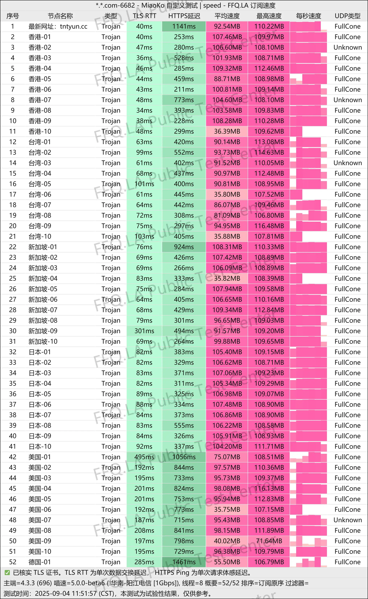
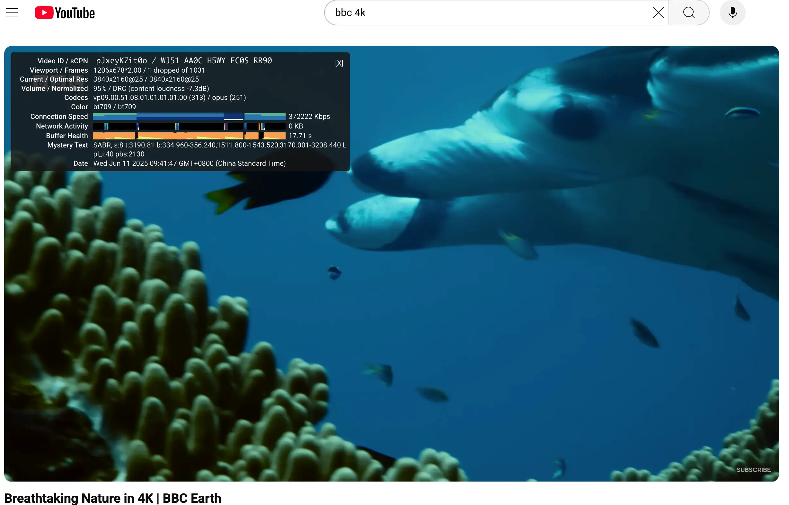
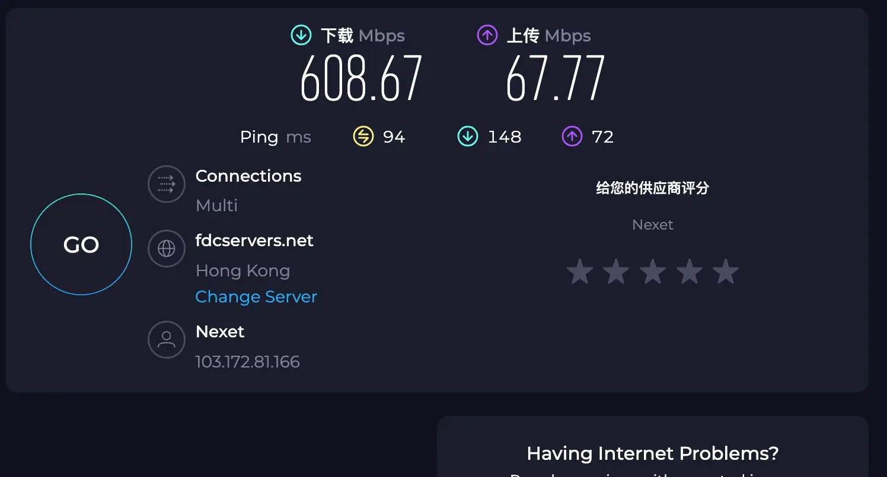
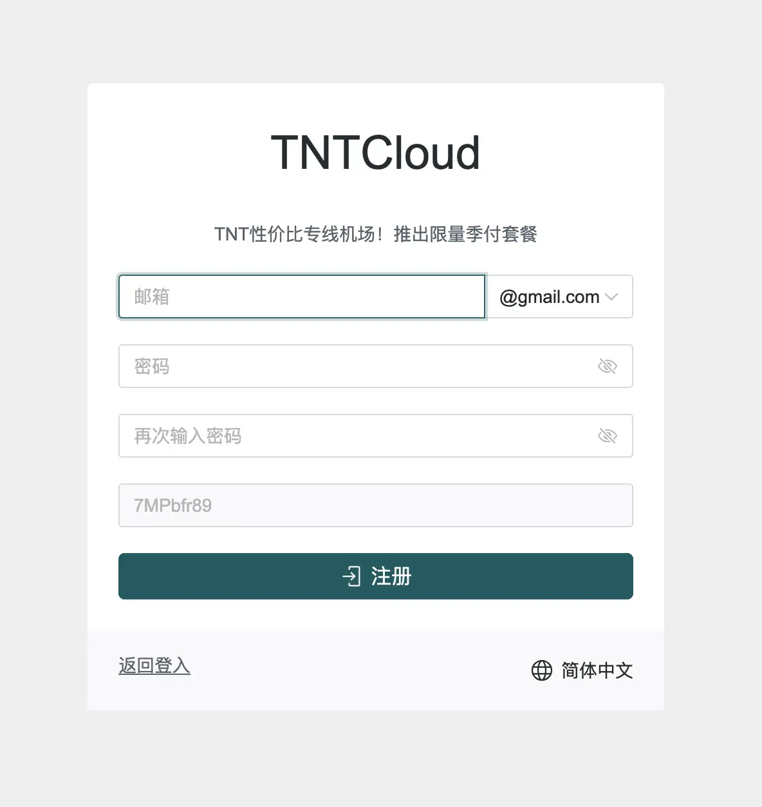
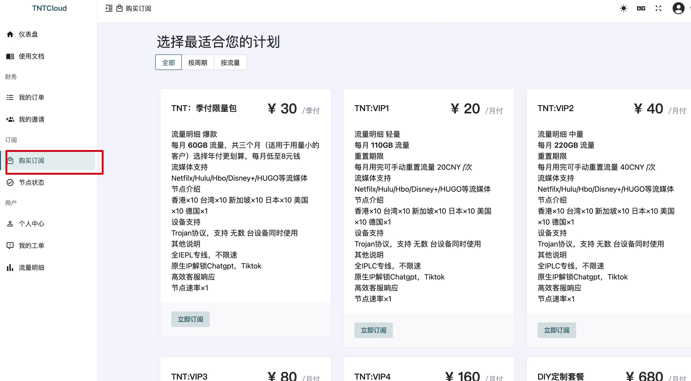
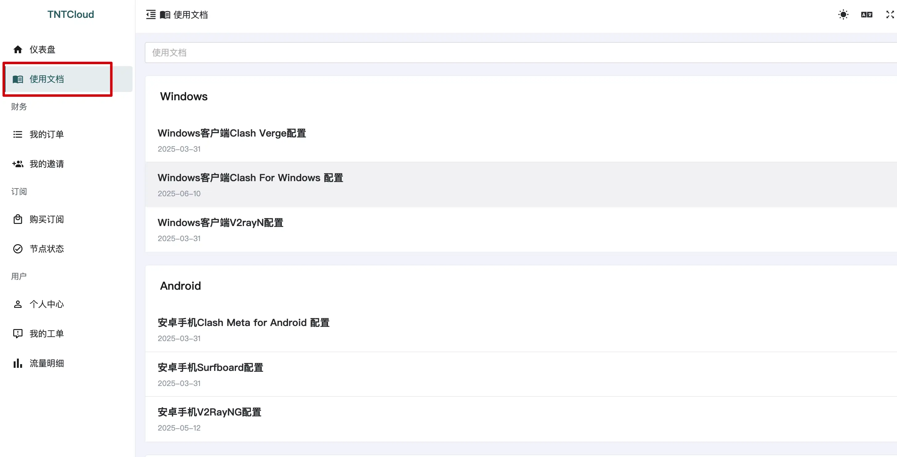
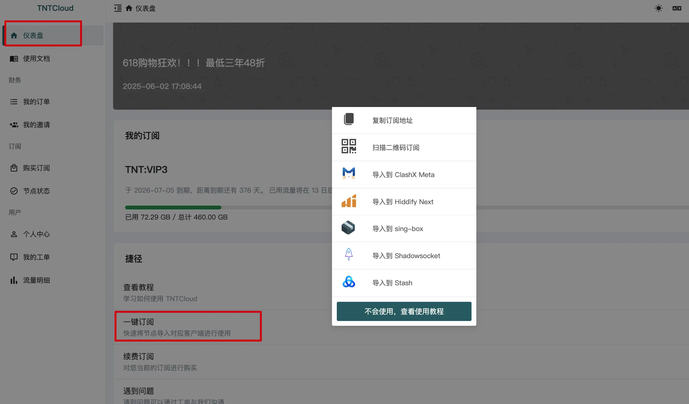
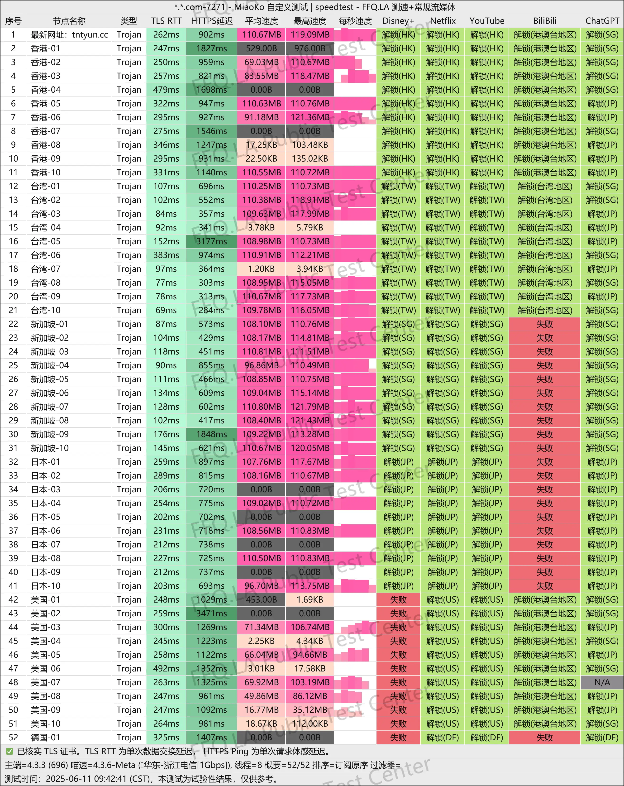
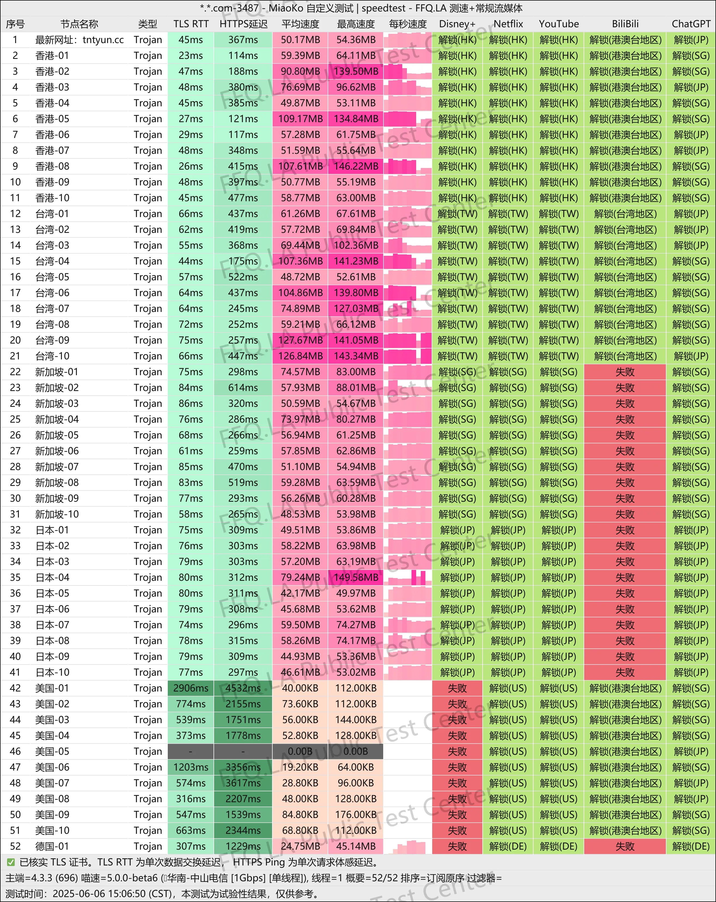

## 🚀 引言：专线中的性价比之王

作为一名重度流媒体用户 + AI 工具使用者，我测试过几十家机场，**TNTCloud 是我近期最推荐的一家专线机场**。它不仅拥有全线 Trojan 协议 + IPLC 内网专线，还支持全球多地区原生 IP 解锁，尤其在 ChatGPT、TikTok、Netflix 等场景表现出色。

晚高峰依然跑满速，不限速不限设备，对多端并发、开发者远程连接、AI 模型调用都非常友好。活动进行中，**使用优惠码 `TNT85` 可享受 85 折限时优惠**，不容错过。

👉 **注册地址（付款支持优惠码 `TNT85`,30元的季付限量包,不享受优惠码）：**  
[🔥 点击访问 TNTCloud 官网 - 开启高速专线体验](https://tanu095.tntvipaff.cc/#/register?code=7MPbfr89)

---

## 📦 基础信息一览（TNTCloud）

| 属性           | 内容                                                                     |
|----------------|------------------------------------------------------------------------|
| 官网           | [点击注册 TNTCloud](https://tanu095.tntvipaff.cc/#/register?code=7MPbfr89) |
| 成立时间        | 2024年                                                                  |
| 协议支持        | Trojan 协议，兼容 Clash / Shadowrocket / Singbox / V2Box 等                  |
| 专线类型        | 全节点 IPLC 内网专线, 所有套餐不限速无倍率                                                        |
| 节点覆盖        | 香港×10、日本×10、台湾×10、新加坡×10、美国×10、德国×1                                    |
| 解锁能力        | ✅ Netflix / ✅ TikTok / ✅ ChatGPT / ✅ Disney+ / ✅ HBO等主流平台              |
| 多端支持        | 不限设备数，可路由器部署，适合多人同时使用                                                  |
| 支付方式        | 支持支付宝 / 微信 / U转账                                                       |
| 适用人群        | AI 工具使用者 / 流媒体爱好者 / 跨境视频创作者 / 外贸与远程开发者                                 |

---

> 📅 最后测试时间：2025-09-04

> 🛠️ 工具环境：1G 宽带 + MiaoKo测速脚本

> 📦 测试方式：延迟 + 解锁 + 下载速度 + 稳定性 + 节点分布  + SpeedTest + Youtube 等综合测试

> 📍 所测机场：TNTCloud

## 📊 实测速度与解锁能力（2025年9月4日）

在 2025 年 9 月 4 日，我使用 MiaoKo 脚本对 TNTCloud 的 52 条 Trojan 协议 IPLC 专线节点进行了深度测速与解锁测试，综合表现非常优秀，尤其适合流媒体 + AI 用户：

### 🚀 节点速度表现亮点

| 性能指标         | 实测数据                                      |
|------------------|-------------------------------------------|
| ✅ 平均节点速度   | 节点普遍达 **100MB/s 以上**，高负载下依然稳定             |
| ✅ 峰值速度表现   | 部分节点测速峰值达 **110MB/s+**，应对多线程下载或 4K 串流毫无压力 |
| ✅ 最低延迟节点   | 香港 01、台湾 03、日区 04 延迟低于 **45ms**，游戏/直播表现优越 |

## 解锁能力可以查看历史测试结果,在最后面
- ✅ **ChatGPT 全节点解锁成功**，从香港、日本、新加坡到美国节点，全部具备 OpenAI 原生可用性，**无任何封锁或验证异常**
- ✅ **Netflix 解锁完整**：港区/新加坡/台湾/日本均支持原生解锁，美区有部分节点成功（符合当前平台识别趋势）
- ✅ **TikTok 支持本地访问 + 投稿 + 直播**：新加坡与日本节点实测可正常上传短视频与开启直播，无频控
- ✅ **AI 工具全面兼容**：Gemini、Claude、Copilot、Midjourney 均能稳定连接调用，适合远程开发与内容创作

---

### 📷 YouTube 实测：BBC Earth 4K 播放无缓冲

在晚高峰时段（2025年6月11日 09:41 PM），通过 TNTCloud 节点播放 BBC Earth 的 4K 视频，**稳定码率达 372,222 Kbps（约 363 Mbps）**，全程无缓冲，加载极快，说明后台带宽与链路品质一流。

---

### ⚡ Speedtest 数据：真实带宽跑满

Speedtest 使用香港节点测速实录：

- 下载速度：**608.67 Mbps**
- 上传速度：**67.77 Mbps**
- Ping 延迟：94ms（国内电信宽带环境）

这意味着 TNTCloud 不仅节点内部速度快，且**整个通道端到端性能稳定**，非常适合上传视频、云备份、远程连接 VPS / GitHub。

---

📌 **总结：TNTCloud 在测速、延迟、解锁能力和带宽稳定性等多维度测试中表现极为出色，是目前市面上最值得入手的 IPLC 专线机场之一。**

---

## 💰 套餐价格与建议（618特惠推荐）

| 套餐名称       | 每月流量     | 价格        | 说明                             |
|----------------|--------------|-------------|----------------------------------|
| 🎯 季付限量包   | 60GB x 3月   | ¥30 / 季    | 最低月均价，轻度用户首选             |
| 🔋 VIP1（轻量） | 110GB        | ¥20 / 月    | 日常流媒体 / AI 聊天             |
| ⚡ VIP2（中量） | 220GB        | ¥40 / 月    | 主力套餐，适合大部分场景             |
| 🚀 VIP3（高量） | 460GB        | ¥80 / 月    | 适合多设备、高画质视频需求用户         |
| 🌀 VIP4（巨量） | 1100GB       | ¥160 / 月   | 重度使用者 / 出海团队共享             |
| 🛠️ 定制套餐     | 独享定制     | ¥680 / 月   | 专线独享 / 定制IP / 企业专用           |

> 💡 优惠提醒：付款时输入优惠码 `TNT85` 可享受 **85折优惠**（季付限量包除外）

---

## 📌 节点性能亮点（延迟/速度/稳定性）

| 指标           | 表现说明                                         |
|----------------|--------------------------------------------------|
| 延迟表现        | 香港/新加坡/台湾节点普遍 < 50ms，日美平均 80~120ms  |
| 下载速度        | 高峰期平均 70MB/s+，多数节点支持 100MB/s 以上速度     |
| 丢包率          | 全节点稳定连接，Ping 无丢包，UDP 支持优异            |
| 解锁能力        | 流媒体 / AI 工具 / TikTok 等全功能解锁                 |
| 并发能力        | 不限设备数，无限流量倍速，适合多端在线、远程办公场景       |

---

## ✅ 推荐人群及使用场景

| 人群类型             | 推荐理由                                                             |
|----------------------|----------------------------------------------------------------------|
| 🎥 流媒体狂热者        | Netflix / Disney+ / HBO / Abema 全平台稳定解锁                             |
| 🤖 AI 工具用户        | ChatGPT / Gemini / Claude / Midjourney 等调用顺畅，延迟极低                    |
| 📱 TikTok 运营者      | TikTok JP / SG 区域原生访问，适合发布短视频 / 做本地号                        |
| 💼 远程办公技术人员     | 全节点高可用支持 GitHub / SSH / 邮件 / API 调用，无封锁风险                    |
| 🧪 科研开发团队        | 可用于 AI 模型训练数据抓取 / 多线程代理 / 自动化测试 / 路由器部署等              |

---

## 🎁 专属优惠码

- 🧧 85折优惠码：`TNT85`（除季付套餐外均可用）
- 🎯 适合人群：想换机场 / 追求稳定 / 高频流媒体 / ChatGPT 多端部署

---

## 🔧 使用流程指引

### 1. [✅ 注册 TNTCloud 官网](https://tanu095.tntvipaff.cc/#/register?code=7MPbfr89)

   

### 2. 购买订阅（推荐使用 `TNT85` 8折优惠码,30元的季付限量包,不享受优惠码,老板说这个套餐已经不赚钱了）

   

### 3. 点击使用文档,下载自己操作系统适合的客户端

   

### 4. 导入订阅链接

  

### 5. 测试 YouTube / ChatGPT / Netflix 是否可正常使用

### 6. 使用遇到问题可联系客服，响应较快，支持TG沟通

---

## ✅ 总结：专线体验 + 真解锁 + 高性价比

| 优势项              | 说明                                                   |
|---------------------|--------------------------------------------------------|
| 🚄 IPLC 专线全覆盖    | 高速稳定，低延迟适配一切应用                              |
| ✅ 全节点原生 IP 解锁  | 解锁 TikTok、Netflix、ChatGPT 全平台                         |
| 💡 不限设备 + 无限速  | 非常适合多设备、技术宅、远程办公用户                         |
| 🔐 Trojan 高兼容性   | 支持多客户端 + 各类设备，连接简单                             |
| 🎯 价格实惠，活动多   | 特别是618折扣期间，门槛极低，性价比极高                       |

> 🧩 **一句话总结：TNTCloud 是一款速度快、解锁强、不限设备的全能型专线机场，适合所有跨境/翻墙/AI 用户**

---

## 👉 马上注册，立享 8折专线体验

  <a href="https://tanu095.tntvipaff.cc/#/register?code=7MPbfr89" target="_blank" style="
    display:inline-block;
    background:linear-gradient(90deg,#ff6a00,#ee0979);
    color:#fff;
    font-weight:600;
    font-size:16px;
    padding:12px 24px;
    border-radius:8px;
    text-decoration:none;
    box-shadow:0 4px 14px rgba(0,0,0,0.25);
    transition:all 0.3s ease;
  " onmouseover="this.style.transform='scale(1.05)'" onmouseout="this.style.transform='scale(1)'">
    <strong>立即访问 TNT Cloud 官网 →</strong>
  </a>

---

## 📚 延伸阅读推荐

- [📖 科学上网机场推荐榜单（实时更新）](https://gptvpnhelper.com/airport-access/)

---

## 历史测速结果

### 2025-06-11

### 2025-06-06

