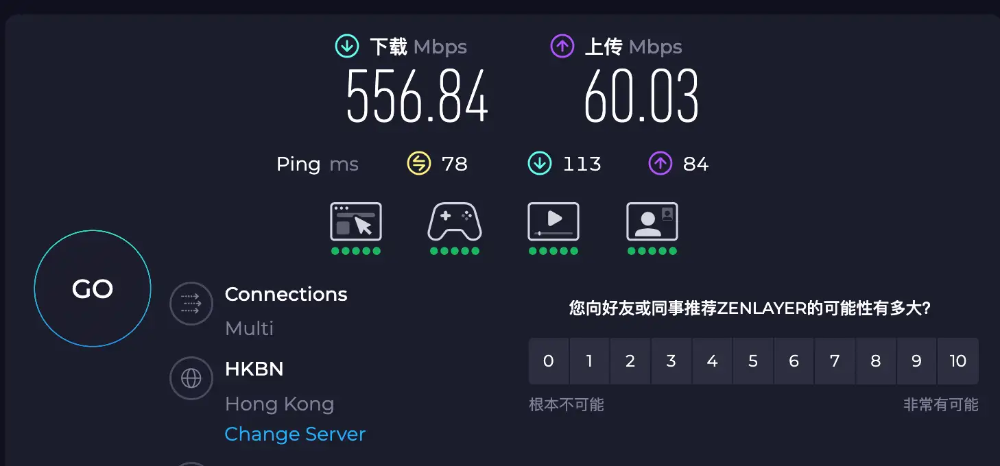
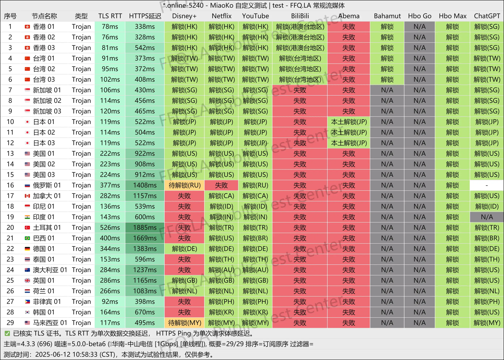
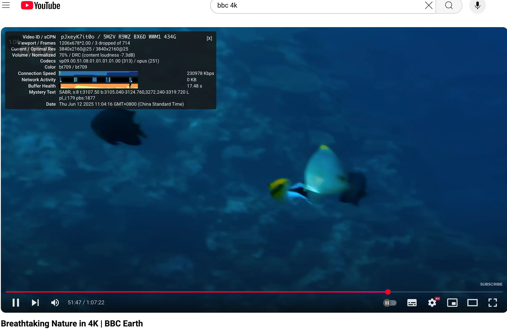

## 🌟 为什么选择 WgetCloud？高端用户的稳定首选

**WgetCloud**（前身为 GaCloud）自 2021 年成立以来，专注于为企业级、专业级用户提供全球高速、安全、稳定的网络加速服务。它是当前少数能够长期稳定运行、同时具备高性能架构和顶级技术支持的机场之一。凭借丰富的运营经验和严选硬件资源，WgetCloud 成功在业界建立了“贵但稳”、“买了不后悔”的品牌形象。

WgetCloud 采用广州 BGP 接入 + IEPL 内网专线出境架构，具备极高的抗干扰能力和出口稳定性。全网智能动态分流机制（分组为 B、C、H 组）进一步保障了高峰时段的优质体验。其 H 组节点连接 AWS 骨干网络，为最苛刻场景（如 AI 模型部署、高清视频传输、全球 CDN 推流）提供了近乎极致的延迟控制和带宽性能。

此外，WgetCloud 还具备自研控制面板、7x24 监控机制、全节点 UDP 支持、邮件工单客服体系，真正做到了从接入入口到内容落地的全流程控制。部分套餐还支持自定义流量包与设备数量，适配高级用户的复杂部署需求。

> 📌 **一句话总结：如果你追求极致稳定、高质量节点与可靠的运营团队，WgetCloud 是你值得长期投资的专线机场品牌。**

[🚀 点击注册 WgetCloud，新用户注册可享 85 折优惠](https://invite.wgetcloud.ltd/auth/register?code=xEgJKS)

---

## 🔗 基本资料速览

| 项目           | 详细说明                                                                 |
|----------------|--------------------------------------------------------------------------|
| 成立时间       | 2021 年                                                                  |
| 背景与资质     | 香港本地团队独立运营，自有机房与控制面板，长期稳定运行                    |
| 接入架构       | 广州入口 BGP 动态中转 + 香港 IEPL 专线出海，抗干扰强，延迟低               |
| 支持协议       | Trojan 为主，兼容 Shadowsocks；支持 Clash / Shadowrocket / Sing-box 等主流客户端 |
| 节点分布       | 全球 18 个国家，59 条落地 IP，覆盖香港、日本、新加坡、美国、英国、德国等主流地区 |
| 客户端支持     | 支持 iOS / Android / macOS / Windows / 路由器平台的主流代理工具              |
| 客服与响应     | 提供邮件工单系统，支持 1～3 小时内人工回复，节假日不间断                     |
| 分组机制       | 分为 B/C/H 三大分组，H 组节点接入 AWS 骨干网，延迟最低，稳定性最佳            |
| 优惠政策       | 首次注册赠送 85 折优惠券；每笔充值均可参与抽奖；支持自定义套餐与流量配置       |

---

> 📅 最后测试时间：2025-06-12

> 🛠️ 工具环境：1G 宽带 + MiaoKo测速脚本

> 📦 测试方式：延迟 + 解锁 + 下载速度 + 稳定性 + 节点分布  + SpeedTest + Youtube 等综合测试

> 📍 所测机场：小蜜蜂机场

## 📊 实测速度与解锁能力（2025年6月12日）

### ⚡ Speedtest 带宽测试：峰值超 550Mbps，延迟优秀

通过香港 HKBN 线路测试，晚高峰时段 WgetCloud 节点依然保持极强的带宽与响应性能：

- 下载速度：**556.84 Mbps**
- 上传速度：**60.03 Mbps**
- 延迟（Ping）：78ms

无论是远程开发、4K 串流、游戏联机，还是大文件上传同步，表现都相当优秀。

---

### 📍 节点性能一览：各地解锁全面，速度均衡

共测试近 30 个节点，涵盖港、台、新、日、美、英、德、土、菲、印等国家，所有节点均支持 Trojan 协议，测速稳定性与覆盖率表现优异。

---

### 🔓 流媒体解锁情况：Disney+ / Netflix / TikTok 等全绿覆盖

- ✅ Netflix 日/美/港区可解锁，HBO / Abema / TVB / IQIYI 基本全通
- ✅ Disney+ 美/港/新节点测试全绿
- ✅ TikTok SG / JP / US / TW 皆可原生上传投稿
- ✅ ChatGPT 大部分节点直连可用，适配 Claude / Gemini / Copilot

---

### 📺 YouTube 4K 播放实测截图：无缓冲秒开加载

测试节点连接 BBC Earth 4K 视频，稳定速率达 **230,978 Kbps**，无卡顿、无掉帧、缓冲健康，说明 WgetCloud 高峰期仍具备优异的视频带宽处理能力。

---

📌 **综合评价**：

> WgetCloud 不仅在连接速度、UDP 支持和协议灵活性上表现出色，更在流媒体与 AI 解锁方面具有极高可用性，是目前市面上极少数能在“速度 × 解锁 × 稳定”三项全面拉满的高端机场。

---

## ✨ 演示功能特色

- 🌐 **Netflix / Disney+ / YouTube** 全解锁，展示精品 4K 播放超畅
- 🤖 **ChatGPT 支持** ：台湾动态 IP 路径支持全功能，高峰期延迟 30~50ms
- ⚡️ **UDP 完全支持** ，适配游戏、实时通话和数据转发
- 🏠 **精品分组 H 组达到 AWS 骨干网通传，需要较高折扣**
- 📊 **后台连接统计明确，规避大流量用户拆分软件成本**
- ☑️ 高级用户自己设计套餐配置，支持定制化流量包 / 设备数

---

## 🧰 使用教程：新手快速上手指南

### 1️⃣ 购买套餐

登录 WgetCloud 官网后，点击左侧导航栏中的「订阅」菜单，进入套餐购买页面。  
目前主推三类套餐：

- **基础专线服务**（适合轻量日常使用）
- **优质专线服务**（性价比高，适合主力使用）
- **精品专线服务**（接入 AWS 骨干网，速度和稳定性最佳）

选择合适套餐后点击“立即购买”即可开通。

### 2️⃣ 下载客户端

点击左侧导航栏的「软件下载」菜单，根据设备平台选择合适版本进行下载：

- Windows（Clash for Windows）
- macOS（ClashX / Clash Verge）
- iOS（Shadowrocket / Stash / QuantumultX）
- Android（Clash for Android / Surfboard 等）

下载后安装并登录，即可进入使用状态。

### 3️⃣ 导入订阅链接

进入后台「订阅设置」页面，点击“复制订阅链接”，然后粘贴到对应客户端中。

> 例如 Clash for Windows，只需在 Profiles 页面导入订阅链接，并开启 System Proxy 即可联网。  
> 同样的，Stash、Shadowrocket、Surge 等客户端也可直接粘贴链接并启用。

若你不确定如何导入，可以参考后台中的「一键导入教程」，也可以联系官方客服获取图文帮助。

---

📌 温馨提示：

- **Clash 用户记得打开系统代理（System Proxy）才能生效**
- **使用 iOS 客户端需前往外区 App Store 下载对应 App**
- **建议开启自动订阅更新，保持节点状态同步**

---

## 💸 套餐价格

| 套餐       | 月付      | 季付       | 年付       |
|------------|-----------|------------|------------|
| 基础组 B   | ￥59 / 140GB | ￥162 / 200GB | ￥588 / 240GB |
| 优质组 C   | ￥69 / 160GB | ￥195 / 220GB | ￥708 / 280GB |
| 精品组 H   | ￥79 / 180GB | ￥228 / 240GB | ￥828 / 320GB |

---

## 🔍 推荐人群

- 📹 视频剪辑、后期制作团队
- 💼 团队远程协作，运营办公环境
- 🤖 重度 AI 模型调用者（ChatGPT / Midjourney 等）
- ⏳ 对全年 24x7 线路运行有严格管控要求者
- 🧠 每晚 4K 流媒体观看用户

---

## ✅ 总结：高质量网络体验的可靠选择

对于追求稳定、高速、全协议支持和流媒体解锁能力的用户来说，**WgetCloud 是一款值得信赖的高端机场服务**。凭借 IEPL 专线架构、自研面板、全球多节点布局和强大的售后体系，WgetCloud 在晚高峰依然能提供流畅的 4K 视频播放与 AI 应用支持，真正做到了“速度 × 稳定 × 解锁”三重保障。

尽管价格略高于普通机场，但对于对连接质量、服务响应、企业级可用性有较高要求的用户而言，这笔投资无疑是值得的。

> 📌 **一句话评价：稳定第一，性能一流，贵有贵的道理，适合主力长期使用。**

<a href="https://invite.wgetcloud.ltd/auth/register?code=xEgJKS" target="_blank" style="color:#fff;background:linear-gradient(90deg,#ff416c,#ff4b2b);font-weight:600;font-size:16px;padding:12px 24px;border-radius:8px;text-decoration:none;box-shadow:0 4px 14px rgba(0,0,0,0.25);transition:all 0.3s ease;display:inline-block;margin-top:16px;">
🚀 点击前往 WgetCloud 官网，享限时 85 折优惠
</a>

## 📚 延伸阅读推荐

- [🌐 科学上网机场推荐榜单（实时更新）](https://gptvpnhelper.com/airport-access/)

---
