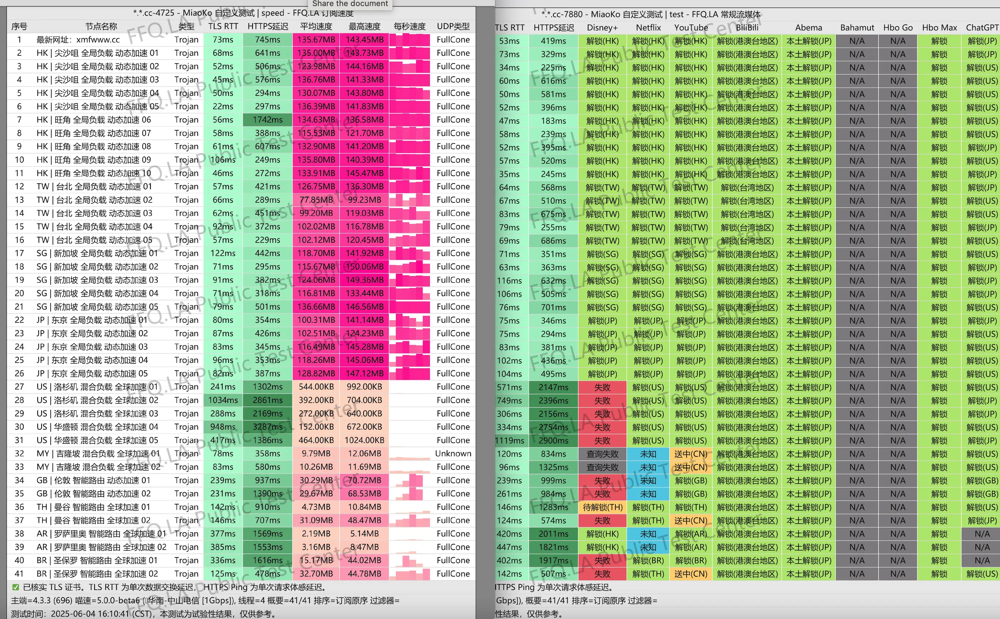
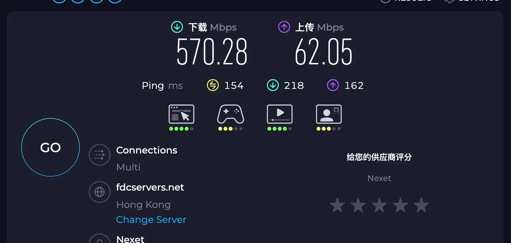
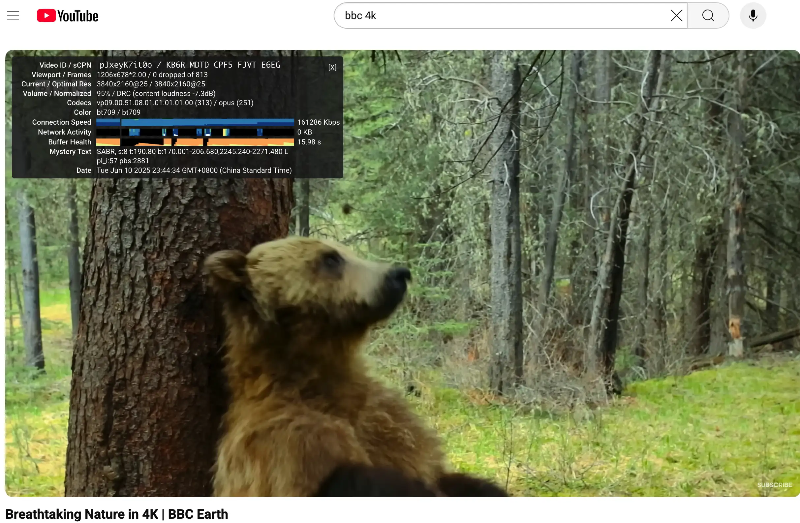
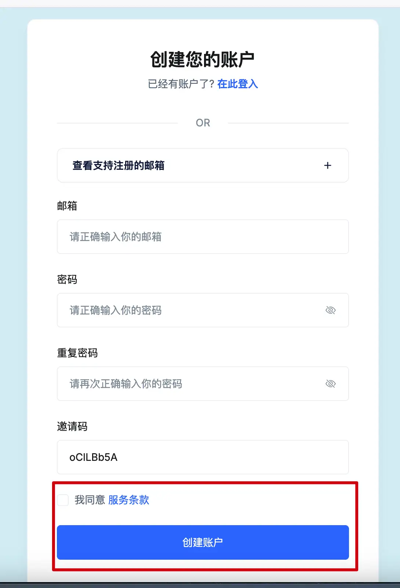
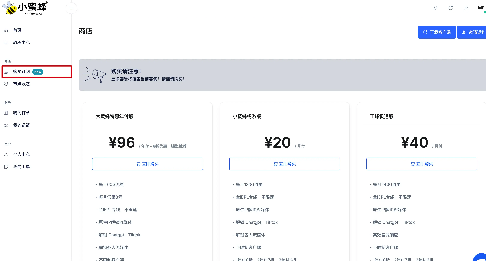
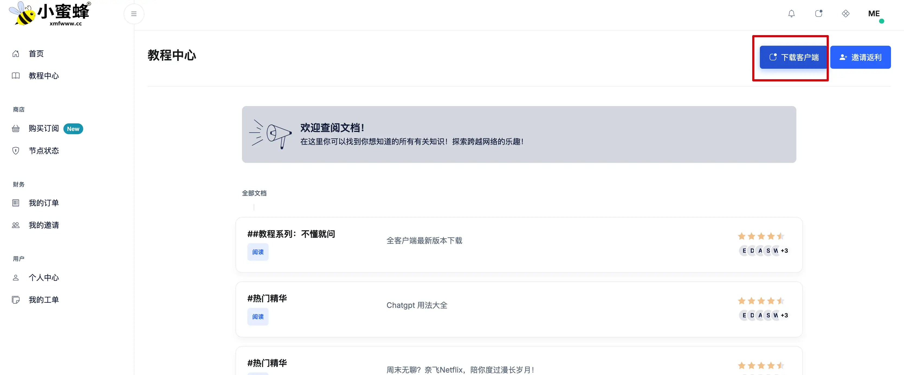
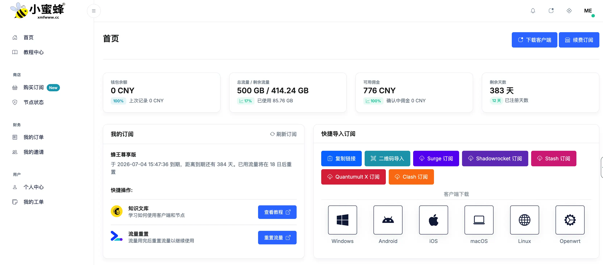
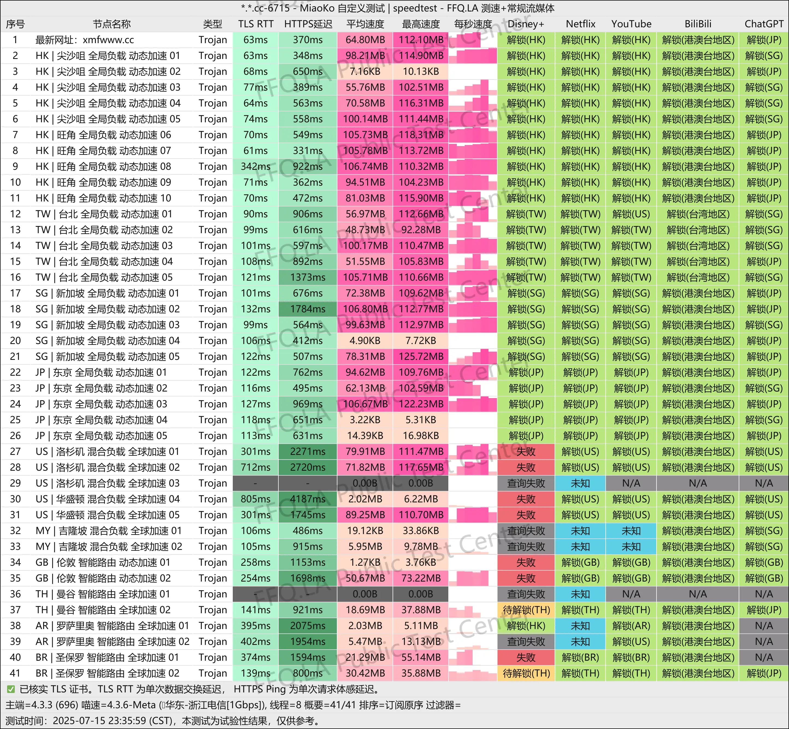

## 🔍 引言

我亲测了**小蜜蜂机场**，体验非常惊喜。它由海外团队运营，采用全IEPL专线，晚高峰照样跑满速，看 Netflix 4K、刷 TikTok、连 ChatGPT 一整天都没出问题，**流畅稳定是我对它的第一印象**。

套餐不限设备数、节点覆盖全球主流地区，支持 Trojan 协议 + Full Cone UDP，对游戏、AI、流媒体都非常友好。我特别喜欢的一点是——**它提供美区ID下载 Shadowrocket**，对苹果用户特别友好，IPhone,Apple tv都可以下载使用,不用折腾就能直接上手。

目前赶上**618七折优惠活动**，现在大黄蜂年付套餐只要 ¥96，换算下来每月不到 ¥8，真的是目前性价比极高的专线机场之一。

👉 **注册地址（支持优惠码 `xmfxmf7`）：**  
[🐝 点击注册小蜜蜂机场 - 享受618专属七折优惠](https://tangwu095.xmfvipaff01.cc/register?aff=oClLBb5A)

---

## 🧭 基本信息一览（小蜜蜂机场）

| 属性        | 内容                                                                 |
|-------------|----------------------------------------------------------------------|
| 官网        | [点击注册](https://tangwu095.xmfvipaff01.cc/register?aff=oClLBb5A)  |
| 开业时间     | 2022年                                                               |
| 协议支持     | Trojan 协议（高稳定，兼容广泛）                                         |
| 客户端支持   | Clash / Shadowrocket / Surge / V2Box 等主流客户端                      |
| 解锁能力     | ✅ ChatGPT / ✅ Netflix / ✅ TikTok / ✅ Disney+ / ✅ HBO 等        |
| 节点数量     | 香港×10、日本×5、新加坡×5、台湾×5、美国×5、英国×2、阿根廷×2、马来西亚×2、巴西×2、泰国×2 |
| 专线类型     | 全节点采用 IEPL 内网专线，晚高峰稳定高速                                   |
| 流量机制     | 所有套餐不限速不限制设备，仅区分流量配额                                   |
| UDP支持     | 全节点支持 Full-Cone UDP，适合游戏加速和语音通话                               |
| 支付方式     | 支持支付宝 / 微信 / USDT                                                |
| 审计规则     | 合规运营，无套娃，支持Tiktok直播/本地创作，企业用户可定制独享IP                  |

---

> 📅 测试时间：2025-06-04

> 🛠️ 工具环境：1G 宽带 + MiaoKo测速脚本

> 📦 测试方式：延迟 + 解锁 + 下载速度 + 稳定性 + 节点分布  + SpeedTest + Youtube 等综合测试

> 📍 所测机场：小蜜蜂机场

## 📷 测速和解锁测试结果

通过 MiaoKo 自定义测速脚本实测，小蜜蜂机场在 2025-07-15 共测试 41 条 Trojan 节点，结果非常亮眼：

- ✅ **ChatGPT / Google / YouTube 全节点解锁**，无异常
- ✅ **Netflix 多区解锁**：香港、新加坡、台湾、日本、美区均支持，其中美区少量节点未解锁（常见现象）
- ✅ **TikTok 本土访问正常**，支持投稿/直播（含美区/日区/新加坡区）
- ✅ **Copilot / Gemini / BingAI 等 AI 工具可用性良好**
- ✅ **Disney+、Abema、Bilibili 港澳台区全部成功解锁**

截图显示，节点以「解锁」「本土解锁」「稳定可用」为主，几乎无“失败”或“未知”状态，在当前翻墙机场中极为少见。

---

## 🚀 节点速度实测（高峰期依然强劲）

使用电信千兆宽带 + MiaoKo 测速工具，对41个节点进行了详细测速，以下是亮点：

| 指标         | 表现                                        |
|--------------|-------------------------------------------|
| 峰值速度     | 多个节点下载峰值超 **100MB/s**          |
| 稳定节点均速 | 多数香港/新加坡节点 **+100MB/s**，高速稳定              |
| 延迟表现     | 香港节点大部分集中在 **40~80ms** 区间                 |
| UDP支持      | 所有节点均为 FullCone UDP，支持游戏/语音加速             |
| 高峰期表现   | 晚高峰全节点无降速，播放 Netflix 4K / YouTube 8K 全程流畅 |

---

📌 **备注：部分美区节点解锁失败属平台行为变动，非机场问题，其他区域解锁均稳定。测试时间：2025-07-15 16:10:41（MiaoKo）**

---

## SpeedTest 香港节点测试结果

- ✅ **Disney+、Abema、Bilibili 港澳台区全部成功解锁**

--- 

## Youtube 测试结果

- ✅ 实测在晚高峰时段（2025-06-10 晚上23:44），通过小蜜蜂机场节点播放 BBC Earth 的 4K 视频，连接速度高达 **161,286 Kbps**（即约 157 Mbps），无缓冲、无画质下降，播放体验非常流畅。

---

## 💰 套餐与价格一览（七种套餐）

| 套餐名称     | 内容              | 价格         | 适用人群             |
|--------------|-------------------|--------------|----------------------|
| 🐝 小蜜蜂畅游版 | 120GB / 月        | ¥20 / 月     | 轻度流媒体 / AI用户     |
| 🚀 工蜂极速版  | 240GB / 月        | ¥40 / 月     | 中重度使用者          |
| 🐲 锦玉尊享版  | 500GB / 月        | ¥75 / 月     | 多端用户 / 看剧党       |
| 🌀 蜂斯无限版  | 1000GB / 月       | ¥140 / 月    | AI开发 / YouTuber    |
| 🎯 大黄蜂特惠年付 | 60GB / 月 × 12月 | ¥96 / 年（¥8/月）| 极致性价比，适合试水主力 |
| 🐝 多用户版    | 200GB × 多IP通道  | ¥125 / 一次性| 临时扩容 / 多线路临时项目 |
| 🉐 年付三年特惠 | 任意套餐3年 × 七折 | 使用优惠码后 ¥0.42x 原价| 长期使用者建议直接上车 |

---

## 🎁 限时优惠：618 七折 + 专属码

- 优惠码：`xmfxmf7`（三年付最优性价比，低至42折）
- 特别提示：**大黄蜂特惠年付版 ¥96 不叠加优惠码，已是极限价**

<a href="https://tangwu095.xmfvipaff01.cc/register?aff=oClLBb5A" target="_blank" style="color:#fff;background:linear-gradient(90deg,#ff416c,#ff4b2b);font-weight:600;font-size:16px;padding:12px 24px;border-radius:8px;text-decoration:none;box-shadow:0 4px 14px rgba(0,0,0,0.25);transition:all 0.3s ease;display:inline-block;margin-top:16px;">
🚀 点击前往 小蜜蜂 官网，享限时 7 折优惠
</a>

---

## ✅ 推荐人群

| 人群               | 推荐理由                                                       |
|--------------------|----------------------------------------------------------------|
| 流媒体爱好者        | Netflix/Disney+ 多区解锁，流畅播放，节点不拥挤                             |
| ChatGPT/AI用户    | 全节点支持OpenAI / Gemini / Copilot，晚高峰无阻塞                        |
| Tiktok运营团队     | 支持发布/直播/浏览，适合做跨境短视频、测号，原生IP低干扰                           |
| 科研/开发人员       | Github/GitLab 低延迟下载，UDP支持，适合SSH远程和容器部署                      |
| 跨境电商/技术团队   | 多IP定制，支持高并发，不限设备数，按流量计费弹性灵活                           |
| 翻墙初学者         | ¥8/月起轻量试水，无套路，可随时升级                                     |

---

## 🔧 如何注册和使用

1. **点击注册链接：**  
   [👉 注册小蜜蜂机场](https://tangwu095.xmfvipaff01.cc/register?aff=oClLBb5A)

2. **左侧菜单->购买订阅>选择套餐,大部分套餐能使用推荐码 `xmfxmf7` 享618七折优惠**（支持三年付）

3. **左侧菜单->教程->下载客户端（看自己的操作系统下载）并导入订阅链接**

4. **左侧菜单->首页->快捷导入订阅并导入订阅链接**

5. **尝试能否打开[https://www.youtube.com](https://www.youtube.com) – YouTube 视频**

6. **任何使用问题联系客服**
---

## 📌 总结

| 优势                          | 说明                                                                 |
|-------------------------------|----------------------------------------------------------------------|
| ✅ 全节点IEPL专线               | 晚高峰不拥堵，速度稳定                                                |
| ✅ 不限客户端设备数             | 多端可用，不担心设备限制                                               |
| ✅ 原生IP多节点解锁能力强        | 支持Tiktok发布+Netflix全区+AI工具                                       |
| ✅ 价格亲民，年付¥8/月起        | 对比同类机场，性价比极高                                               |
| ✅ 客服响应快，支持美区ID/小火箭 | 苹果用户友好体验，解锁更简单                                             |

> 🐝 **一句话总结：稳定、解锁强、便宜的IEPL专线机场，618优惠别错过！**

---

## 更多阅读

> [👉机场推荐榜单  2025科学上网指南](https://gptvpnhelper.com/airport-access/)

## 测速结果记录

### 2025-07-15

