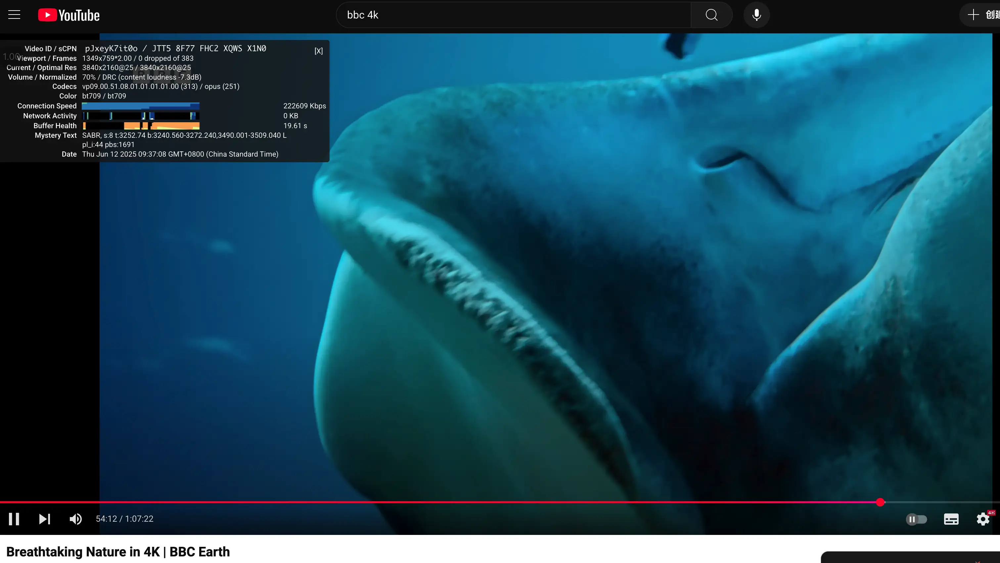
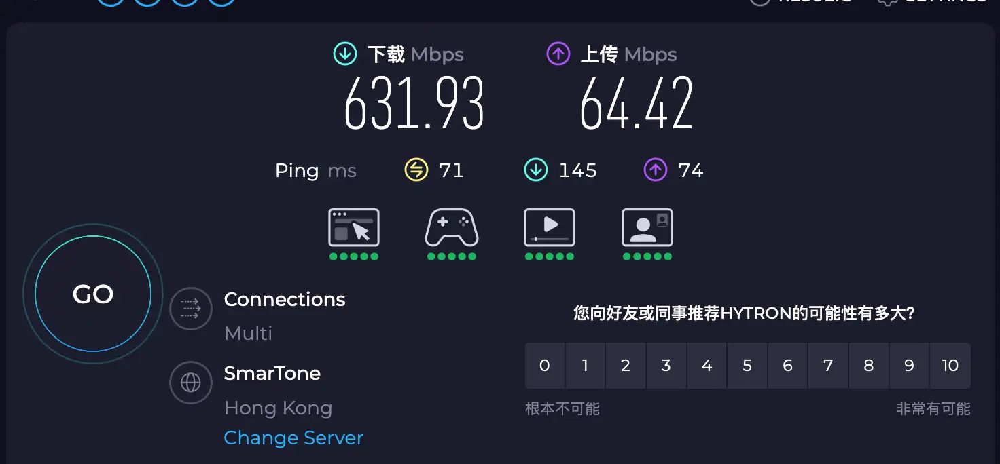
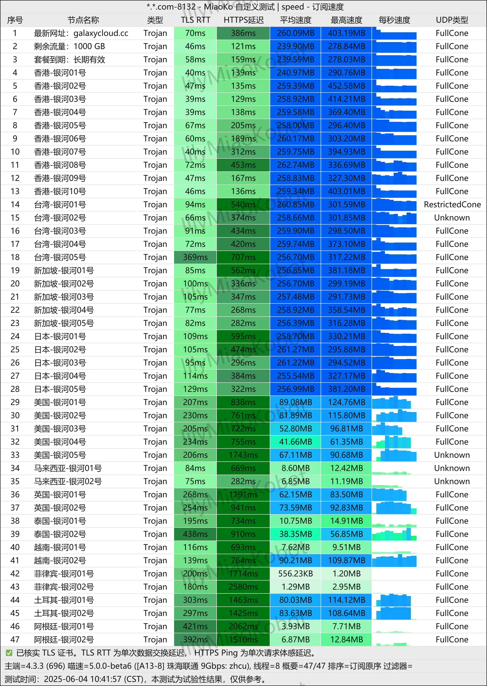

## 🚀 引言：老牌团队再出发，Trojan 专线再进化

**Galaxy 银河云** 是老牌机场青云梯团队在 2023 年重新推出的新品牌，专注于 Trojan 协议 + IEPL 专线架构。继承稳定、速度快、节点覆盖广的传统优势，同时引入灵活套餐设计、全天候在线客服与退款机制，兼顾新手与进阶用户需求。

全节点原生 IP，全平台支持 ChatGPT / Netflix / TikTok / Claude，支持多端设备连接，不限速、不限设备。无论你是流媒体重度用户、AI 工具使用者，还是远程开发者，银河云都能带来一线专线体验。性价比在专线机场里拉满了，可作主力机场，年付小包低使用率可选，换有不限时套餐，敏感期不掉线,
节点丰富。最近国庆活动限时全场8折,是下手的好时机

🔗 新用户快速入门：  
[🔗 点击注册 Galaxy 银河云](https://inv03.galaxyaff.cc/register?aff=tcOd0ob7)

> 🎁 ⚠️⚠️付款时记得填专属优惠码：**
🎁 专属优惠码：`10180`（全场 8 折） 即日起 ～ 2025年11月1日 23:59

---

## 📆 基础信息一览

| 属性         | 详情                                                                          |
|--------------|-----------------------------------------------------------------------------|
| 成立时间     | 2023年6月，由老牌机场青云梯团队重磅打造，新加坡大机房支撑，技术成熟，运营稳定                                   |
| 协议支持     | Trojan 协议，支持 Clash、Meta、Singbox、Shadowrocket、V2Box 等全平台客户端                  |
| 专线类型     | 全节点 IEPL 内网专线，无倍率、不限速，稳定高效                                                  |
| 节点覆盖     | 香港×10、台湾×5、新加坡×5、日本×5、美国×5、马来西亚×2、越南×2、菲律宾×2、泰国×2、英国×2、阿根廷×2、土耳其×2          |
| 解锁能力     | 支持 ChatGPT、Claude、Gemini、Netflix（含美/港/台/日/英区）、TikTok、Disney+、YouTube 4K 等平台 |
| 多端设备     | 支持无限设备同时在线，兼容 Android、iOS、Windows、macOS、路由器等多种设备                            |
| 稳定性与客服 | 全天候 24 小时在线客服，节点问题 1 小时内极速处理，支持退款，敏感时期稳定不掉线                                 |
| 支付方式     | 支持支付宝、微信、USDT，VX / USDT 需联系客服处理                                             |

---

> 📅 最后测试时间：2025-06-12

> 🛠️ 工具环境：1G 宽带 + MiaoKo测速脚本

> 📦 测试方式：延迟 + 解锁 + 下载速度 + 稳定性 + 节点分布  + SpeedTest + Youtube 等综合测试

> 📍 所测机场：银河云机场

## 📊 速度与解锁测试结果（2025年6月10日）

通过 MiaoKo 测速脚本，此次深度测试了 GalaxyVPN 全节点速度、延迟、容量、解锁能力，结果如下：

---

## ✨ 测速概览

| 属性         | 数据结果                              |
|--------------|----------------------------------------|
| 节点速度     | 平均 100MB/s，最高约 150MB/s+          |
| 延迟         | 东亚类节点平均低于 50ms                |
| 解锁程度     | Netflix / TikTok / ChatGPT 全面支持     |
| 高峰期稳定性 | 不降速，无一路失诊，上传/播放结果精彩  |

### 📷 YouTube 实测：BBC Earth 4K 播放无缓冲

在高峰时段（2025年6月12日 09:37 AM），通过 Galaxy 银河云香港节点播放 BBC Earth 的 4K 视频，**稳定码率达 222,609 Kbps（约 217 Mbps）**，全程 0 掉帧，缓冲健康状态良好，说明线路带宽充足，能够支撑多线程 4K 串流播放无压力。

---

### ⚡ Speedtest 数据：节点带宽性能强劲

Speedtest 使用 Galaxy 银河云香港节点实测结果如下：

- 下载速度：**631.93 Mbps**
- 上传速度：**64.42 Mbps**
- Ping 延迟：71ms（国内电信宽带环境）

这意味着 Galaxy 银河云不仅在 HTTP/UDP 多通道传输中稳定性强，**在上传/下载大文件、AI 工具调用、视频创作等场景中均表现优异**，非常适合作为主力机场日常使用。

---

📌 **总结：Galaxy 银河云在节点速度、流媒体解锁、延迟表现等多个维度均展现出专线级水准，特别适合重度多设备用户与 AI/流媒体高并发场景使用。**

---

## 💸 套餐价格一览

| 套餐名称       | 流量 / 月 | 月付  | 季付  | 半年付 | 年付   | 两年付 | 三年付            |
|----------------|------------|--------|--------|--------|--------|--------|--------------------|
| 年付轻量包     | 50GB       | -      | -      | -      | ￥98   | -      | -                  |
| 星尘套餐       | 100GB      | ￥18   | ￥49   | ￥92   | ￥173  | ￥302  | ￥389              |
| 行星套餐       | 200GB      | ￥35   | ￥95   | ￥179  | ￥336  | ￥588  | ￥756              |
| 恒星套餐       | 400GB      | ￥70   | ￥189  | ￥357  | ￥672  | ￥1176 | ￥1512             |
| 星系套餐       | 800GB      | ￥140  | ￥378  | ￥714  | ￥1344 | ￥2352 | ￥3024             |
| 永久不限时套餐 | 1000GB     | -      | -      | -      | -      | -      | ￥680（一次性）     |

---

## 🌟 总结：性能抽顶、解锁完美，正是入手好时机

**Galaxy 银河云** 通过这次全面测试，无论是解锁能力、并发互联、进出网络速度都符合专线级标准。相比原青云梯机场，在稳定性和性价比方面更有优势。如果你正在找一个长期稳定、解锁力强、性价比双高的机场，GalaxyVPN 会是一个极佳选择！

> 🎁 ⚠️⚠️付款时记得填专属优惠码：**
🎁 专属优惠码：`10180`（全场 8 折） 即日起 ～ 2025年11月1日 23:59

<a href="https://inv03.galaxyaff.cc/register?aff=tcOd0ob7" target="_blank" style="color:#fff;background:linear-gradient(90deg,#ff416c,#ff4b2b);font-weight:600;font-size:16px;padding:12px 24px;border-radius:8px;text-decoration:none;box-shadow:0 4px 14px rgba(0,0,0,0.25);transition:all 0.3s ease;display:inline-block;margin-top:16px;">
🚀 点击前往 银河云 官网，限时8折优惠
</a>

---

## 🧭 使用流程指南

1. 🔗 **注册账号**：[点击前往 Galaxy 官网](https://inv03.galaxyaff.cc/register?aff=tcOd0ob7)
2. 💰 **选择套餐**：轻量用户选“星尘”，中重度推荐“行星套餐”以上
3. 🔐 **复制订阅链接**：兼容 Clash、Shadowrocket、Singbox 等主流客户端
4. ⚙️ **导入客户端**，一键使用
5. ✅ **测试服务**：访问 YouTube / Netflix / ChatGPT 等确认可用性

---

## 📌 推荐人群与使用场景

| 使用人群          | 推荐理由                                                       |
|-------------------|----------------------------------------------------------------|
| 🎥 流媒体爱好者    | YouTube 4K / Netflix / Disney+ 全平台流畅播放解锁              |
| 🤖 AI 工具深度用户 | ChatGPT / Gemini / Claude / Midjourney 等 AI 工具低延迟稳定使用 |
| 📱 TikTok 运营者   | SG / JP 原生节点适合发布短视频、开直播，不易封号限流           |
| 🧳 远程办公开发者   | GitHub / API / 邮箱 / SSH 稳定连通，适合多端工作环境             |

---

## 📚 延伸阅读推荐

- [🌐 科学上网机场推荐榜单（实时更新）](https://gptvpnhelper.com/airport-access/)

---

## 历史测速结果

### 2025-06-06

